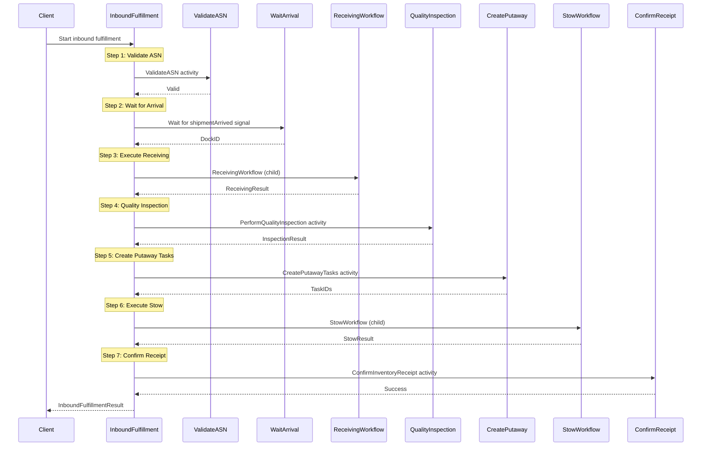
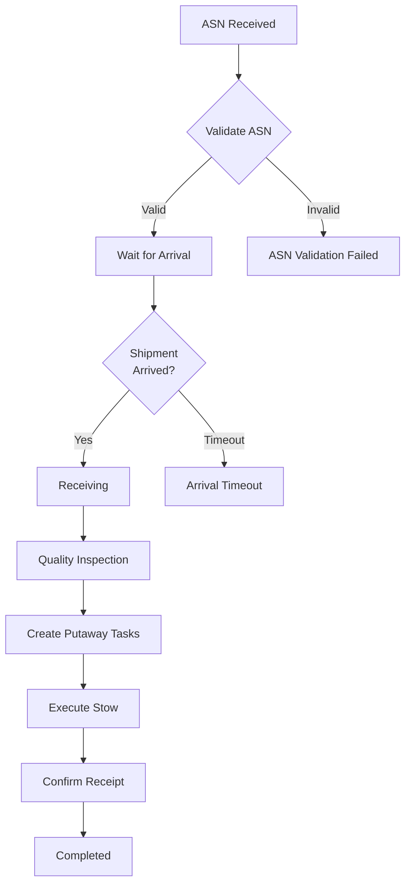

# InboundFulfillmentWorkflow

Orchestrates the inbound fulfillment process from ASN (Advanced Shipping Notice) through stow.

## Overview

The Inbound Fulfillment Workflow coordinates:
1. ASN validation
2. Waiting for shipment arrival
3. Receiving and quality inspection
4. Putaway task creation
5. Stow execution
6. Inventory receipt confirmation

## Configuration

| Property | Value |
|----------|-------|
| Task Queue | `orchestrator` |
| Execution Timeout | 24 hours |
| Activity Timeout | 5 minutes (default) |
| Child Workflow Timeout | 4 hours |

## Input

```go
// InboundFulfillmentInput represents the input for the inbound fulfillment workflow
type InboundFulfillmentInput struct {
    ShipmentID      string                 `json:"shipmentId"`
    ASNID           string                 `json:"asnId"`
    SupplierID      string                 `json:"supplierId"`
    ExpectedItems   []InboundExpectedItem  `json:"expectedItems"`
    ExpectedArrival time.Time              `json:"expectedArrival"`
    DockID          string                 `json:"dockId,omitempty"`
}

// InboundExpectedItem represents an expected item in the inbound shipment
type InboundExpectedItem struct {
    SKU               string  `json:"sku"`
    ProductName       string  `json:"productName"`
    ExpectedQuantity  int     `json:"expectedQuantity"`
    UnitCost          float64 `json:"unitCost"`
    Weight            float64 `json:"weight"`
    IsHazmat          bool    `json:"isHazmat"`
    RequiresColdChain bool    `json:"requiresColdChain"`
}
```

## Output

```go
// InboundFulfillmentResult represents the result of the inbound fulfillment workflow
type InboundFulfillmentResult struct {
    ShipmentID         string   `json:"shipmentId"`
    Status             string   `json:"status"`             // completed, asn_validation_failed, etc.
    TotalExpected      int      `json:"totalExpected"`
    TotalReceived      int      `json:"totalReceived"`
    TotalDamaged       int      `json:"totalDamaged"`
    PutawayTaskIDs     []string `json:"putawayTaskIds,omitempty"`
    DiscrepancyCount   int      `json:"discrepancyCount"`
    Error              string   `json:"error,omitempty"`
}
```

## Workflow Steps



## Signals

| Signal | Payload | Timeout | Purpose |
|--------|---------|---------|---------|
| `shipmentArrived` | `ShipmentArrivalSignal` | ExpectedArrival + 4 hours | Notifies of physical shipment arrival |

```go
// ShipmentArrivalSignal is the signal payload for shipment arrival
type ShipmentArrivalSignal struct {
    ShipmentID string    `json:"shipmentId"`
    DockID     string    `json:"dockId"`
    ArrivedAt  time.Time `json:"arrivedAt"`
}
```

## Child Workflows

| Child Workflow | Workflow ID Pattern | Purpose |
|----------------|---------------------|---------|
| `ReceivingWorkflow` | `receiving-{shipmentId}` | Executes receiving process |
| `StowWorkflow` | `stow-{shipmentId}` | Executes stow process |

## Activities Used

| Activity | Purpose | On Failure |
|----------|---------|------------|
| `ValidateASN` | Validates ASN data | Return error |
| `MarkShipmentArrived` | Updates shipment status | Log warning, continue |
| `PerformQualityInspection` | Samples and inspects items | Log warning, continue |
| `CreatePutawayTasks` | Creates stow tasks | Return error |
| `ConfirmInventoryReceipt` | Confirms inventory in system | Log warning, continue |
| `CompleteReceiving` | Marks receiving complete | Log warning, continue |

## Receiving Result

```go
// ReceivingResult represents the result of receiving activities
type ReceivingResult struct {
    ShipmentID       string `json:"shipmentId"`
    TotalReceived    int    `json:"totalReceived"`
    TotalDamaged     int    `json:"totalDamaged"`
    DiscrepancyCount int    `json:"discrepancyCount"`
    Success          bool   `json:"success"`
}
```

## Quality Inspection

```go
// QualityInspectionResult represents the result of quality inspection
type QualityInspectionResult struct {
    ShipmentID     string `json:"shipmentId"`
    InspectedCount int    `json:"inspectedCount"`
    PassedCount    int    `json:"passedCount"`
    FailedCount    int    `json:"failedCount"`
    Passed         bool   `json:"passed"`
}
```

Default sampling rate is 10%. Quality failures are logged but don't stop the workflow.

## Stow Result

```go
// StowResult represents the result of stow execution
type StowResult struct {
    ShipmentID  string `json:"shipmentId"`
    StowedCount int    `json:"stowedCount"`
    FailedCount int    `json:"failedCount"`
    Success     bool   `json:"success"`
}
```

## Status Values

| Status | Description |
|--------|-------------|
| `in_progress` | Workflow is running |
| `completed` | Successfully completed |
| `asn_validation_failed` | ASN validation failed |
| `arrival_timeout` | Shipment did not arrive in time |
| `receiving_failed` | Receiving workflow failed |
| `putaway_creation_failed` | Could not create putaway tasks |
| `stow_failed` | Stow workflow failed |

## Inbound Flow Diagram



## Usage Example

```go
// Start inbound fulfillment workflow
options := client.StartWorkflowOptions{
    ID:                       fmt.Sprintf("inbound-%s", shipmentID),
    TaskQueue:                "orchestrator",
    WorkflowExecutionTimeout: 24 * time.Hour,
}

input := InboundFulfillmentInput{
    ShipmentID:      "SHIP-001",
    ASNID:           "ASN-001",
    SupplierID:      "SUPPLIER-123",
    ExpectedItems:   expectedItems,
    ExpectedArrival: time.Now().Add(4 * time.Hour),
}

we, err := client.ExecuteWorkflow(ctx, options, InboundFulfillmentWorkflow, input)

// Send arrival signal when shipment arrives
signal := ShipmentArrivalSignal{
    ShipmentID: "SHIP-001",
    DockID:     "DOCK-A1",
    ArrivedAt:  time.Now(),
}
err = client.SignalWorkflow(ctx, workflowID, "", "shipmentArrived", signal)
```

## Related Documentation

- [Receiving Activities](../activities/receiving-activities) - Receiving operations
- [Inventory Activities](../activities/inventory-activities) - Inventory operations
- [Order Fulfillment Workflow](./order-fulfillment) - Outbound fulfillment
