# OrderFulfillmentWorkflow

The main saga workflow that orchestrates the entire order fulfillment process from validation through shipping.

## Overview

This is the primary workflow that coordinates all bounded contexts in the WMS Platform:
**Order → Waving → Routing → Picking → Consolidation → Packing → SLAM → Sortation → Shipping**

## Configuration

| Property | Value |
|----------|-------|
| Task Queue | `orchestrator` |
| Execution Timeout | 24 hours |
| Activity Timeout | 5 minutes (30 min total with retries) |
| Heartbeat Timeout | 30 seconds |
| Retry Policy | Standard (3 attempts, exponential backoff) |

## Input

```go
// OrderFulfillmentInput represents the input for the order fulfillment workflow
type OrderFulfillmentInput struct {
    OrderID            string    `json:"orderId"`           // Unique order identifier
    CustomerID         string    `json:"customerId"`        // Customer identifier
    Items              []Item    `json:"items"`             // Order line items
    Priority           string    `json:"priority"`          // same_day, next_day, standard
    PromisedDeliveryAt time.Time `json:"promisedDeliveryAt"` // Delivery promise time
    IsMultiItem        bool      `json:"isMultiItem"`       // Multi-item order flag

    // Process path fields
    GiftWrap         bool                   `json:"giftWrap"`              // Gift wrap required
    GiftWrapDetails  *GiftWrapDetailsInput  `json:"giftWrapDetails,omitempty"`
    HazmatDetails    *HazmatDetailsInput    `json:"hazmatDetails,omitempty"`
    ColdChainDetails *ColdChainDetailsInput `json:"coldChainDetails,omitempty"`
    TotalValue       float64                `json:"totalValue"`            // Order total value

    // Unit-level tracking fields (always enabled)
    UnitIDs         []string `json:"unitIds,omitempty"`         // Pre-reserved unit IDs if any
}

// Item represents an order item
type Item struct {
    SKU               string  `json:"sku"`
    Quantity          int     `json:"quantity"`
    Weight            float64 `json:"weight"`
    IsFragile         bool    `json:"isFragile"`
    IsHazmat          bool    `json:"isHazmat"`
    RequiresColdChain bool    `json:"requiresColdChain"`
}

// GiftWrapDetailsInput contains gift wrap configuration
type GiftWrapDetailsInput struct {
    WrapType    string `json:"wrapType"`
    GiftMessage string `json:"giftMessage"`
    HidePrice   bool   `json:"hidePrice"`
}

// HazmatDetailsInput contains hazmat details
type HazmatDetailsInput struct {
    Class              string `json:"class"`
    UNNumber           string `json:"unNumber"`
    PackingGroup       string `json:"packingGroup"`
    ProperShippingName string `json:"properShippingName"`
    LimitedQuantity    bool   `json:"limitedQuantity"`
}

// ColdChainDetailsInput contains cold chain requirements
type ColdChainDetailsInput struct {
    MinTempCelsius  float64 `json:"minTempCelsius"`
    MaxTempCelsius  float64 `json:"maxTempCelsius"`
    RequiresDryIce  bool    `json:"requiresDryIce"`
    RequiresGelPack bool    `json:"requiresGelPack"`
}
```

## Output

```go
// OrderFulfillmentResult represents the result of the order fulfillment workflow
type OrderFulfillmentResult struct {
    OrderID        string `json:"orderId"`
    Status         string `json:"status"`                    // completed, partial_success, failed
    TrackingNumber string `json:"trackingNumber,omitempty"`
    WaveID         string `json:"waveId,omitempty"`
    Error          string `json:"error,omitempty"`

    // Unit-level tracking results
    PathID         string   `json:"pathId,omitempty"`         // Persisted process path ID
    CompletedUnits []string `json:"completedUnits,omitempty"` // Successfully processed units
    FailedUnits    []string `json:"failedUnits,omitempty"`    // Failed units
    ExceptionIDs   []string `json:"exceptionIds,omitempty"`   // Exception IDs for failures
    PartialSuccess bool     `json:"partialSuccess,omitempty"` // Some units succeeded
}
```

## Workflow Steps

### High-Level Flow

```mermaid
flowchart LR
    subgraph Stage1[" Stage 1: Entry "]
        A[📦 Order Received] --> B[✅ Validate]
    end

    subgraph Stage2[" Stage 2: Planning "]
        B --> C[🗺️ Process Path]
        C --> D[📋 Wave Assignment]
    end

    subgraph Stage3[" Stage 3: Execution "]
        D --> E[🏃 Pick]
        E --> F{Multi-route?}
        F -->|Yes| G[🧱 Wall/Consolidate]
        F -->|No| H[📦 Pack]
        G --> H
    end

    subgraph Stage4[" Stage 4: Ship "]
        H --> I[🏷️ SLAM]
        I --> J[📤 Sort]
        J --> K[🚚 Ship]
    end

    K --> L[✅ Complete]
```



### Order State Machine


### Detailed Sequence


### Stage Progression


## Query Handlers

| Query | Returns | Purpose |
|-------|---------|---------|
| `getStatus` | `OrderFulfillmentQueryStatus` | Get current workflow status |

```go
// OrderFulfillmentQueryStatus represents the current status
type OrderFulfillmentQueryStatus struct {
    OrderID          string `json:"orderId"`
    CurrentStage     string `json:"currentStage"`     // validation, planning, wes_execution, etc.
    Status           string `json:"status"`           // in_progress, completed, failed
    CompletionPercent int   `json:"completionPercent"` // 0-100
    TotalStages      int    `json:"totalStages"`      // Always 5
    CompletedStages  int    `json:"completedStages"`
    Error            string `json:"error,omitempty"`
}
```

## Child Workflows

| Child | Workflow ID Pattern | Task Queue | Purpose |
|-------|---------------------|------------|---------|
| [PlanningWorkflow](./planning) | `planning-{orderId}` | `orchestrator` | Process path and wave assignment |
| [WESExecutionWorkflow](./wes-execution) | `wes-{orderId}` | `wes-execution-queue` | Pick → Wall → Pack |
| [SortationWorkflow](./sortation) | `sortation-{orderId}` | `orchestrator` | Route to destination chute |
| [ShippingWorkflow](./shipping) | `shipping-{orderId}` | `orchestrator` | Carrier handoff |

## Activities Used

| Activity | Purpose |
|----------|---------|
| `ValidateOrder` | Validates order data and inventory availability |
| `ExecuteSLAM` | Scan, Label, Apply, Manifest process |
| `MarkPacked` | Updates order status to packed |
| `ReleaseInventoryReservation` | Compensation on failure |

## Error Handling

### Compensation Flow


### Failure Statuses

| Status | Description | Compensation |
|--------|-------------|--------------|
| `validation_failed` | Order validation failed | None |
| `planning_failed` | Wave assignment timeout or path error | None |
| `wes_execution_failed` | Picking, walling, or packing failed | Release inventory |
| `slam_failed` | Label generation failed | None |
| `sortation_failed` | Package routing failed | None |
| `shipping_failed` | Carrier handoff failed | None |

## Unit-Level Tracking

Unit-level tracking is **always enabled** in the current version. This provides:

- Individual unit tracking through the fulfillment process
- Granular audit trails for each physical unit
- Better exception handling at the unit level
- Accurate consolidation for multi-route orders

When `UnitIDs` are provided in the input, those pre-reserved units are used. Otherwise, units are reserved during the planning phase.

## Versioning

```go
// Current version
OrderFulfillmentWorkflowVersion = 1

// Change IDs for specific features
OrderFulfillmentMultiRouteSupport = "multi-route-support"
OrderFulfillmentUnitTracking      = "unit-level-tracking"  // Now always enabled
```

## Usage Example

```go
// Start workflow
options := client.StartWorkflowOptions{
    ID:                       fmt.Sprintf("order-fulfillment-%s", orderID),
    TaskQueue:                "orchestrator",
    WorkflowExecutionTimeout: 24 * time.Hour,
}

input := workflows.OrderFulfillmentInput{
    OrderID:            "ORD-123",
    CustomerID:         "CUST-456",
    Items:              items,
    Priority:           "same_day",
    PromisedDeliveryAt: time.Now().Add(8 * time.Hour),
    IsMultiItem:        true,
    TotalValue:         149.99,
    // Unit tracking is always enabled - UnitIDs are optional (reserved during planning if not provided)
}

we, err := client.ExecuteWorkflow(ctx, options, workflows.OrderFulfillmentWorkflow, input)

// Query status
var status workflows.OrderFulfillmentQueryStatus
err = we.QueryWorkflow(ctx, &status, "getStatus")
```

## Related Documentation

- [Planning Workflow](./planning) - Process path determination
- [WES Execution Workflow](./wes-execution) - Warehouse execution
- [Order Activities](../activities/order-activities) - Order management activities
- [Inventory Activities](../activities/inventory-activities) - Inventory operations
- [Architecture - Order Fulfillment](/architecture/sequence-diagrams/order-fulfillment)
