# PackingWorkflow

Coordinates the packing process for an order including material selection, labeling, and sealing.

## Overview

The Packing Workflow handles:
1. Creating and starting pack tasks
2. Selecting appropriate packaging materials
3. Packing items into the package
4. Weighing, labeling, and sealing
5. Marking inventory as packed
6. Unit-level pack tracking (when enabled)

## Configuration

| Property | Value |
|----------|-------|
| Task Queue | `orchestrator` |
| Execution Timeout | 4 hours |
| Activity Timeout | 15 minutes |

## Input

```go
// PackingWorkflowInput represents input for the packing workflow
type PackingWorkflowInput struct {
    OrderID string `json:"orderId"`
    WaveID  string `json:"waveId"`
    // Unit-level tracking fields
    UnitIDs []string `json:"unitIds,omitempty"` // Specific units to pack
    PathID  string   `json:"pathId,omitempty"`  // Process path ID for consistency
}
```

## Output

```go
// PackResult represents the result of packing operations
type PackResult struct {
    PackageID      string  `json:"packageId"`
    TrackingNumber string  `json:"trackingNumber"`
    Carrier        string  `json:"carrier"`
    Weight         float64 `json:"weight"`
}
```

## Workflow Steps


## Activities Used

| Activity | Purpose | On Failure |
|----------|---------|------------|
| `CreatePackTask` | Creates a pack task | Return error |
| `StartPackTask` | Sets start timestamp on task | Return error |
| `SelectPackagingMaterials` | Chooses box/envelope based on items | Return error |
| `PackItems` | Places items in package | Return error |
| `WeighPackage` | Records package weight | Return error |
| `GenerateShippingLabel` | Creates carrier label with tracking | Return error |
| `ApplyLabelToPackage` | Attaches label to package | Return error |
| `SealPackage` | Seals the package | Return error |
| `PackInventory` | Marks hard allocations as packed | Log warning, continue |
| `ConfirmUnitPacked` | Confirms unit-level packing (if enabled) | Log warning, continue |
| `CompletePackTask` | Sets completion timestamp | Log warning, continue |

## Package Material Selection

Material selection is based on order characteristics:


### Complete Packing Flow

```mermaid
flowchart TD
    START[📦 Start Packing] --> CREATE[Create Pack Task]
    CREATE --> STARTPK[Start Pack Task]

    STARTPK --> SELECT[🎁 Select Materials]

    SELECT --> PACK_TYPE{Package Type?}
    PACK_TYPE -->|Envelope| ENV[📨 Poly Mailer]
    PACK_TYPE -->|Small| SM[📦 Small Box]
    PACK_TYPE -->|Medium| MED[📦 Medium Box]
    PACK_TYPE -->|Large| LG[📦 Large Box]

    ENV --> FRAGILE{Fragile Items?}
    SM --> FRAGILE
    MED --> FRAGILE
    LG --> FRAGILE

    FRAGILE -->|Yes| PADDING[Add Bubble Wrap/Padding]
    FRAGILE -->|No| PACK_ITEMS

    PADDING --> PACK_ITEMS[📥 Pack Items]

    PACK_ITEMS --> WEIGH[⚖️ Weigh Package]
    WEIGH --> LABEL[🏷️ Generate Label]
    LABEL --> APPLY[Apply Label]
    APPLY --> SEAL[🔒 Seal Package]
    SEAL --> COMPLETE[✅ Complete]

    style COMPLETE fill:#c8e6c9
```



### Packing Station Layout

```mermaid
flowchart LR
    subgraph Input["Items Arrive"]
        BIN[📥 Order Bin<br/>from Consolidation]
    end

    subgraph Station["Packing Station"]
        SCAN[Scan Items] --> VERIFY[Verify Count]
        VERIFY --> PLACE[Place in Box]
        PLACE --> ADD_FILL[Add Fill/Padding]
        ADD_FILL --> WEIGH[Weigh]
    end

    subgraph Labels["Label Print"]
        WEIGH --> PRINT[🖨️ Print Label]
        PRINT --> STICK[Apply Label]
    end

    subgraph Output["Sealed Package"]
        STICK --> SEAL[🔒 Seal]
        SEAL --> CONV[📤 To Conveyor]
    end

    BIN --> SCAN
```



### Pack Task State Machine


### Weight Verification

```mermaid
flowchart TD
    WEIGH[⚖️ Weigh Package] --> EXPECTED{Within Expected<br/>Weight Range?}

    EXPECTED -->|Yes| PROCEED[✅ Proceed to Label]
    EXPECTED -->|No| CHECK{Variance?}

    CHECK -->|Under| UNDER[⚠️ Missing Items?]
    CHECK -->|Over| OVER[⚠️ Extra Items?]

    UNDER --> RECOUNT[Recount Items]
    OVER --> RECOUNT

    RECOUNT --> FIX{Fixed?}
    FIX -->|Yes| PROCEED
    FIX -->|No| ESCALATE[🚨 Escalate to Supervisor]
```



## Inventory Status Update

After packing, hard allocations are updated:

```go
// PackInventory input
{
    "orderId":  orderID,
    "packedBy": "packing-station",
    "items": [
        {"sku": "SKU-001", "allocationId": "ALLOC-001"},
        {"sku": "SKU-002", "allocationId": "ALLOC-002"}
    ]
}
```

## Unit-Level Tracking

When `useUnitTracking` is enabled:

1. Each unit is confirmed individually via `ConfirmUnitPacked`
2. Associates units with the package ID
3. Records packer ID and station ID
4. Partial failures are logged but don't fail the workflow

## Error Handling

| Scenario | Handling |
|----------|----------|
| Task creation fails | Return error |
| Material selection fails | Return error |
| Packing fails | Return error |
| Weighing fails | Return error |
| Label generation fails | Return error |
| Label application fails | Return error |
| Sealing fails | Return error |
| Inventory update fails | Log warning, continue |
| Task completion fails | Log warning, continue |

## Label Data Structure

```go
// Label data returned from GenerateShippingLabel
type LabelData struct {
    TrackingNumber string `json:"trackingNumber"`
    Carrier        struct {
        Code string `json:"code"`
        Name string `json:"name"`
    } `json:"carrier"`
    LabelURL  string `json:"labelUrl"`
    CreatedAt string `json:"createdAt"`
}
```

## Usage Example

```go
// Called from WES Execution Workflow
packInput := map[string]interface{}{
    "orderId":       input.OrderID,
    "waveId":        input.WaveID,
    "allocationIds": pickResult.AllocationIDs,
    "pickedItems":   pickResult.PickedItems,
    "unitIds":       input.UnitIDs,
    "pathId":        input.PathID,
}

var packResult PackResult
err := workflow.ExecuteActivity(ctx, "PackingWorkflow", packInput).Get(ctx, &packResult)
```

## Related Documentation

- [WES Execution Workflow](./wes-execution) - Parent workflow
- [Consolidation Workflow](./consolidation) - Previous step (if applicable)
- [Shipping Workflow](./shipping) - Next step
- [Packing Activities](../activities/packing-activities) - Activity details
