# OrchestratedPickingWorkflow

Coordinates the picking process for an order with enhanced features like unit-level tracking and inventory staging.

## Overview

The Orchestrated Picking Workflow handles:
1. Creating pick tasks for workers
2. Assigning pickers to tasks
3. Waiting for pick completion via signal
4. Confirming inventory picks and staging (hard allocation)
5. Unit-level pick tracking (when enabled)

## Configuration

| Property | Value |
|----------|-------|
| Task Queue | `orchestrator` |
| Execution Timeout | 4 hours |
| Activity Timeout | 10 minutes |
| Pick Completion Timeout | 30 minutes |

## Input

```go
// PickingWorkflowInput represents input for the picking workflow
type PickingWorkflowInput struct {
    OrderID string      `json:"orderId"`
    WaveID  string      `json:"waveId"`
    Route   RouteResult `json:"route"`
    // Unit-level tracking fields
    UnitIDs []string `json:"unitIds,omitempty"` // Specific units to pick
    PathID  string   `json:"pathId,omitempty"`  // Process path ID for consistency
}
```

## Output

```go
// PickResult represents the result of picking operations
type PickResult struct {
    Success       bool         `json:"success"`
    TaskID        string       `json:"taskId"`
    PickedItems   []PickedItem `json:"pickedItems"`
    AllocationIDs []string     `json:"allocationIds,omitempty"` // Hard allocation IDs
    // Unit-level tracking results
    PickedUnitIDs []string `json:"pickedUnitIds,omitempty"`
    FailedUnitIDs []string `json:"failedUnitIds,omitempty"`
    ExceptionIDs  []string `json:"exceptionIds,omitempty"`
}

// PickedItem represents a picked item
type PickedItem struct {
    SKU        string `json:"sku"`
    Quantity   int    `json:"quantity"`
    LocationID string `json:"locationId"`
    ToteID     string `json:"toteId"`
}
```

## Workflow Steps


## Signals

| Signal | Payload | Timeout | Purpose |
|--------|---------|---------|---------|
| `pickCompleted` | `PickCompletedSignal` | 30 minutes | Notifies workflow of pick completion |

```go
// PickCompletedSignal represents pick completion notification
type PickCompletedSignal struct {
    TaskID      string       `json:"taskId"`
    PickedItems []PickedItem `json:"pickedItems"`
    Success     bool         `json:"success"`
}
```

## Activities Used

| Activity | Purpose | On Failure |
|----------|---------|------------|
| `CreatePickTask` | Creates a pick task for the order | Return error |
| `AssignPickerToTask` | Assigns an available picker | Return error |
| `ConfirmInventoryPick` | Decrements inventory at locations | Log warning, continue |
| `StageInventory` | Converts soft reservation to hard allocation | Log warning, continue |
| `ConfirmUnitPick` | Confirms unit-level pick (if tracking enabled) | Log warning, create exception |
| `CreateUnitException` | Records unit-level picking exceptions | Log warning, continue |

## Inventory Staging

After successful picking, inventory transitions from **soft reservation** to **hard allocation**:


**Hard Allocation** means:
- Physical claim on inventory
- Cannot be released without explicit return-to-shelf operation
- Creates `allocationIds` for downstream workflows

### Picking Flow Decision Tree

```mermaid
flowchart TD
    START[📋 Start Picking] --> CREATE[Create Pick Task]
    CREATE --> ASSIGN[Assign Picker]

    ASSIGN --> WAIT{Wait for Signal}
    WAIT -->|pickCompleted| CHECK{Success?}
    WAIT -->|Timeout 30m| TIMEOUT[⏰ Timeout Error]

    CHECK -->|Yes| CONFIRM[Confirm Inventory Pick]
    CHECK -->|No| EXCEPTION[Handle Exception]

    CONFIRM --> STAGE[Stage Inventory<br/>Soft → Hard Allocation]

    STAGE --> UNIT{Unit Tracking?}
    UNIT -->|Yes| TRACK[Confirm Each Unit]
    UNIT -->|No| DONE

    TRACK --> TRACK_CHECK{All Units OK?}
    TRACK_CHECK -->|Yes| DONE[✅ Pick Complete]
    TRACK_CHECK -->|Partial| PARTIAL[⚠️ Partial Success]
    TRACK_CHECK -->|All Failed| FAIL[❌ Pick Failed]

    EXCEPTION --> SHORT{Stock Shortage?}
    SHORT -->|Yes| SHORTAGE[→ StockShortageWorkflow]
    SHORT -->|No| FAIL

    style DONE fill:#c8e6c9
    style PARTIAL fill:#fff9c4
    style FAIL fill:#ffcdd2
    style TIMEOUT fill:#ffcdd2
```



### Picker Assignment Timeline


### Pick Task State Machine


## Unit-Level Tracking

When `useUnitTracking` is enabled:

1. Each unit is confirmed individually via `ConfirmUnitPick`
2. Failed units create exceptions via `CreateUnitException`
3. Results include `pickedUnitIds`, `failedUnitIds`, and `exceptionIds`
4. If all units fail, the workflow returns an error

## Error Handling

| Scenario | Handling |
|----------|----------|
| Task creation fails | Return error, workflow fails |
| Picker assignment fails | Return error, workflow fails |
| Pick timeout (30 min) | Return timeout error |
| Inventory confirmation fails | Log warning, continue |
| Staging fails | Log warning, continue |
| All units fail (unit tracking) | Return error |

## Usage Example

```go
// Called from WES Execution Workflow
pickInput := map[string]interface{}{
    "orderId": input.OrderID,
    "waveId":  input.WaveID,
    "route":   input.Route,
    "items":   input.Items,
    "unitIds": input.UnitIDs, // Optional
    "pathId":  input.PathID,  // Optional
}

var pickResult PickResult
err := workflow.ExecuteActivity(ctx, "OrchestratedPickingWorkflow", pickInput).Get(ctx, &pickResult)
```

## Related Documentation

- [Order Fulfillment Workflow](./order-fulfillment) - Parent workflow
- [WES Execution Workflow](./wes-execution) - Calling workflow
- [Picking Activities](../activities/picking-activities) - Activity details
- [Stock Shortage Workflow](./stock-shortage) - Shortage handling
