# PlanningWorkflow

Determines the process path for an order and handles wave assignment with priority-based timeouts.

## Overview

The Planning Workflow is responsible for:
1. Determining the optimal process path based on order characteristics
2. Persisting the process path for unit-level tracking
3. Reserving units if unit tracking is enabled
4. Waiting for wave assignment via signal

## Configuration

| Property | Value |
|----------|-------|
| Task Queue | `orchestrator` |
| Execution Timeout | 5 hours |
| Activity Timeout | 2 minutes |

## Input

```go
// PlanningWorkflowInput represents the input for the planning workflow
type PlanningWorkflowInput struct {
    OrderID            string    `json:"orderId"`
    CustomerID         string    `json:"customerId"`
    Items              []Item    `json:"items"`
    Priority           string    `json:"priority"`          // same_day, next_day, standard
    PromisedDeliveryAt time.Time `json:"promisedDeliveryAt"`
    IsMultiItem        bool      `json:"isMultiItem"`

    // Process path inputs
    GiftWrap         bool                   `json:"giftWrap"`
    GiftWrapDetails  *GiftWrapDetailsInput  `json:"giftWrapDetails,omitempty"`
    HazmatDetails    *HazmatDetailsInput    `json:"hazmatDetails,omitempty"`
    ColdChainDetails *ColdChainDetailsInput `json:"coldChainDetails,omitempty"`
    TotalValue       float64                `json:"totalValue"`

    // Unit tracking
    UseUnitTracking bool     `json:"useUnitTracking,omitempty"`
    UnitIDs         []string `json:"unitIds,omitempty"`
}
```

## Output

```go
// PlanningWorkflowResult represents the result of the planning workflow
type PlanningWorkflowResult struct {
    ProcessPath        ProcessPathResult `json:"processPath"`
    PathID             string            `json:"pathId"`             // Persisted path ID
    WaveID             string            `json:"waveId"`
    WaveScheduledStart time.Time         `json:"waveScheduledStart"`
    ReservedUnitIDs    []string          `json:"reservedUnitIds,omitempty"`
    Success            bool              `json:"success"`
    Error              string            `json:"error,omitempty"`
}

// ProcessPathResult represents the determined process path
type ProcessPathResult struct {
    PathID                string   `json:"pathId"`
    Requirements          []string `json:"requirements"`          // multi_item, fragile, hazmat, etc.
    ConsolidationRequired bool     `json:"consolidationRequired"` // Needs walling step
    GiftWrapRequired      bool     `json:"giftWrapRequired"`
    SpecialHandling       []string `json:"specialHandling"`
    TargetStation         string   `json:"targetStation,omitempty"`
}
```

## Workflow Steps


## Signals

| Signal | Payload | Timeout | Purpose |
|--------|---------|---------|---------|
| `waveAssigned` | `WaveAssignment` | Priority-based | Notifies workflow of wave assignment |

```go
// WaveAssignment represents a wave assignment signal
type WaveAssignment struct {
    WaveID         string    `json:"waveId"`
    ScheduledStart time.Time `json:"scheduledStart"`
}
```

### Wave Assignment Timeouts

| Priority | Timeout |
|----------|---------|
| `same_day` | 30 minutes |
| `next_day` | 2 hours |
| `standard` | 4 hours |

## Activities Used

| Activity | Purpose | Retry Policy |
|----------|---------|--------------|
| `DetermineProcessPath` | Calculates optimal path | Standard |
| `PersistProcessPath` | Saves path for tracking | Standard |
| `ReserveUnits` | Reserves inventory units | Standard |
| `AssignToWave` | Registers order with wave | Standard |

## Process Path Determination

The process path is determined based on:

| Condition | Path Type | Stages |
|-----------|-----------|--------|
| Single item (1-3) | `pick_pack` | Pick → Pack |
| Multi-item (4-20) | `pick_wall_pack` | Pick → Wall → Pack |
| Multi-zone | `pick_consolidate_pack` | Pick → Consolidate → Pack |
| Gift wrap | Adds gift wrap stage | ... → Gift Wrap → ... |
| Hazmat | Special handling path | Certified workers only |
| Cold chain | Temperature-controlled | Cold chain equipment |

### Process Path Decision Tree

```mermaid
flowchart TD
    START[🛒 Order Received] --> COUNT{Item Count?}

    COUNT -->|1-3 items| PP[pick_pack]
    COUNT -->|4-20 items| PWP[pick_wall_pack]
    COUNT -->|20+ items| MR[multi_route]

    PP --> ZONE{Multi-zone?}
    PWP --> ZONE
    MR --> ZONE

    ZONE -->|Yes| PCP[pick_consolidate_pack]
    ZONE -->|No| SPECIAL

    PCP --> SPECIAL{Special Handling?}

    SPECIAL --> GW{Gift Wrap?}
    GW -->|Yes| GW_ADD[+ gift_wrap stage]
    GW -->|No| HAZ

    GW_ADD --> HAZ{Hazmat?}
    HAZ -->|Yes| HAZ_PATH[hazmat_path<br/>🧪 Certified Only]
    HAZ -->|No| COLD

    HAZ_PATH --> COLD{Cold Chain?}
    COLD -->|Yes| COLD_PATH[cold_chain_path<br/>❄️ Temp Controlled]
    COLD -->|No| FINAL

    COLD_PATH --> FINAL[📋 Final Process Path]

    style PP fill:#e8f5e9
    style PWP fill:#fff3e0
    style MR fill:#ffebee
    style HAZ_PATH fill:#fff9c4
    style COLD_PATH fill:#e3f2fd
```



### Process Path Stages


### Wave Assignment Flow


## Error Handling

### Timeout Handling

```go
// Wave assignment timeout triggers failure
if !waveAssigned {
    return &PlanningWorkflowResult{
        Success: false,
        Error:   fmt.Sprintf("wave assignment timeout for order %s", input.OrderID),
    }, nil
}
```

### Failure Scenarios

| Scenario | Handling |
|----------|----------|
| Process path determination fails | Return error, no compensation needed |
| Unit reservation fails | Return partial result with available units |
| Wave assignment timeout | Return `wave_timeout` status (eligible for reprocessing) |

## Versioning

```go
PlanningWorkflowVersion = 1
```

## Usage Example

```go
// Called as child workflow from OrderFulfillmentWorkflow
planningChildCtx := workflow.WithChildOptions(ctx, workflow.ChildWorkflowOptions{
    WorkflowID:               fmt.Sprintf("planning-%s", input.OrderID),
    WorkflowExecutionTimeout: 5 * time.Hour,
})

var planningResult *PlanningWorkflowResult
err = workflow.ExecuteChildWorkflow(planningChildCtx, PlanningWorkflow, planningInput).Get(ctx, &planningResult)
```

### Sending Wave Assignment Signal

```go
// From waving service or HTTP bridge
signal := WaveAssignment{
    WaveID:         "WAVE-001",
    ScheduledStart: time.Now().Add(15 * time.Minute),
}

err := client.SignalWorkflow(ctx, workflowID, "", "waveAssigned", signal)
```

## Related Documentation

- [Order Fulfillment Workflow](./order-fulfillment) - Parent workflow
- [Process Path Activities](../activities/process-path-activities) - Path determination
- [Unit Activities](../activities/unit-activities) - Unit tracking
- [Signals & Queries](../signals-queries) - Signal reference
