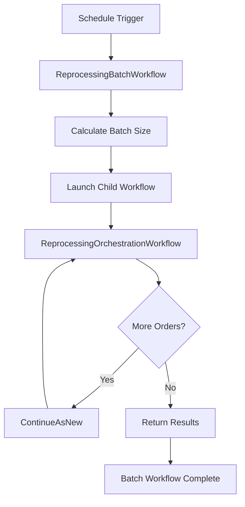

# ReprocessingBatchWorkflow

A scheduled workflow that triggers batch reprocessing of failed order workflows. Designed to be executed by Temporal Schedules for automatic retry of failed orders.

## Overview

The Reprocessing Batch Workflow is the entry point for scheduled reprocessing runs:

1. Receives trigger from Temporal Schedule
2. Launches the [ReprocessingOrchestrationWorkflow](./reprocessing-orchestration) as a child workflow
3. Returns quickly to not block the schedule
4. Reports aggregated results when orchestration completes

## Configuration

| Property | Value |
|----------|-------|
| Task Queue | `orchestrator` |
| Execution Timeout | 15 minutes |
| Child Workflow Timeout | 15 minutes |
| Retry Policy | 2 maximum attempts |

### Constants

| Constant | Default | Description |
|----------|---------|-------------|
| `ReprocessingBatchSize` | 100 | Default number of orders per batch |
| `MaxReprocessingRetries` | 5 | Max retries before DLQ |
| `ReprocessableStatuses` | Various | Order statuses eligible for retry |

## Input

```go
type ReprocessingBatchInput struct {
    // MaxOrders overrides the default batch size
    MaxOrders int `json:"maxOrders,omitempty"`
}
```

## Output

```go
type ReprocessingResult struct {
    ProcessedAt    time.Time `json:"processedAt"`
    FoundCount     int       `json:"foundCount"`     // Orders found needing reprocessing
    RestartedCount int       `json:"restartedCount"` // Orders successfully restarted
    DLQCount       int       `json:"dlqCount"`       // Orders moved to dead letter queue
    ErrorCount     int       `json:"errorCount"`     // Orders that failed to process
    SkippedCount   int       `json:"skippedCount"`   // Orders skipped (already processing)
}
```

## Workflow Flow



## Temporal Schedule Setup

```go
// Example schedule configuration
schedule := &scheduleClient.ScheduleOptions{
    ID: "reprocessing-batch-schedule",
    Spec: scheduleClient.ScheduleSpec{
        // Run every 15 minutes
        Intervals: []scheduleClient.ScheduleIntervalSpec{
            {Every: 15 * time.Minute},
        },
    },
    Action: &scheduleClient.ScheduleWorkflowAction{
        ID:        "reprocessing-batch",
        Workflow:  workflows.ReprocessingBatchWorkflow,
        TaskQueue: "orchestrator",
        Args:      []interface{}{workflows.ReprocessingBatchInput{}},
    },
}
```

## Error Handling

| Scenario | Behavior |
|----------|----------|
| Child workflow fails | Batch workflow returns error, schedule will retry |
| Query fails | Partial results returned with error count |
| Individual order fails | Counted in `ErrorCount`, processing continues |

## Usage Example

```go
// Manual trigger (typically handled by schedule)
options := client.StartWorkflowOptions{
    ID:        fmt.Sprintf("reprocessing-batch-%d", time.Now().Unix()),
    TaskQueue: "orchestrator",
}

input := workflows.ReprocessingBatchInput{
    MaxOrders: 200, // Override default batch size
}

we, err := client.ExecuteWorkflow(ctx, options, workflows.ReprocessingBatchWorkflow, input)

var result workflows.ReprocessingResult
err = we.Get(ctx, &result)

fmt.Printf("Processed: %d, Restarted: %d, DLQ: %d\n",
    result.FoundCount, result.RestartedCount, result.DLQCount)
```

## Monitoring

### Key Metrics

| Metric | Alert Threshold | Description |
|--------|-----------------|-------------|
| `dlqCount` | > 10 per run | High DLQ rate indicates systemic issues |
| `errorCount` | > 5% of found | Processing errors need investigation |
| `foundCount` | > 100 consistently | Backlog building up |

### Dashboard Queries

```sql
-- Orders reprocessed per day
SELECT date_trunc('day', processed_at),
       SUM(restarted_count) as restarted,
       SUM(dlq_count) as sent_to_dlq
FROM reprocessing_results
GROUP BY 1
ORDER BY 1 DESC;
```

## Related Documentation

- [Reprocessing Orchestration Workflow](./reprocessing-orchestration) - Actual processing logic
- [Order Fulfillment Workflow](./order-fulfillment) - Main order workflow that may fail
- [Reprocessing Activities](../activities/reprocessing-activities) - Activity implementations
- [Dead Letter Queue API](/api/order-service/dead-letter-queue) - DLQ management
