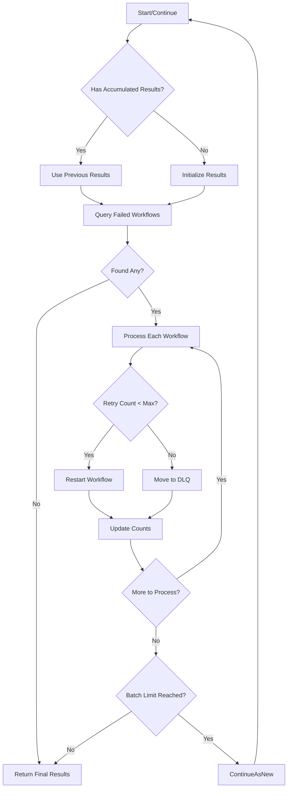
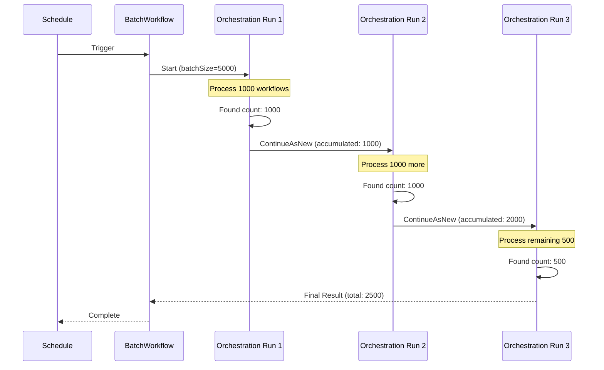
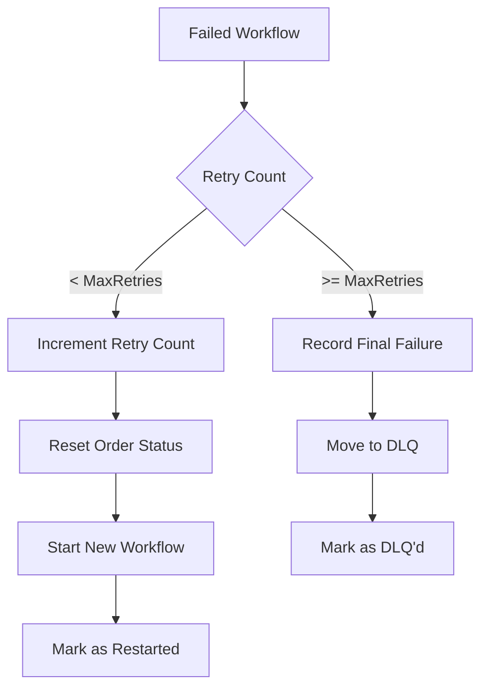

# ReprocessingOrchestrationWorkflow

Orchestrates the actual reprocessing of failed order workflows, handling large batches through Temporal's ContinueAsNew pattern to avoid hitting event history limits.

## Overview

The Reprocessing Orchestration Workflow:

1. Queries for failed workflows that need reprocessing
2. Processes each failed workflow (restart or move to DLQ)
3. Uses ContinueAsNew to handle large batches safely
4. Accumulates results across continuations

## Configuration

| Property | Value |
|----------|-------|
| Task Queue | `orchestrator` |
| Activity Timeout | 2-3 minutes |
| Max Workflows Per Continuation | 1000 |
| Retry Policy | 3 maximum attempts |

### Versioning

```go
// Current version
ReprocessingOrchestrationWorkflowVersion = 1
// Version 1: Added ContinueAsNew support for large batches
```

## Input

```go
type ReprocessingOrchestrationInput struct {
    FailureStatuses   []string            `json:"failureStatuses"`   // Statuses to query
    MaxRetries        int                 `json:"maxRetries"`        // Max retries before DLQ
    BatchSize         int                 `json:"batchSize"`         // Orders to process
    AccumulatedResult *ReprocessingResult `json:"accumulatedResult"` // Results from previous run
    ContinuationCount int                 `json:"continuationCount"` // Continuation tracking
}
```

## Output

```go
type ReprocessingResult struct {
    ProcessedAt    time.Time `json:"processedAt"`
    FoundCount     int       `json:"foundCount"`
    RestartedCount int       `json:"restartedCount"`
    DLQCount       int       `json:"dlqCount"`
    ErrorCount     int       `json:"errorCount"`
    SkippedCount   int       `json:"skippedCount"`
}
```

## Workflow Steps

### Processing Flow



### ContinueAsNew Pattern



## Decision Logic

### Restart vs DLQ Decision



## Activities Used

| Activity | Purpose |
|----------|---------|
| `QueryFailedWorkflows` | Queries order service for failed workflows |
| `ProcessFailedWorkflow` | Restarts workflow or moves to DLQ |
| `IncrementRetryCount` | Updates retry metadata |
| `ResetOrderStatus` | Resets order for re-processing |
| `MoveToDLQ` | Moves order to dead letter queue |

### QueryFailedWorkflows Input

```go
type QueryFailedWorkflowsInput struct {
    FailureStatuses []string `json:"failureStatuses"` // e.g., ["picking_failed", "packing_failed"]
    MaxRetries      int      `json:"maxRetries"`      // Only return orders below this retry count
    Limit           int      `json:"limit"`           // Max orders to return
}
```

### ProcessFailedWorkflow Result

```go
type ProcessWorkflowResult struct {
    OrderID       string `json:"orderId"`
    Restarted     bool   `json:"restarted"`
    MovedToDLQ    bool   `json:"movedToDlq"`
    NewWorkflowID string `json:"newWorkflowId,omitempty"`
    Error         string `json:"error,omitempty"`
}
```

## Error Handling

| Error Type | Behavior |
|------------|----------|
| Query failure | Workflow fails, returns partial results |
| Individual processing failure | Counted in `ErrorCount`, continues with next |
| Activity timeout | Retried up to 3 times |

## ContinueAsNew Safety

The workflow implements ContinueAsNew to prevent hitting Temporal's 50K event history limit:

- **Max 1000 workflows per continuation**: Keeps event count manageable
- **Accumulated results preserved**: State carried across continuations
- **Continuation tracking**: Monitors how many times workflow has continued

```go
// Check if we should continue processing more workflows
if currentBatchCount >= queryLimit {
    return result, workflow.NewContinueAsNewError(ctx, ReprocessingOrchestrationWorkflow,
        ReprocessingOrchestrationInput{
            FailureStatuses:   input.FailureStatuses,
            MaxRetries:        input.MaxRetries,
            BatchSize:         input.BatchSize,
            AccumulatedResult: result,
            ContinuationCount: input.ContinuationCount + 1,
        })
}
```

## Usage Example

```go
// Usually called as child workflow from ReprocessingBatchWorkflow
// Can be called directly for testing:
options := client.StartWorkflowOptions{
    ID:        fmt.Sprintf("reprocessing-orchestration-%d", time.Now().Unix()),
    TaskQueue: "orchestrator",
}

input := workflows.ReprocessingOrchestrationInput{
    FailureStatuses: []string{"picking_failed", "packing_failed", "shipping_failed"},
    MaxRetries:      5,
    BatchSize:       500,
}

we, err := client.ExecuteWorkflow(ctx, options, workflows.ReprocessingOrchestrationWorkflow, input)

var result workflows.ReprocessingResult
err = we.Get(ctx, &result)
```

## Related Documentation

- [Reprocessing Batch Workflow](./reprocessing-batch) - Parent scheduled workflow
- [Reprocessing Activities](../activities/reprocessing-activities) - Activity implementations
- [Order Service - Reprocessing API](/api/rest-api#reprocessing-api) - REST endpoints
- [Dead Letter Queue API](/api/rest-api#dead-letter-queue-api) - DLQ management
