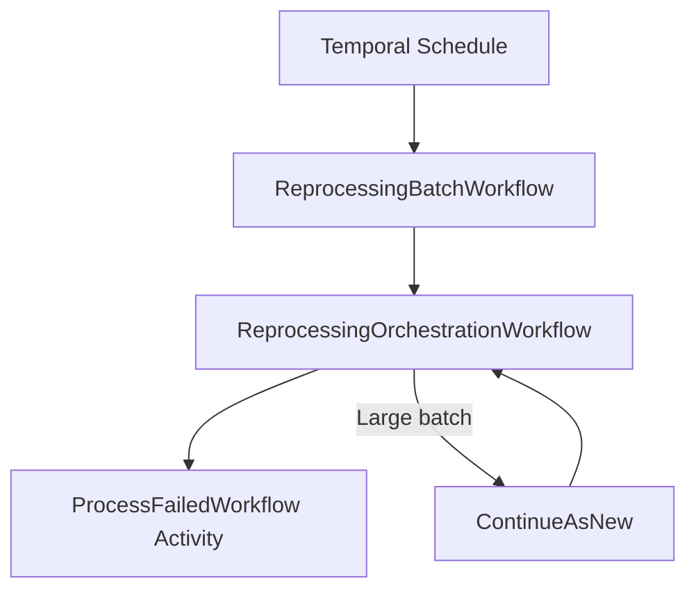
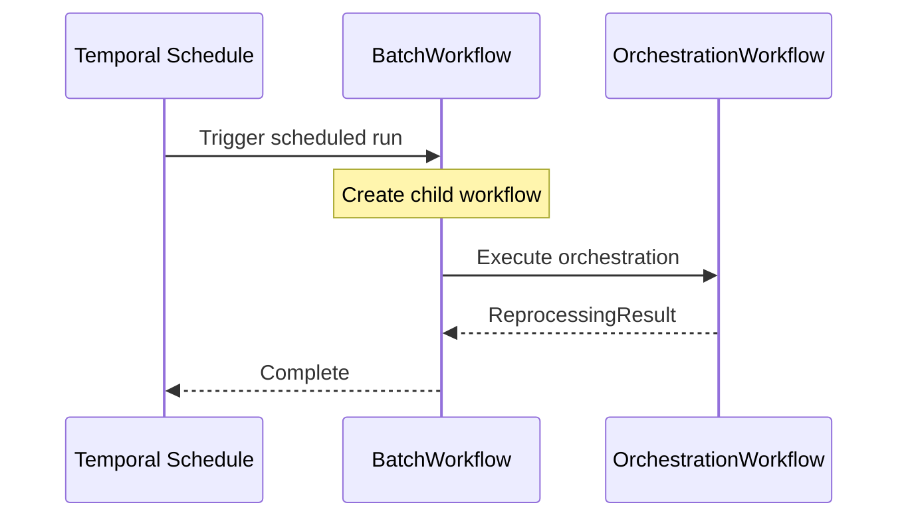
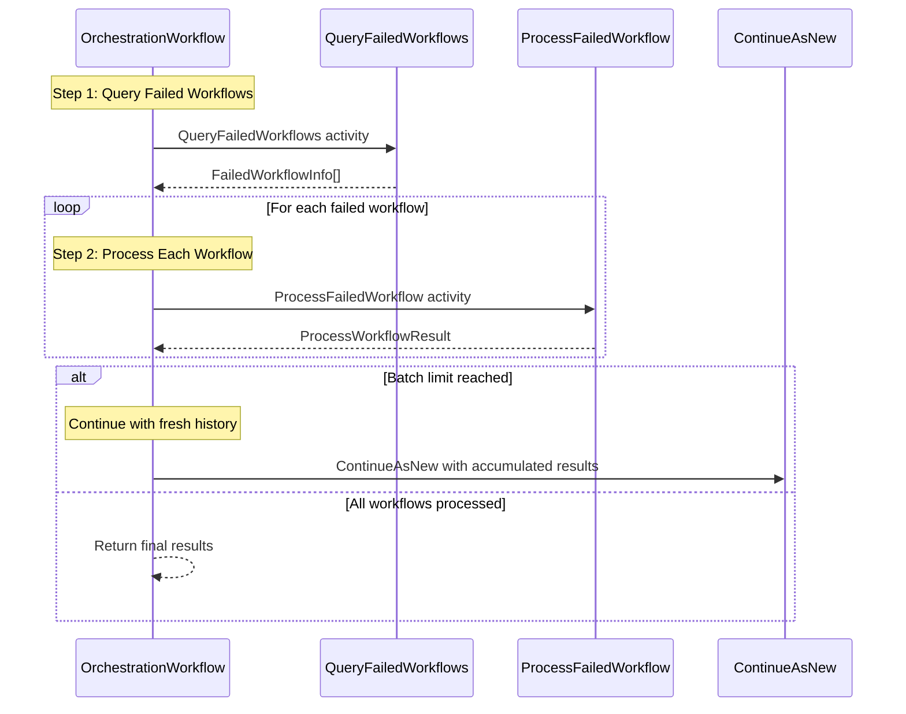
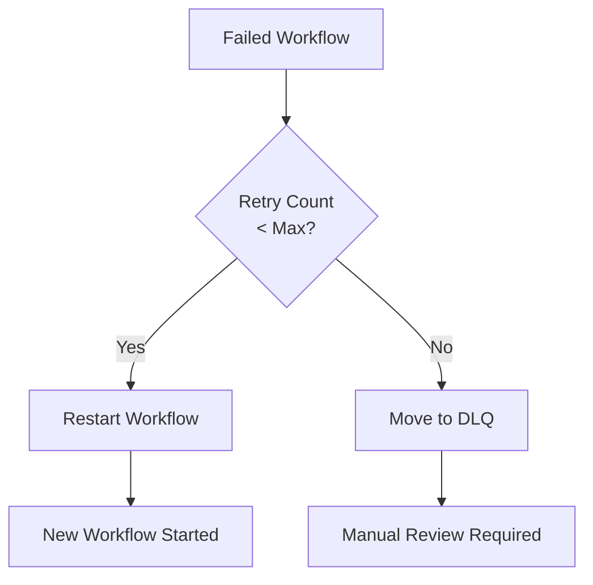

# ReprocessingWorkflow

Scheduled workflow that automatically reprocesses failed order fulfillment workflows.

## Overview

The Reprocessing Workflows handle:
1. Querying for failed workflows that need reprocessing
2. Evaluating retry eligibility based on retry count
3. Restarting workflows or moving to DLQ (Dead Letter Queue)
4. Supporting large batch processing via ContinueAsNew

## Configuration

| Property | Value |
|----------|-------|
| Task Queue | `orchestrator` |
| Execution Timeout | 15 minutes |
| Max Retries | Configurable (default in constants) |
| Batch Size | Configurable (default in constants) |
| Max per Continuation | 1000 workflows |

## Reprocessing Batch Input

```go
// ReprocessingBatchInput is the input for the batch workflow
type ReprocessingBatchInput struct {
    // MaxOrders overrides the default batch size
    MaxOrders int `json:"maxOrders,omitempty"`
}
```

## Reprocessing Result

```go
// ReprocessingResult contains the results of a reprocessing batch run
type ReprocessingResult struct {
    ProcessedAt    time.Time `json:"processedAt"`
    FoundCount     int       `json:"foundCount"`
    RestartedCount int       `json:"restartedCount"`
    DLQCount       int       `json:"dlqCount"`
    ErrorCount     int       `json:"errorCount"`
    SkippedCount   int       `json:"skippedCount"`
}
```

## Workflow Hierarchy



## ReprocessingBatchWorkflow

Scheduled entry point that delegates to the orchestration workflow.



## ReprocessingOrchestrationWorkflow

Main orchestration logic with ContinueAsNew support.

```go
// ReprocessingOrchestrationInput is the input for the orchestration workflow
type ReprocessingOrchestrationInput struct {
    FailureStatuses []string `json:"failureStatuses"`
    MaxRetries      int      `json:"maxRetries"`
    BatchSize       int      `json:"batchSize"`
    // ContinueAsNew support
    AccumulatedResult *ReprocessingResult `json:"accumulatedResult,omitempty"`
    ContinuationCount int                 `json:"continuationCount,omitempty"`
}
```

### Workflow Steps



## Failed Workflow Info

```go
// FailedWorkflowInfo contains information about a failed workflow
type FailedWorkflowInfo struct {
    OrderID       string    `json:"orderId"`
    WorkflowID    string    `json:"workflowId"`
    RunID         string    `json:"runId"`
    FailureStatus string    `json:"failureStatus"`
    FailureReason string    `json:"failureReason"`
    FailedAt      time.Time `json:"failedAt"`
    RetryCount    int       `json:"retryCount"`
    CustomerID    string    `json:"customerId"`
    Priority      string    `json:"priority"`
}
```

## Process Workflow Result

```go
// ProcessWorkflowResult contains the result of processing a single failed workflow
type ProcessWorkflowResult struct {
    OrderID       string `json:"orderId"`
    Restarted     bool   `json:"restarted"`
    MovedToDLQ    bool   `json:"movedToDlq"`
    NewWorkflowID string `json:"newWorkflowId,omitempty"`
    Error         string `json:"error,omitempty"`
}
```

## Activities Used

| Activity | Purpose | On Failure |
|----------|---------|------------|
| `QueryFailedWorkflows` | Finds failed workflows eligible for retry | Return error |
| `ProcessFailedWorkflow` | Restarts or DLQs a workflow | Log warning, continue |

## Reprocessable Statuses

Workflows are eligible for reprocessing if they have these statuses:

```go
// Example reprocessable statuses
var ReprocessableStatuses = []string{
    "validation_failed",
    "planning_failed",
    "wes_execution_failed",
    "slam_failed",
    "sortation_failed",
    "shipping_failed",
}
```

## Retry Decision Logic



## ContinueAsNew Pattern

For large batches, the workflow uses ContinueAsNew to avoid hitting the 50K event history limit:

```go
const maxWorkflowsPerContinuation = 1000

// When batch limit reached
if currentBatchCount >= queryLimit {
    return result, workflow.NewContinueAsNewError(ctx,
        ReprocessingOrchestrationWorkflow,
        ReprocessingOrchestrationInput{
            FailureStatuses:   input.FailureStatuses,
            MaxRetries:        input.MaxRetries,
            BatchSize:         input.BatchSize,
            AccumulatedResult: result,  // Carry forward results
            ContinuationCount: input.ContinuationCount + 1,
        })
}
```

## Workflow Versioning

```go
// Version tracking for safe deployments
version := workflow.GetVersion(ctx, "ReprocessingOrchestrationWorkflow",
    workflow.DefaultVersion, ReprocessingOrchestrationWorkflowVersion)
```

## Scheduling

The ReprocessingBatchWorkflow is designed to run on a Temporal Schedule:

```go
// Example schedule configuration
schedule := &schedpb.Schedule{
    Spec: &schedpb.ScheduleSpec{
        CronString: "*/15 * * * *", // Every 15 minutes
    },
    Action: &schedpb.ScheduleAction{
        StartWorkflow: &workflowpb.NewWorkflowExecutionInfo{
            WorkflowId:   "reprocessing-scheduled",
            WorkflowType: &common.WorkflowType{Name: "ReprocessingBatchWorkflow"},
            TaskQueue:    &taskqueuepb.TaskQueue{Name: "orchestrator"},
            Input:        nil, // Uses default batch size
        },
    },
}
```

## Result Interpretation

| Metric | Description |
|--------|-------------|
| `FoundCount` | Total failed workflows found |
| `RestartedCount` | Workflows successfully restarted |
| `DLQCount` | Workflows moved to DLQ (max retries exceeded) |
| `ErrorCount` | Workflows that failed to process |
| `SkippedCount` | Workflows skipped for other reasons |

## Usage Example

```go
// Manual trigger (for testing or one-off runs)
options := client.StartWorkflowOptions{
    ID:                       "reprocessing-manual-run",
    TaskQueue:                "orchestrator",
    WorkflowExecutionTimeout: 15 * time.Minute,
}

input := ReprocessingBatchInput{
    MaxOrders: 100, // Process up to 100 orders
}

we, err := client.ExecuteWorkflow(ctx, options, ReprocessingBatchWorkflow, input)

var result ReprocessingResult
err = we.Get(ctx, &result)
```

## Related Documentation

- [Order Fulfillment Workflow](./order-fulfillment) - Workflows being reprocessed
- [Retry Policies](../retry-policies) - Retry configuration
- [Signals & Queries](../signals-queries) - Signal reference
