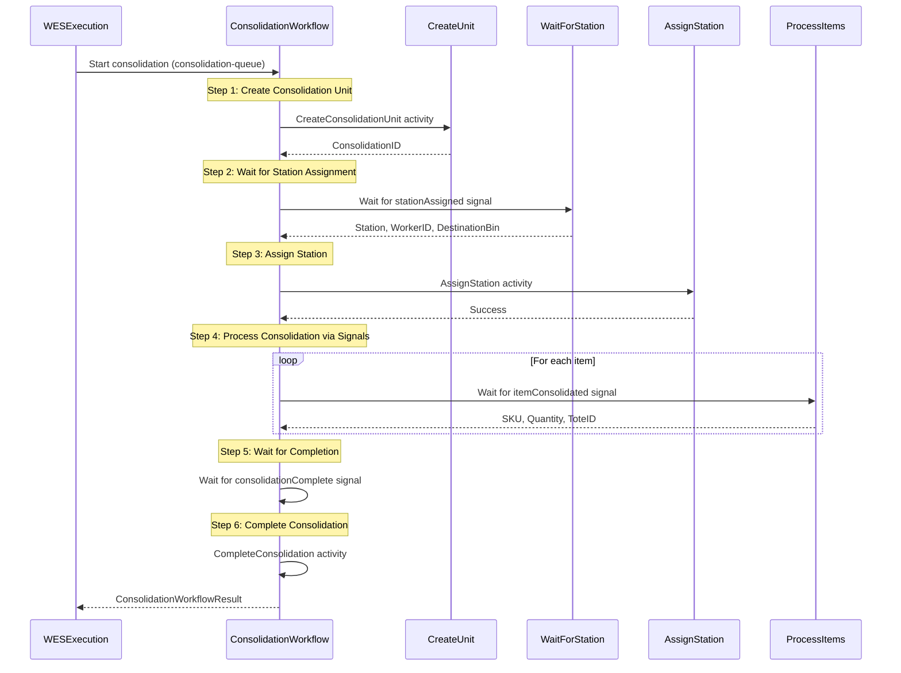
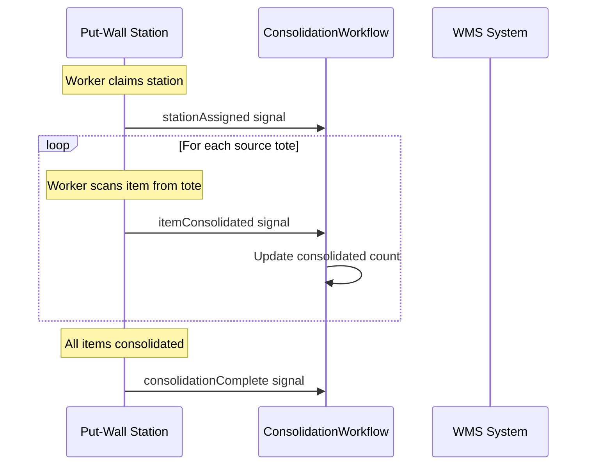
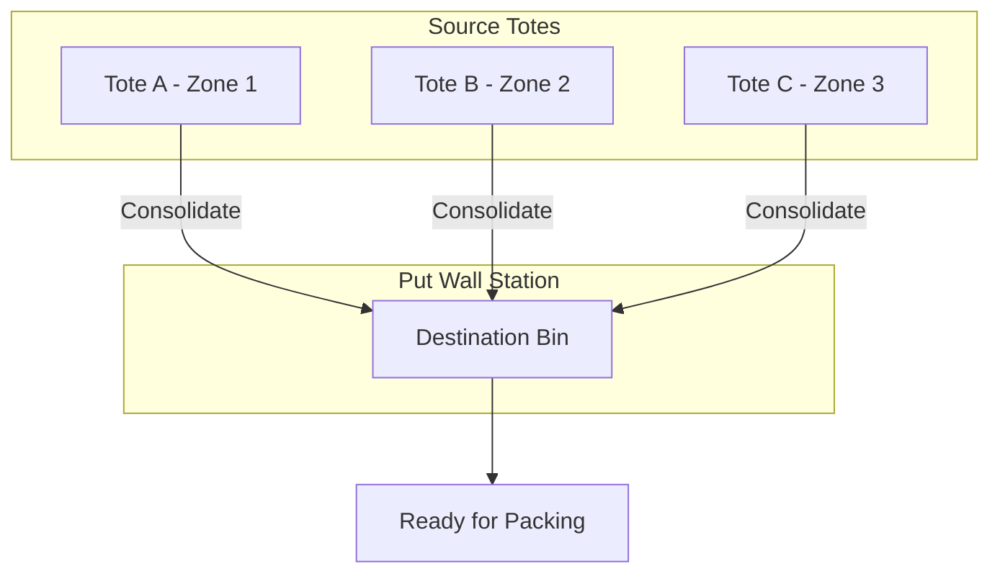

# Consolidation Service - ConsolidationWorkflow

Service-level workflow that handles item consolidation with signal-based progress tracking.

## Overview

The Consolidation Service's ConsolidationWorkflow provides:
1. Signal-based station assignment
2. Real-time consolidation progress via signals
3. Destination bin management
4. Multi-tote consolidation support

## Configuration

| Property | Value |
|----------|-------|
| Task Queue | `consolidation-queue` |
| Execution Timeout | 4 hours |
| Activity Timeout | 10 minutes |
| Heartbeat Timeout | 30 seconds |
| Consolidation Timeout | 1 hour |

## Input

```go
// ConsolidationWorkflowInput represents the input for the consolidation workflow
type ConsolidationWorkflowInput struct {
    OrderID     string       `json:"orderId"`
    PickedItems []PickedItem `json:"pickedItems"`
}

// PickedItem represents a picked item from the picking workflow
type PickedItem struct {
    SKU        string `json:"sku"`
    Quantity   int    `json:"quantity"`
    LocationID string `json:"locationId"`
    ToteID     string `json:"toteId"`
}
```

## Output

```go
// ConsolidationWorkflowResult represents the result of the consolidation workflow
type ConsolidationWorkflowResult struct {
    ConsolidationID   string `json:"consolidationId"`
    DestinationBin    string `json:"destinationBin"`
    TotalConsolidated int    `json:"totalConsolidated"`
    Success           bool   `json:"success"`
    Error             string `json:"error,omitempty"`
}
```

## Workflow Steps



## Signals

| Signal | Payload | Timeout | Purpose |
|--------|---------|---------|---------|
| `stationAssigned` | `StationInfo` | 15 minutes | Station claims the work |
| `itemConsolidated` | `ConsolidatedItem` | - | Item moved to destination |
| `consolidationComplete` | `CompletionInfo` | - | All items consolidated |

### Signal Payloads

```go
// StationInfo signal payload
type StationInfo struct {
    Station        string `json:"station"`
    WorkerID       string `json:"workerId"`
    DestinationBin string `json:"destinationBin"`
}

// ConsolidatedItem signal payload
type ConsolidatedItem struct {
    SKU      string `json:"sku"`
    Quantity int    `json:"quantity"`
    ToteID   string `json:"toteId"`  // Source tote
}

// CompletionInfo signal payload
type CompletionInfo struct {
    Success           bool `json:"success"`
    TotalConsolidated int  `json:"totalConsolidated"`
}
```

## Signal Flow



## Activities Used

| Activity | Purpose | On Failure |
|----------|---------|------------|
| `CreateConsolidationUnit` | Creates consolidation unit | Return error |
| `AssignStation` | Records station assignment | Log warning |
| `CompleteConsolidation` | Marks consolidation complete | Log warning |

## Consolidation Flow



## Error Handling

| Scenario | Handling |
|----------|----------|
| Unit creation fails | Return error |
| Station assignment timeout (15 min) | Return timeout error |
| Consolidation timeout (1 hour) | Set error, complete workflow |

## Success Criteria

Consolidation is considered successful when:
- `TotalConsolidated > 0` (at least one item consolidated)

```go
result.Success = totalConsolidated > 0
```

## Usage Example

```go
// Called as child workflow from WES service
childWorkflowOptions := workflow.ChildWorkflowOptions{
    TaskQueue: "consolidation-queue",
    RetryPolicy: &temporal.RetryPolicy{
        MaximumAttempts: 3,
    },
}
childCtx := workflow.WithChildOptions(ctx, childWorkflowOptions)

input := map[string]interface{}{
    "orderId":     "ORD-123",
    "pickedItems": pickedItems,
}

var result ConsolidationWorkflowResult
err := workflow.ExecuteChildWorkflow(childCtx, "ConsolidationWorkflow", input).Get(ctx, &result)
```

## Related Documentation

- [Orchestrator Consolidation Workflow](./consolidation) - Orchestrator version
- [WES Service Workflow](./service-wes) - Parent workflow
- [Consolidation Activities](../activities/consolidation-activities) - Activity details
