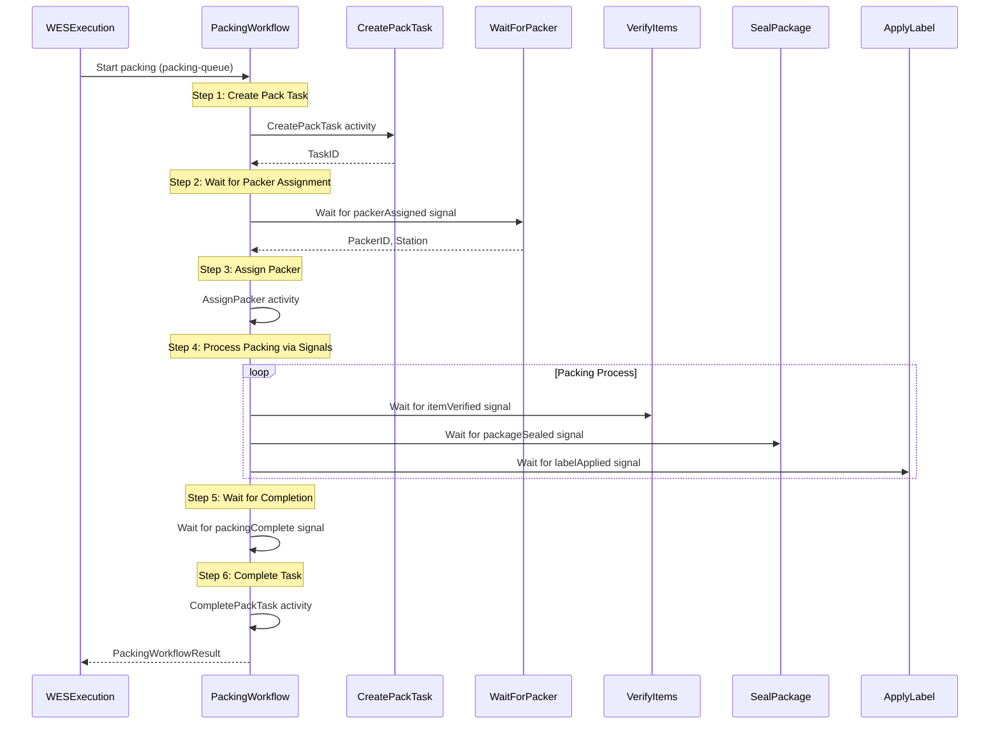
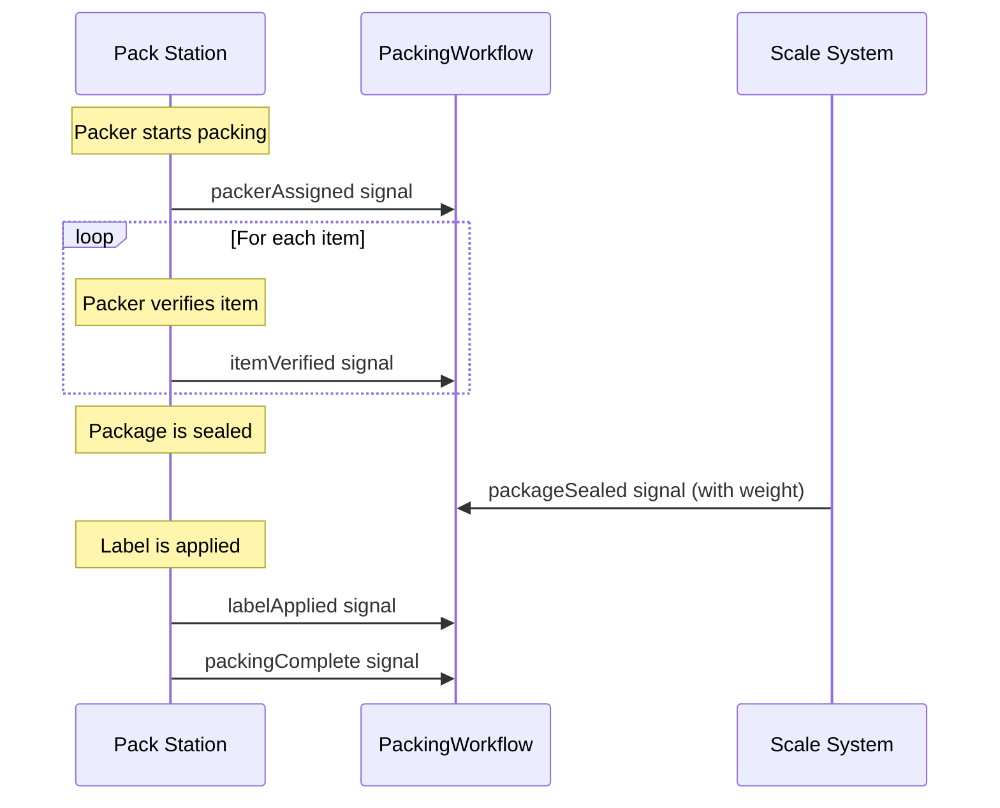

# Packing Service - PackingWorkflow

Service-level workflow that handles the packing process with signal-based progress tracking.

## Overview

The Packing Service's PackingWorkflow provides:
1. Signal-based packer assignment
2. Real-time packing progress via signals (verify, seal, label)
3. Automatic task lifecycle management
4. Package and tracking number generation

## Configuration

| Property | Value |
|----------|-------|
| Task Queue | `packing-queue` |
| Execution Timeout | 4 hours |
| Activity Timeout | 10 minutes |
| Heartbeat Timeout | 30 seconds |
| Packing Timeout | 1 hour |

## Input

```go
// PackingWorkflowInput represents the input for the packing workflow
type PackingWorkflowInput struct {
    OrderID string `json:"orderId"`
}
```

## Output

```go
// PackingWorkflowResult represents the result of the packing workflow
type PackingWorkflowResult struct {
    PackageID      string  `json:"packageId"`
    TrackingNumber string  `json:"trackingNumber"`
    Carrier        string  `json:"carrier"`
    Weight         float64 `json:"weight"`
    Success        bool    `json:"success"`
    Error          string  `json:"error,omitempty"`
}
```

## Workflow Steps



## Signals

| Signal | Payload | Purpose |
|--------|---------|---------|
| `packerAssigned` | `PackerInfo` | Packer claims the task |
| `itemVerified` | `ItemVerification` | Item verification completed |
| `packageSealed` | `PackageSealed` | Package sealed with weight |
| `labelApplied` | `LabelInfo` | Tracking label applied |
| `packingComplete` | `{Success: bool}` | All packing complete |

### Signal Payloads

```go
// PackerInfo signal payload
type PackerInfo struct {
    PackerID string `json:"packerId"`
    Station  string `json:"station"`
}

// ItemVerification signal payload
type ItemVerification struct {
    SKU      string `json:"sku"`
    Verified bool   `json:"verified"`
}

// PackageSealed signal payload
type PackageSealed struct {
    PackageID string  `json:"packageId"`
    Weight    float64 `json:"weight"`
}

// LabelInfo signal payload
type LabelInfo struct {
    TrackingNumber string `json:"trackingNumber"`
    Carrier        string `json:"carrier"`
}
```

## Signal Flow



## Activities Used

| Activity | Purpose | On Failure |
|----------|---------|------------|
| `CreatePackTask` | Creates pack task | Return error |
| `AssignPacker` | Records packer assignment | Log warning |
| `CompletePackTask` | Marks task complete | Log warning |

## Error Handling

| Scenario | Handling |
|----------|----------|
| Task creation fails | Return error |
| Packer assignment timeout (20 min) | Return timeout error |
| Packing timeout (1 hour) | Set error, complete workflow |

## Success Criteria

Packing is considered successful when:
- `TrackingNumber` is not empty (label was applied)

```go
result.Success = packageInfo.TrackingNumber != ""
```

## Usage Example

```go
// Called as child workflow from WES service
childWorkflowOptions := workflow.ChildWorkflowOptions{
    TaskQueue: "packing-queue",
    RetryPolicy: &temporal.RetryPolicy{
        MaximumAttempts: 3,
    },
}
childCtx := workflow.WithChildOptions(ctx, childWorkflowOptions)

input := map[string]interface{}{
    "orderId": "ORD-123",
}

var result PackingWorkflowResult
err := workflow.ExecuteChildWorkflow(childCtx, "PackingWorkflow", input).Get(ctx, &result)
```

## Related Documentation

- [Orchestrator Packing Workflow](./packing) - Orchestrator version
- [WES Service Workflow](./service-wes) - Parent workflow
- [Packing Activities](../activities/packing-activities) - Activity details
