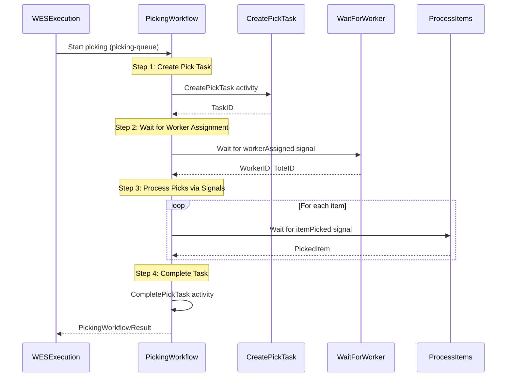
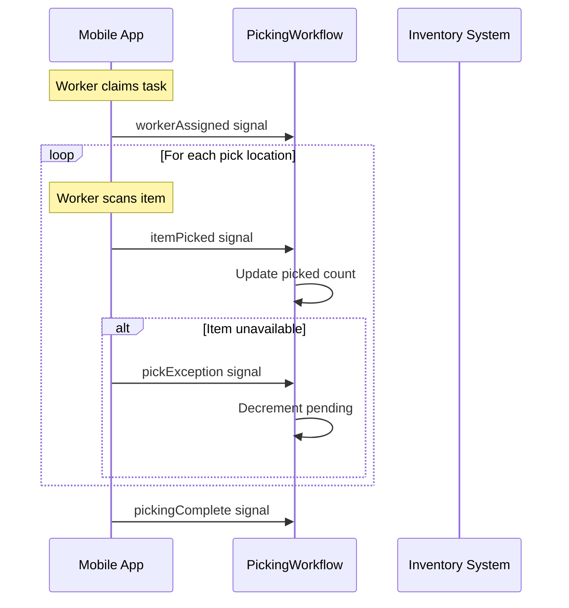

# Picking Service - PickingWorkflow

Service-level workflow that handles the picking process with signal-based worker coordination.

## Overview

The Picking Service's PickingWorkflow provides:
1. Signal-based worker assignment
2. Real-time item picking updates via signals
3. Exception handling for pick issues
4. Task lifecycle management

**Note**: This differs from the orchestrator's `OrchestratedPickingWorkflow` by focusing on service-specific operations.

## Configuration

| Property | Value |
|----------|-------|
| Task Queue | `picking-queue` |
| Execution Timeout | 4 hours |
| Activity Timeout | 10 minutes |
| Heartbeat Timeout | 30 seconds |
| Pick Timeout | 2 hours |

## Input

```go
// PickingWorkflowInput represents the input for the picking workflow
type PickingWorkflowInput struct {
    OrderID string      `json:"orderId"`
    WaveID  string      `json:"waveId"`
    Route   RouteResult `json:"route"`
}

// RouteResult represents the route from the orchestrator
type RouteResult struct {
    RouteID           string      `json:"routeId"`
    Stops             []RouteStop `json:"stops"`
    EstimatedDistance float64     `json:"estimatedDistance"`
    Strategy          string      `json:"strategy"`
}

// RouteStop represents a stop in the pick route
type RouteStop struct {
    LocationID string `json:"locationId"`
    SKU        string `json:"sku"`
    Quantity   int    `json:"quantity"`
}
```

## Output

```go
// PickingWorkflowResult represents the result of the picking workflow
type PickingWorkflowResult struct {
    TaskID      string       `json:"taskId"`
    PickedItems []PickedItem `json:"pickedItems"`
    Success     bool         `json:"success"`
    Error       string       `json:"error,omitempty"`
}

// PickedItem represents a picked item
type PickedItem struct {
    SKU        string `json:"sku"`
    Quantity   int    `json:"quantity"`
    LocationID string `json:"locationId"`
    ToteID     string `json:"toteId"`
}
```

## Workflow Steps



## Signals

| Signal | Payload | Timeout | Purpose |
|--------|---------|---------|---------|
| `workerAssigned` | `WorkerAssignment` | 30 minutes | Worker claims the task |
| `itemPicked` | `PickedItem` | - | Item pick confirmation |
| `pickingComplete` | `{Success: bool}` | - | All items picked |
| `pickException` | `PickException` | - | Item pick failed |

### Signal Payloads

```go
// WorkerAssignment signal payload
type WorkerAssignment struct {
    WorkerID string `json:"workerId"`
    ToteID   string `json:"toteId"`
}

// PickException signal payload
type PickException struct {
    SKU       string `json:"sku"`
    Reason    string `json:"reason"`   // not_found, damaged, quantity_mismatch
    Available int    `json:"available"`
}
```

## Signal Flow



## Activities Used

| Activity | Purpose | On Failure |
|----------|---------|------------|
| `CreatePickTask` | Creates task with route details | Return error |
| `CompletePickTask` | Marks task complete | Log warning |

## Error Handling

| Scenario | Handling |
|----------|----------|
| Task creation fails | Return error |
| Worker assignment timeout (30 min) | Return timeout error |
| Pick timeout (2 hours) | Complete with picked items |
| Exception signal received | Log warning, continue |

## Typed Input Benefits

The workflow uses typed struct input for:
- Type safety at compile time
- Better IDE support
- Clearer API contracts
- Determinism in Temporal replays

```go
// Good: Typed struct input
func PickingWorkflow(ctx workflow.Context, input PickingWorkflowInput) (*PickingWorkflowResult, error)

// Avoid: Map input
func PickingWorkflow(ctx workflow.Context, input map[string]interface{}) (*PickingWorkflowResult, error)
```

## Usage Example

```go
// Called as child workflow from WES service
childWorkflowOptions := workflow.ChildWorkflowOptions{
    TaskQueue: "picking-queue",
    RetryPolicy: &temporal.RetryPolicy{
        MaximumAttempts: 3,
    },
}
childCtx := workflow.WithChildOptions(ctx, childWorkflowOptions)

input := PickingWorkflowInput{
    OrderID: "ORD-123",
    WaveID:  "WAVE-001",
    Route: RouteResult{
        RouteID: "ROUTE-001",
        Stops:   stops,
    },
}

var result PickingWorkflowResult
err := workflow.ExecuteChildWorkflow(childCtx, "PickingWorkflow", input).Get(ctx, &result)
```

## Related Documentation

- [Orchestrator Picking Workflow](./picking) - Orchestrator version
- [WES Service Workflow](./service-wes) - Parent workflow
- [Picking Activities](../activities/picking-activities) - Activity details
