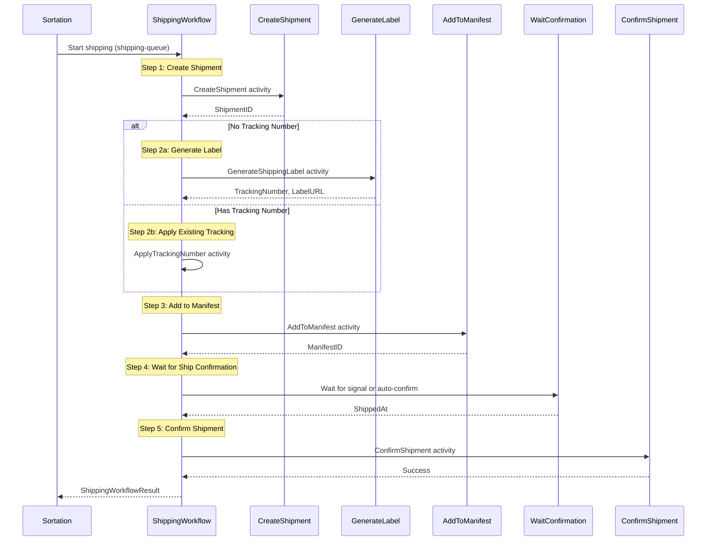
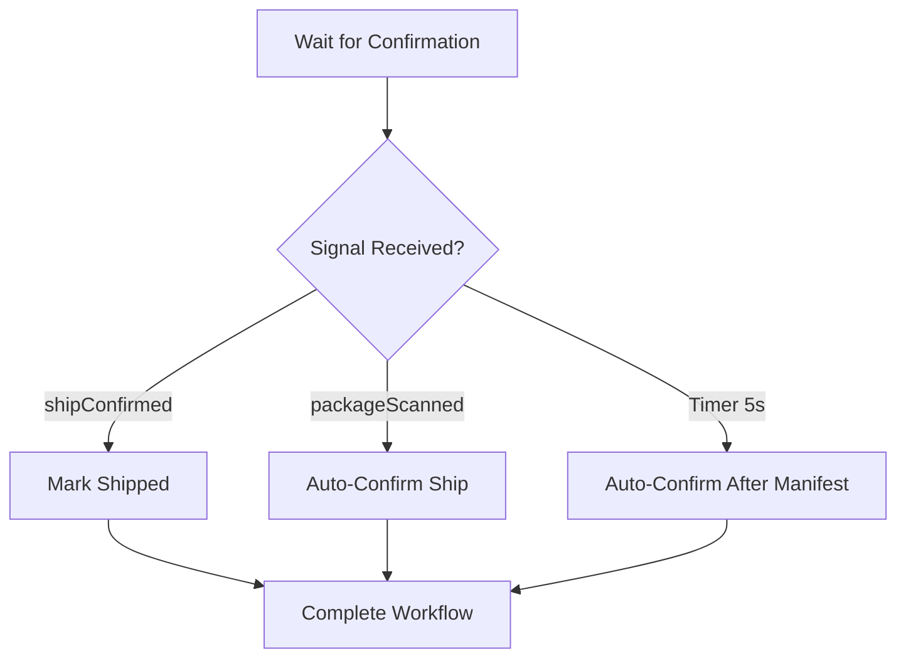

# Shipping Service - ShippingWorkflow

Service-level workflow that handles the SLAM (Scan, Label, Apply, Manifest) and shipping process.

## Overview

The Shipping Service's ShippingWorkflow provides:
1. Shipment record creation
2. Label generation (if not already done)
3. Manifest addition
4. Ship confirmation via signal or auto-confirm

## Configuration

| Property | Value |
|----------|-------|
| Task Queue | `shipping-queue` |
| Execution Timeout | 4 hours |
| Activity Timeout | 10 minutes |
| Heartbeat Timeout | 30 seconds |

## Input

```go
// ShippingWorkflowInput represents the input for the shipping workflow
type ShippingWorkflowInput struct {
    OrderID        string `json:"orderId"`
    PackageID      string `json:"packageId"`
    TrackingNumber string `json:"trackingNumber"`
    Carrier        string `json:"carrier"`
}
```

## Output

```go
// ShippingWorkflowResult represents the result of the shipping workflow
type ShippingWorkflowResult struct {
    ShipmentID     string     `json:"shipmentId"`
    TrackingNumber string     `json:"trackingNumber"`
    ManifestID     string     `json:"manifestId,omitempty"`
    ShippedAt      *time.Time `json:"shippedAt,omitempty"`
    Success        bool       `json:"success"`
    Error          string     `json:"error,omitempty"`
}
```

## Workflow Steps



## Signals

| Signal | Payload | Purpose |
|--------|---------|---------|
| `shipConfirmed` | `ShipConfirmation` | Manual ship confirmation |
| `packageScanned` | `PackageScan` | Auto-confirms ship on carrier scan |

### Signal Payloads

```go
// ShipConfirmation signal payload
type ShipConfirmation struct {
    ShippedAt         time.Time  `json:"shippedAt"`
    EstimatedDelivery *time.Time `json:"estimatedDelivery,omitempty"`
}

// PackageScan signal payload
type PackageScan struct {
    Location  string    `json:"location"`
    ScannedAt time.Time `json:"scannedAt"`
}
```

## Ship Confirmation Flow



**Auto-Confirm Behavior**: In a typical SLAM workflow, the shipment is auto-confirmed 5 seconds after manifesting. In production, this would typically wait for carrier pickup confirmation.

## Activities Used

| Activity | Purpose | On Failure |
|----------|---------|------------|
| `CreateShipment` | Creates shipment record | Return error |
| `GenerateShippingLabel` | Generates label if needed | Return error |
| `ApplyTrackingNumber` | Applies existing tracking | Log warning |
| `AddToManifest` | Adds to carrier manifest | Log warning, continue |
| `ConfirmShipment` | Confirms final shipment | Log warning |

## Label Generation

If no tracking number is provided, the workflow generates one:

```go
if trackingNumber == "" {
    var labelInfo struct {
        TrackingNumber string `json:"trackingNumber"`
        LabelURL       string `json:"labelUrl"`
    }
    err = workflow.ExecuteActivity(ctx, "GenerateShippingLabel", shipmentID).Get(ctx, &labelInfo)
    result.TrackingNumber = labelInfo.TrackingNumber
}
```

## Error Handling

| Scenario | Handling |
|----------|----------|
| Shipment creation fails | Return error |
| Label generation fails | Return error |
| Manifest addition fails | Log warning, continue |
| Ship confirmation timeout | Return timeout error |
| Confirm shipment fails | Log warning (shipment still valid) |

## Usage Example

```go
// Called as child workflow from sortation or order fulfillment
childWorkflowOptions := workflow.ChildWorkflowOptions{
    TaskQueue: "shipping-queue",
    RetryPolicy: &temporal.RetryPolicy{
        MaximumAttempts: 3,
    },
}
childCtx := workflow.WithChildOptions(ctx, childWorkflowOptions)

input := map[string]interface{}{
    "orderId":        "ORD-123",
    "packageId":      "PKG-001",
    "trackingNumber": "1Z999AA10123456784",
    "carrier":        "UPS",
}

var result ShippingWorkflowResult
err := workflow.ExecuteChildWorkflow(childCtx, "ShippingWorkflow", input).Get(ctx, &result)
```

## Related Documentation

- [Orchestrator Shipping Workflow](./shipping) - Orchestrator version
- [Sortation Workflow](./sortation) - Previous step
- [Shipping Activities](../activities/shipping-activities) - Activity details
