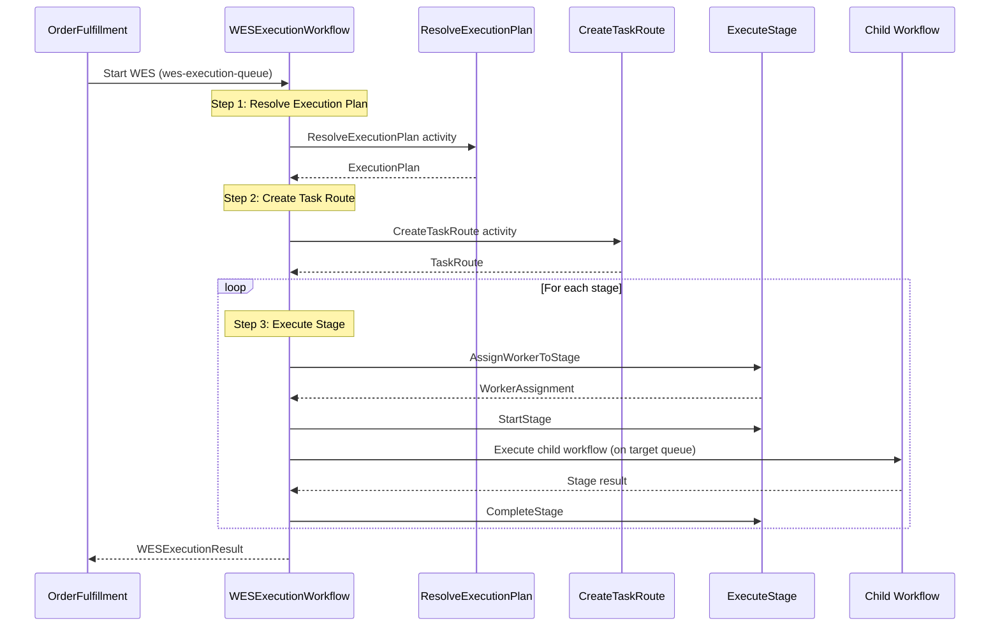
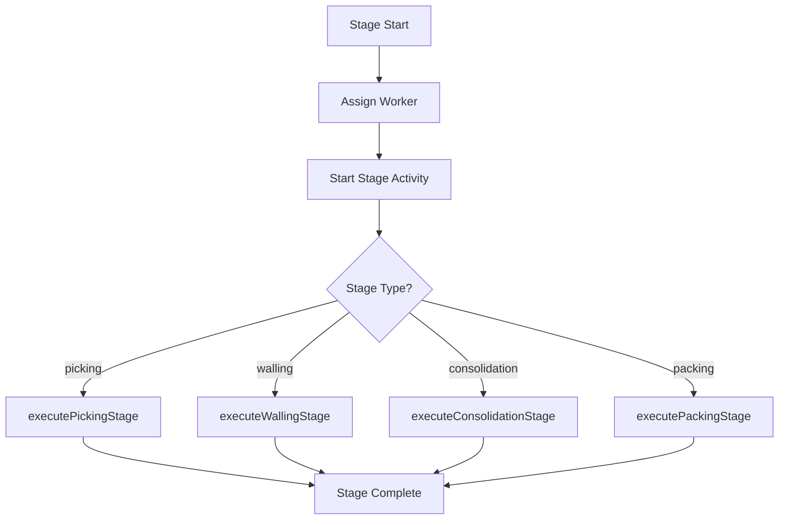

# WES Service - WESExecutionWorkflow

Main execution workflow that orchestrates order processing through stages via cross-queue child workflows.

## Overview

The WES (Warehouse Execution System) Service's WESExecutionWorkflow provides:
1. Dynamic execution plan resolution
2. Task route creation and tracking
3. Stage-by-stage execution with worker assignment
4. Cross-queue child workflow coordination

## Configuration

| Property | Value |
|----------|-------|
| Task Queue | `wes-execution-queue` |
| Execution Timeout | 4 hours |
| Activity Timeout | 5 minutes (default), stage-specific |
| Stage Default Timeout | 30 minutes |

## Task Queue Constants

```go
const (
    PickingTaskQueue       = "orchestrator-queue" // OrchestratedPickingWorkflow
    ConsolidationTaskQueue = "consolidation-queue"
    PackingTaskQueue       = "packing-queue"
)
```

## Input

```go
// WESExecutionInput represents the input for the WES execution workflow
type WESExecutionInput struct {
    OrderID         string     `json:"orderId"`
    WaveID          string     `json:"waveId"`
    Items           []ItemInfo `json:"items"`
    MultiZone       bool       `json:"multiZone"`
    ProcessPathID   string     `json:"processPathId,omitempty"`
    SpecialHandling []string   `json:"specialHandling,omitempty"`
}

// ItemInfo represents an item in the order
type ItemInfo struct {
    SKU        string `json:"sku"`
    Quantity   int    `json:"quantity"`
    LocationID string `json:"locationId,omitempty"`
    Zone       string `json:"zone,omitempty"`
}
```

## Output

```go
// WESExecutionResult represents the result of the WES execution workflow
type WESExecutionResult struct {
    RouteID         string       `json:"routeId"`
    OrderID         string       `json:"orderId"`
    Status          string       `json:"status"`          // in_progress, completed, failed
    PathType        string       `json:"pathType"`        // pick_pack, pick_wall_pack
    StagesCompleted int          `json:"stagesCompleted"`
    TotalStages     int          `json:"totalStages"`
    PickResult      *StageResult `json:"pickResult,omitempty"`
    WallingResult   *StageResult `json:"wallingResult,omitempty"`
    PackingResult   *StageResult `json:"packingResult,omitempty"`
    CompletedAt     int64        `json:"completedAt,omitempty"`
    Error           string       `json:"error,omitempty"`
}

// StageResult represents the result of a stage execution
type StageResult struct {
    StageType   string `json:"stageType"`   // picking, walling, packing
    TaskID      string `json:"taskId"`
    WorkerID    string `json:"workerId"`
    Success     bool   `json:"success"`
    CompletedAt int64  `json:"completedAt,omitempty"`
    Error       string `json:"error,omitempty"`
}
```

## Workflow Steps



## Execution Plan

```go
// ExecutionPlan represents the resolved execution plan
type ExecutionPlan struct {
    TemplateID      string            `json:"templateId"`
    PathType        string            `json:"pathType"`        // pick_pack, pick_wall_pack
    Stages          []StageDefinition `json:"stages"`
    SpecialHandling []string          `json:"specialHandling"`
    ProcessPathID   string            `json:"processPathId"`
}

// StageDefinition represents a stage in the execution plan
type StageDefinition struct {
    Order       int         `json:"order"`
    StageType   string      `json:"stageType"`   // picking, walling, consolidation, packing
    TaskType    string      `json:"taskType"`
    Required    bool        `json:"required"`
    TimeoutMins int         `json:"timeoutMins"`
    Config      StageConfig `json:"config,omitempty"`
}

// StageConfig represents stage-specific configuration
type StageConfig struct {
    RequiresPutWall bool   `json:"requiresPutWall,omitempty"`
    PutWallZone     string `json:"putWallZone,omitempty"`
    StationID       string `json:"stationId,omitempty"`
}
```

## Stage Execution

Each stage is executed via `executeStage()`:



## Cross-Queue Workflow Execution

Stages execute as child workflows on different task queues:

| Stage | Child Workflow | Target Queue |
|-------|---------------|--------------|
| Picking | `OrchestratedPickingWorkflow` | `orchestrator-queue` |
| Consolidation | `ConsolidationWorkflow` | `consolidation-queue` |
| Packing | `PackingWorkflow` | `packing-queue` |
| Walling | Activity (not child) | Local |

```go
// Example: Picking stage child workflow
childWorkflowOptions := workflow.ChildWorkflowOptions{
    TaskQueue: PickingTaskQueue, // "orchestrator-queue"
    RetryPolicy: &temporal.RetryPolicy{
        MaximumAttempts: 3,
    },
}
childCtx := workflow.WithChildOptions(ctx, childWorkflowOptions)

var pickingResult map[string]interface{}
err := workflow.ExecuteChildWorkflow(childCtx, PickingWorkflowName, pickingInput).Get(ctx, &pickingResult)
```

## Walling Stage

The walling stage uses an activity + signal pattern instead of child workflow:

```go
// Execute walling activity
err := workflow.ExecuteActivity(ctx, "ExecuteWallingTask", wallingInput).Get(ctx, nil)

// Wait for walling completion signal
wallingCompletedSignal := workflow.GetSignalChannel(ctx, "wallingCompleted")
// ... wait for signal with 15 minute timeout
```

## Activities Used

| Activity | Purpose | On Failure |
|----------|---------|------------|
| `ResolveExecutionPlan` | Determines execution path | Return error |
| `CreateTaskRoute` | Creates route for tracking | Return error |
| `AssignWorkerToStage` | Assigns worker to stage | Return error |
| `StartStage` | Marks stage as started | Return error |
| `CompleteStage` | Marks stage as complete | Log warning |
| `FailStage` | Records stage failure | - |
| `ExecuteWallingTask` | Executes walling (put-wall) | Return error |

## Error Handling

Stage failures trigger cleanup:

```go
if err != nil {
    // Mark stage as failed
    workflow.ExecuteActivity(ctx, "FailStage", map[string]interface{}{
        "routeId": taskRoute.RouteID,
        "error":   err.Error(),
    }).Get(ctx, nil)

    result.Status = "failed"
    result.Error = fmt.Sprintf("stage %s failed: %v", stage.StageType, err)
    result.StagesCompleted = i
    return result, err
}
```

## Usage Example

```go
// Called from OrderFulfillmentWorkflow
wesChildCtx := workflow.WithChildOptions(ctx, workflow.ChildWorkflowOptions{
    WorkflowID:               fmt.Sprintf("wes-%s", input.OrderID),
    WorkflowExecutionTimeout: 4 * time.Hour,
    TaskQueue:                "wes-execution-queue",
})

wesInput := WESExecutionInput{
    OrderID:         input.OrderID,
    WaveID:          waveAssignment.WaveID,
    Items:           wesItems,
    MultiZone:       processPath.ConsolidationRequired,
    ProcessPathID:   processPath.PathID,
    SpecialHandling: processPath.SpecialHandling,
}

var wesResult WESExecutionResult
err = workflow.ExecuteChildWorkflow(wesChildCtx, "WESExecutionWorkflow", wesInput).Get(ctx, &wesResult)
```

## Related Documentation

- [Order Fulfillment Workflow](./order-fulfillment) - Parent workflow
- [WES Execution (Orchestrator)](./wes-execution) - Orchestrator version
- [Service Picking Workflow](./service-picking) - Picking child
- [Service Packing Workflow](./service-packing) - Packing child
- [Service Consolidation Workflow](./service-consolidation) - Consolidation child
