# ShippingWorkflow

Coordinates the SLAM (Scan, Label, Apply, Manifest) and shipping process for completed packages.

## Overview

The Shipping Workflow handles:
1. Creating shipment records
2. SLAM process: Scan → Label verification → Apply to manifest → Manifest
3. Marking orders as shipped
4. Finalizing inventory (removing from system)
5. Customer notification with tracking info
6. Unit-level shipping tracking (when enabled)

## Configuration

| Property | Value |
|----------|-------|
| Task Queue | `orchestrator` |
| Execution Timeout | 4 hours |
| Activity Timeout | 10 minutes |

## Input

```go
// ShippingWorkflowInput represents input for the shipping workflow
type ShippingWorkflowInput struct {
    OrderID        string `json:"orderId"`
    PackageID      string `json:"packageId"`
    TrackingNumber string `json:"trackingNumber"`
    Carrier        string `json:"carrier"`
    // Unit-level tracking fields
    UnitIDs []string `json:"unitIds,omitempty"` // Specific units being shipped
    PathID  string   `json:"pathId,omitempty"`  // Process path ID for consistency
}
```

## Output

The workflow returns `nil` on success or an error on failure.

## Workflow Steps


## SLAM Process

SLAM stands for **Scan, Label, Apply, Manifest**:


| Step | Activity | Description |
|------|----------|-------------|
| **S**can | `ScanPackage` | Scan package barcode to verify identity |
| **L**abel | `VerifyShippingLabel` | Verify label matches tracking number |
| **A**pply | `PlaceOnOutboundDock` | Place package on carrier dock area |
| **M**anifest | `AddToCarrierManifest` | Add to carrier's daily manifest |

### Complete Shipping Flow

```mermaid
flowchart TD
    START[📦 Package Arrives] --> SHIPMENT[Create Shipment Record]

    subgraph SLAM["🏷️ SLAM Process"]
        SHIPMENT --> S[S - Scan Package]
        S --> L[L - Verify Label]
        L --> LABEL_OK{Label Valid?}

        LABEL_OK -->|Yes| A[A - Place on Dock]
        LABEL_OK -->|No| REPRINT[🖨️ Reprint Label]
        REPRINT --> L

        A --> M[M - Add to Manifest]
    end

    M --> MARK[📋 Mark Order Shipped]
    MARK --> INV[Update Inventory]
    INV --> NOTIFY[📧 Notify Customer]
    NOTIFY --> COMPLETE[✅ Ship Complete]

    style COMPLETE fill:#c8e6c9
    style SLAM fill:#e3f2fd
```



### Shipping Timeline

```mermaid
sequenceDiagram
    participant SORT as Sortation
    participant SHIP as Shipping WF
    participant SLAM as SLAM Station
    participant CARRIER as Carrier API
    participant CX as Customer

    SORT->>SHIP: Package ready

    SHIP->>SLAM: Scan package
    SLAM-->>SHIP: Verified

    SHIP->>SLAM: Verify label
    SLAM-->>SHIP: Label matches

    SHIP->>SLAM: Place on dock
    Note over SLAM: Package on carrier dock

    SHIP->>CARRIER: Add to manifest
    CARRIER-->>SHIP: Manifest updated

    SHIP->>CX: Send tracking notification
    Note over CX: "Your order has shipped!"

    Note over SHIP: ✅ Complete
```



### Dock Layout by Carrier

```mermaid
flowchart TD
    subgraph Sortation["📤 From Sortation"]
        PKG[Package]
    end

    PKG --> ROUTE{Route by<br/>Carrier}

    subgraph Docks["🚚 Carrier Docks"]
        ROUTE -->|UPS| UPS[UPS Dock<br/>Lane 1-3]
        ROUTE -->|FedEx| FEDEX[FedEx Dock<br/>Lane 4-6]
        ROUTE -->|USPS| USPS[USPS Dock<br/>Lane 7-8]
        ROUTE -->|DHL| DHL[DHL Dock<br/>Lane 9-10]
    end

    UPS --> TRUCK1[🚛 UPS Truck]
    FEDEX --> TRUCK2[🚛 FedEx Truck]
    USPS --> TRUCK3[🚛 USPS Truck]
    DHL --> TRUCK4[🚛 DHL Truck]
```



### Shipment State Machine


## Activities Used

| Activity | Purpose | On Failure |
|----------|---------|------------|
| `CreateShipment` | Creates shipment record | Return error |
| `ScanPackage` | Verifies package identity | Return error |
| `VerifyShippingLabel` | Validates label matches tracking | Return error |
| `PlaceOnOutboundDock` | Assigns to carrier dock | Return error |
| `AddToCarrierManifest` | Adds to carrier manifest | Return error |
| `MarkOrderShipped` | Updates order status | Return error |
| `ShipInventory` | Finalizes inventory removal | Log warning, continue |
| `NotifyCustomerShipped` | Sends tracking notification | Log warning, continue |
| `ConfirmUnitShipped` | Confirms unit-level shipping (if enabled) | Log warning, continue |

## Inventory Finalization

After shipping, hard allocations are removed from the inventory system:

```go
// ShipInventory input
{
    "orderId": orderID,
    "items": [
        {"sku": "SKU-001", "allocationId": "ALLOC-001"},
        {"sku": "SKU-002", "allocationId": "ALLOC-002"}
    ]
}
```

This finalizes the inventory lifecycle:


## Customer Notification

Customer is notified with tracking information:

```go
// NotifyCustomerShipped input
{
    "orderId":        orderID,
    "trackingNumber": trackingNumber,
    "carrier":        carrier
}
```

Notification failure is non-fatal - workflow continues and logs warning.

## Unit-Level Tracking

When `useUnitTracking` is enabled:

1. Each unit is confirmed individually via `ConfirmUnitShipped`
2. Associates units with shipment ID and tracking number
3. Records handler ID for audit trail
4. Partial failures are logged but don't fail the workflow

## Error Handling

| Scenario | Handling |
|----------|----------|
| Shipment creation fails | Return error |
| Package scan fails | Return error |
| Label verification fails | Return error with verification failure message |
| Dock placement fails | Return error |
| Manifest addition fails | Return error |
| Mark shipped fails | Return error |
| Inventory finalization fails | Log warning, continue |
| Customer notification fails | Log warning, continue |

## Carrier Integration

Supported carrier patterns:


## Usage Example

```go
// Called from OrderFulfillmentWorkflow or SortationWorkflow
shippingInput := map[string]interface{}{
    "orderId":        input.OrderID,
    "packageId":      packResult.PackageID,
    "trackingNumber": packResult.TrackingNumber,
    "carrier":        packResult.Carrier,
    "allocationIds":  pickResult.AllocationIDs,
    "pickedItems":    pickResult.PickedItems,
    "unitIds":        input.UnitIDs,
    "pathId":         input.PathID,
}

err := workflow.ExecuteActivity(ctx, "ShippingWorkflow", shippingInput).Get(ctx, nil)
```

## Related Documentation

- [Order Fulfillment Workflow](./order-fulfillment) - Parent workflow
- [Sortation Workflow](./sortation) - Previous step
- [Packing Workflow](./packing) - Produces package for shipping
- [Shipping Activities](../activities/shipping-activities) - Activity details
