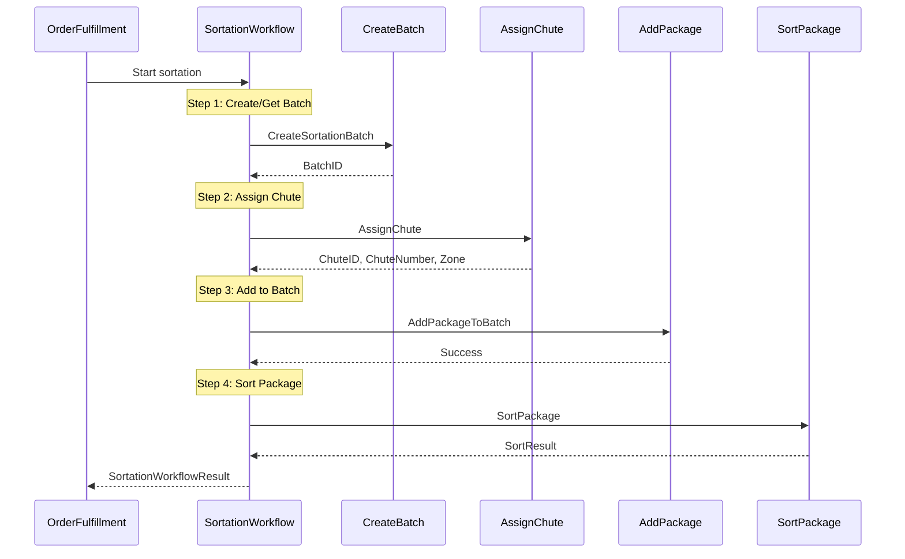
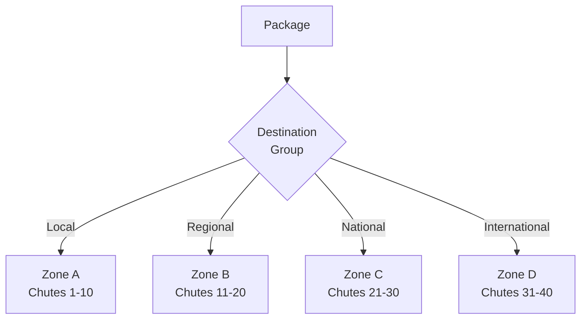

# SortationWorkflow

Routes packages to destination chutes based on carrier and destination for final carrier pickup.

## Overview

The Sortation Workflow manages the process of:
1. Creating sortation batches by carrier/destination
2. Assigning packages to appropriate chutes
3. Physically sorting packages to chutes
4. Managing batch closure and dispatch

## Configuration

| Property | Value |
|----------|-------|
| Task Queue | `orchestrator` |
| Execution Timeout | 24 hours |
| Activity Timeout | 2 minutes |

## Input

```go
// SortationWorkflowInput represents the input for the sortation workflow
type SortationWorkflowInput struct {
    OrderID        string  `json:"orderId"`
    PackageID      string  `json:"packageId"`
    TrackingNumber string  `json:"trackingNumber"`
    ManifestID     string  `json:"manifestId"`
    CarrierID      string  `json:"carrierId"`
    Destination    string  `json:"destination"`      // Zip code
    Weight         float64 `json:"weight"`
    SortationCenter string `json:"sortationCenter,omitempty"`
}
```

## Output

```go
// SortationWorkflowResult represents the result of the sortation workflow
type SortationWorkflowResult struct {
    BatchID          string `json:"batchId"`
    PackageID        string `json:"packageId"`
    ChuteID          string `json:"chuteId"`
    ChuteNumber      int    `json:"chuteNumber"`
    Zone             string `json:"zone"`
    DestinationGroup string `json:"destinationGroup"`
    SortedAt         int64  `json:"sortedAt"`
    Success          bool   `json:"success"`
}
```

## Workflow Steps



## Activities Used

| Activity | Purpose |
|----------|---------|
| `CreateSortationBatch` | Creates or retrieves existing batch for carrier/destination |
| `AssignChute` | Assigns package to physical chute based on destination |
| `AddPackageToBatch` | Registers package in batch |
| `SortPackage` | Records physical sort to chute |

## Chute Assignment Logic

Chutes are assigned based on:



## Batch Sortation Workflow

For high-volume batch processing:

```go
// BatchSortationWorkflowInput for processing multiple packages
type BatchSortationWorkflowInput struct {
    SortationCenter string                  `json:"sortationCenter"`
    CarrierID       string                  `json:"carrierId"`
    Packages        []SortationWorkflowInput `json:"packages"`
}

// BatchSortationWorkflowResult for batch results
type BatchSortationWorkflowResult struct {
    BatchID       string `json:"batchId"`
    TotalPackages int    `json:"totalPackages"`
    SortedCount   int    `json:"sortedCount"`
    FailedCount   int    `json:"failedCount"`
    Success       bool   `json:"success"`
}
```

## Error Handling

| Error | Handling |
|-------|----------|
| Batch creation fails | Retry with standard policy |
| Chute assignment fails | Return error, package needs manual sort |
| Sort confirmation fails | Log warning, continue |

## Related Documentation

- [Order Fulfillment Workflow](./order-fulfillment) - Parent workflow
- [Sortation Activities](../activities/sortation-activities) - Activity details
- [Shipping Workflow](./shipping) - Next step in flow
