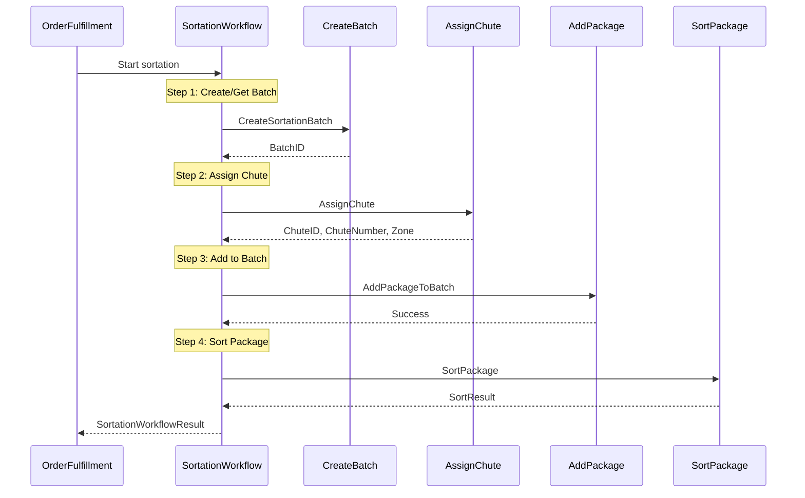
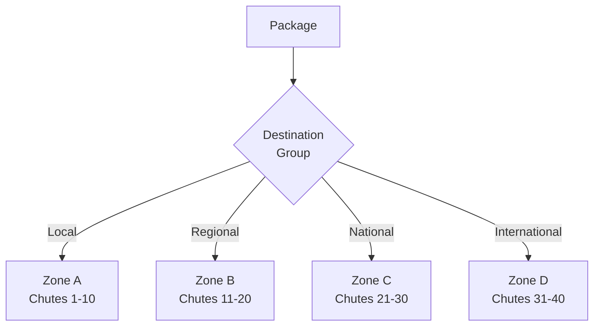
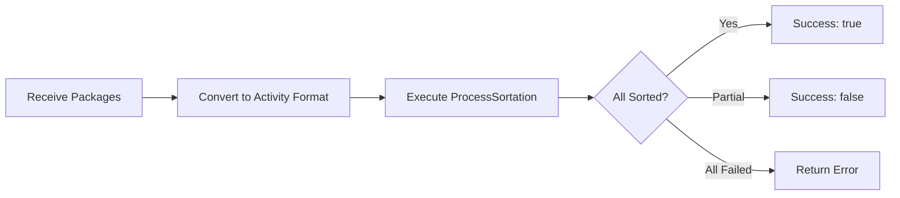

# SortationWorkflow

Routes packages to destination chutes based on carrier and destination for final carrier pickup.

## Overview

The Sortation Workflow manages the process of:
1. Creating sortation batches by carrier/destination
2. Assigning packages to appropriate chutes
3. Physically sorting packages to chutes
4. Managing batch closure and dispatch

## Configuration

| Property | Value |
|----------|-------|
| Task Queue | `orchestrator` |
| Execution Timeout | 24 hours |
| Activity Timeout | 2 minutes |

## Input

```go
// SortationWorkflowInput represents the input for the sortation workflow
type SortationWorkflowInput struct {
    OrderID        string  `json:"orderId"`
    PackageID      string  `json:"packageId"`
    TrackingNumber string  `json:"trackingNumber"`
    ManifestID     string  `json:"manifestId"`
    CarrierID      string  `json:"carrierId"`
    Destination    string  `json:"destination"`      // Zip code
    Weight         float64 `json:"weight"`
    SortationCenter string `json:"sortationCenter,omitempty"`
}
```

## Output

```go
// SortationWorkflowResult represents the result of the sortation workflow
type SortationWorkflowResult struct {
    BatchID          string `json:"batchId"`
    PackageID        string `json:"packageId"`
    ChuteID          string `json:"chuteId"`
    ChuteNumber      int    `json:"chuteNumber"`
    Zone             string `json:"zone"`
    DestinationGroup string `json:"destinationGroup"`
    SortedAt         int64  `json:"sortedAt"`
    Success          bool   `json:"success"`
}
```

## Workflow Steps



## Activities Used

| Activity | Purpose |
|----------|---------|
| `CreateSortationBatch` | Creates or retrieves existing batch for carrier/destination |
| `AssignChute` | Assigns package to physical chute based on destination |
| `AddPackageToBatch` | Registers package in batch |
| `SortPackage` | Records physical sort to chute |

## Chute Assignment Logic

Chutes are assigned based on:



## BatchSortationWorkflow

A high-throughput workflow for processing multiple packages in a single sortation operation.

### Overview

The Batch Sortation Workflow processes multiple packages at once, optimizing for:
- Reduced API calls through batching
- Unified batch assignment
- Efficient chute allocation

### Configuration

| Property | Value |
|----------|-------|
| Task Queue | `orchestrator` |
| Execution Timeout | 24 hours |
| Activity Timeout | 5 minutes |
| Retry Policy | 3 maximum attempts |

### Input

```go
type BatchSortationWorkflowInput struct {
    SortationCenter string                  `json:"sortationCenter"` // Sortation facility
    CarrierID       string                  `json:"carrierId"`       // Carrier for all packages
    Packages        []SortationPackageInput `json:"packages"`        // Packages to sort
}

type SortationPackageInput struct {
    PackageID      string  `json:"packageId"`
    OrderID        string  `json:"orderId"`
    TrackingNumber string  `json:"trackingNumber"`
    Destination    string  `json:"destination"`     // Zip code
    Weight         float64 `json:"weight"`
}
```

### Output

```go
type BatchSortationWorkflowResult struct {
    BatchID       string `json:"batchId"`       // Assigned batch
    TotalPackages int    `json:"totalPackages"` // Input package count
    SortedCount   int    `json:"sortedCount"`   // Successfully sorted
    FailedCount   int    `json:"failedCount"`   // Failed to sort
    Success       bool   `json:"success"`       // All packages sorted
}
```

### Workflow Flow



### Activities Used

| Activity | Purpose |
|----------|---------|
| `ProcessSortation` | Bulk processes all packages in the batch |

### Usage Example

```go
options := client.StartWorkflowOptions{
    ID:        fmt.Sprintf("batch-sortation-%s-%d", carrierID, time.Now().Unix()),
    TaskQueue: "orchestrator",
}

input := workflows.BatchSortationWorkflowInput{
    SortationCenter: "MAIN-SORT",
    CarrierID:       "UPS",
    Packages: []workflows.SortationPackageInput{
        {PackageID: "PKG-001", OrderID: "ORD-001", Destination: "10001", Weight: 2.5},
        {PackageID: "PKG-002", OrderID: "ORD-002", Destination: "90210", Weight: 1.2},
        {PackageID: "PKG-003", OrderID: "ORD-003", Destination: "33101", Weight: 3.8},
    },
}

we, err := client.ExecuteWorkflow(ctx, options, workflows.BatchSortationWorkflow, input)

var result workflows.BatchSortationWorkflowResult
err = we.Get(ctx, &result)

fmt.Printf("Sorted %d/%d packages in batch %s\n",
    result.SortedCount, result.TotalPackages, result.BatchID)
```

### When to Use Batch vs Individual

| Scenario | Recommended Workflow |
|----------|---------------------|
| Single package from order fulfillment | `SortationWorkflow` |
| Wave release with 50+ packages | `BatchSortationWorkflow` |
| Carrier pickup preparation | `BatchSortationWorkflow` |
| Manual sort station | `SortationWorkflow` |

## Error Handling

| Error | Handling |
|-------|----------|
| Batch creation fails | Retry with standard policy |
| Chute assignment fails | Return error, package needs manual sort |
| Sort confirmation fails | Log warning, continue |

## Related Documentation

- [Order Fulfillment Workflow](./order-fulfillment) - Parent workflow
- [Sortation Activities](../activities/sortation-activities) - Activity details
- [Shipping Workflow](./shipping) - Next step in flow
