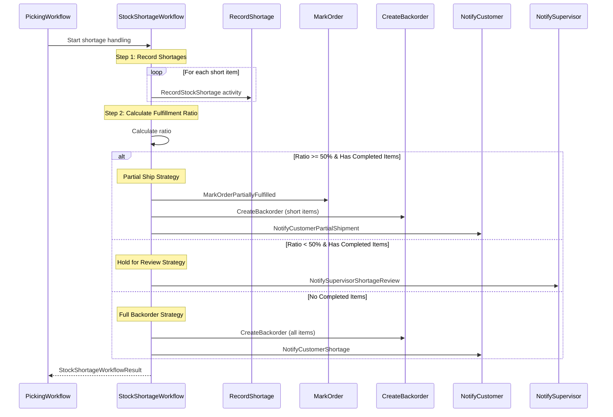
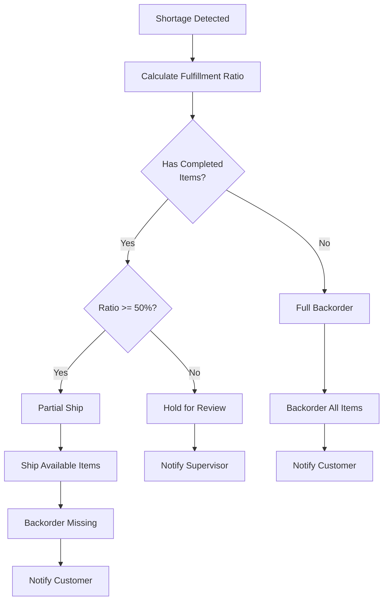
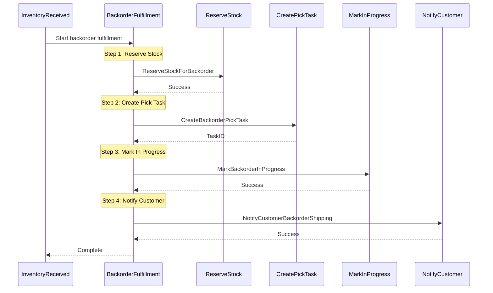

# StockShortageWorkflow

Handles compensation for confirmed stock shortages during picking with automatic fulfillment strategy decisions.

## Overview

The Stock Shortage Workflow coordinates:
1. Recording inventory shortages
2. Calculating fulfillment ratio
3. Deciding on fulfillment strategy (partial ship, backorder, or hold)
4. Creating backorders for missing items
5. Notifying customers and supervisors

## Configuration

| Property | Value |
|----------|-------|
| Task Queue | `orchestrator` |
| Execution Timeout | 4 hours |
| Activity Timeout | 5 minutes |
| Partial Shipment Threshold | 50% |

## Input

```go
// StockShortageWorkflowInput represents input for the stock shortage handling workflow
type StockShortageWorkflowInput struct {
    OrderID        string       `json:"orderId"`
    CustomerID     string       `json:"customerId"`
    ShortItems     []ShortItem  `json:"shortItems"`
    CompletedItems []PickedItem `json:"completedItems"`
    ReportedBy     string       `json:"reportedBy"`
}

// ShortItem represents an item with a stock shortage
type ShortItem struct {
    SKU          string `json:"sku"`
    LocationID   string `json:"locationId"`
    RequestedQty int    `json:"requestedQty"`
    AvailableQty int    `json:"availableQty"`
    ShortageQty  int    `json:"shortageQty"`
    Reason       string `json:"reason"` // not_found, damaged, quantity_mismatch
}
```

## Output

```go
// StockShortageWorkflowResult represents the result of shortage handling
type StockShortageWorkflowResult struct {
    OrderID              string `json:"orderId"`
    Strategy             string `json:"strategy"` // partial_ship, full_backorder, hold_for_review
    ShippedItemCount     int    `json:"shippedItemCount"`
    BackorderedItemCount int    `json:"backorderedItemCount"`
    BackorderID          string `json:"backorderId,omitempty"`
    CustomerNotified     bool   `json:"customerNotified"`
}
```

## Workflow Steps



## Fulfillment Strategy Decision



## Shortage Reasons

| Reason | Description |
|--------|-------------|
| `not_found` | Item not at expected location |
| `damaged` | Item found damaged |
| `quantity_mismatch` | Less quantity than expected |

## Activities Used

| Activity | Purpose | On Failure |
|----------|---------|------------|
| `RecordStockShortage` | Records shortage in inventory system | Log warning, continue |
| `MarkOrderPartiallyFulfilled` | Updates order status | Log warning, continue |
| `CreateBackorder` | Creates backorder for missing items | Log error |
| `NotifyCustomerPartialShipment` | Notifies of partial fulfillment | Log warning, continue |
| `NotifyCustomerShortage` | Notifies of complete shortage | Log warning, continue |
| `NotifySupervisorShortageReview` | Escalates to supervisor | Log warning, continue |

## Strategy Comparison

| Strategy | Condition | Action |
|----------|-----------|--------|
| `partial_ship` | Ratio >= 50% with completed items | Ship available, backorder rest |
| `hold_for_review` | Ratio < 50% with completed items | Hold everything for supervisor |
| `full_backorder` | No completed items | Create full backorder |

## Partial Shipment Threshold

```go
// PartialShipmentThreshold is the minimum fulfillment ratio (0.0-1.0) to auto-ship
const PartialShipmentThreshold = 0.50
```

Orders with at least 50% fulfillment automatically proceed with partial shipment.

---

# BackorderFulfillmentWorkflow

Handles auto-fulfillment of backorders when stock arrives.

## Overview

Triggered by `InventoryReceivedEvent` for backordered SKUs, this workflow:
1. Reserves stock for backorder items
2. Creates new pick tasks linked to original order
3. Notifies customers of backorder shipping

## Input

```go
// BackorderFulfillmentInput
{
    "backorderId":     string,
    "originalOrderId": string,
    "customerId":      string
}
```

## Workflow Steps



## Activities Used

| Activity | Purpose | On Failure |
|----------|---------|------------|
| `ReserveStockForBackorder` | Reserves incoming stock | Return error |
| `CreateBackorderPickTask` | Creates pick task for backorder | Return error |
| `MarkBackorderInProgress` | Updates backorder status | Log warning |
| `NotifyCustomerBackorderShipping` | Sends shipping notification | Log warning |

## Usage Example

```go
// Called from StockShortageWorkflow on picking failure
shortageInput := StockShortageWorkflowInput{
    OrderID:    "ORD-123",
    CustomerID: "CUST-456",
    ShortItems: []ShortItem{
        {
            SKU:          "SKU-001",
            LocationID:   "LOC-A1",
            RequestedQty: 5,
            AvailableQty: 2,
            ShortageQty:  3,
            Reason:       "quantity_mismatch",
        },
    },
    CompletedItems: completedPickedItems,
    ReportedBy:     "PICKER-001",
}

var result StockShortageWorkflowResult
err := workflow.ExecuteChildWorkflow(ctx, StockShortageWorkflow, shortageInput).Get(ctx, &result)
```

## Related Documentation

- [Picking Workflow](./picking) - Detects shortages during picking
- [Order Fulfillment Workflow](./order-fulfillment) - Parent workflow
- [Inventory Activities](../activities/inventory-activities) - Inventory operations
