# WESExecutionWorkflow

The Warehouse Execution System workflow coordinates picking, walling (consolidation), and packing operations.

## Overview

WES (Warehouse Execution System) is responsible for the physical fulfillment operations:
- **Picking**: Retrieving items from storage locations
- **Walling**: Consolidating items from multiple picks (for multi-item orders)
- **Packing**: Packaging items for shipment

## Configuration

| Property | Value |
|----------|-------|
| Task Queue | `wes-execution-queue` |
| Execution Timeout | 4 hours |
| Activity Timeout | 10 minutes |

## Input

```go
// WESExecutionInput represents the input for the WES execution workflow
type WESExecutionInput struct {
    OrderID         string        `json:"orderId"`
    WaveID          string        `json:"waveId"`
    Items           []WESItemInfo `json:"items"`
    MultiZone       bool          `json:"multiZone"`         // Requires consolidation
    ProcessPathID   string        `json:"processPathId,omitempty"`
    SpecialHandling []string      `json:"specialHandling,omitempty"` // fragile, hazmat, etc.
}

// WESItemInfo represents item information for WES
type WESItemInfo struct {
    SKU        string `json:"sku"`
    Quantity   int    `json:"quantity"`
    LocationID string `json:"locationId,omitempty"`
    Zone       string `json:"zone,omitempty"`
}
```

## Output

```go
// WESExecutionResult represents the result of the WES execution workflow
type WESExecutionResult struct {
    RouteID         string          `json:"routeId"`
    OrderID         string          `json:"orderId"`
    Status          string          `json:"status"`          // completed, failed
    PathType        string          `json:"pathType"`        // pick_pack, pick_wall_pack
    StagesCompleted int             `json:"stagesCompleted"`
    TotalStages     int             `json:"totalStages"`
    PickResult      *WESStageResult `json:"pickResult,omitempty"`
    WallingResult   *WESStageResult `json:"wallingResult,omitempty"`
    PackingResult   *WESStageResult `json:"packingResult,omitempty"`
    CompletedAt     int64           `json:"completedAt,omitempty"`
    Error           string          `json:"error,omitempty"`
}

// WESStageResult represents the result of a stage in WES
type WESStageResult struct {
    StageType   string `json:"stageType"`   // picking, walling, packing
    TaskID      string `json:"taskId"`
    WorkerID    string `json:"workerId"`
    Success     bool   `json:"success"`
    CompletedAt int64  `json:"completedAt,omitempty"`
    Error       string `json:"error,omitempty"`
}
```

## Workflow Steps

### Pick → Pack Path (1-3 items)


### Pick → Wall → Pack Path (4+ items)


## Signals

| Signal | Payload | Purpose |
|--------|---------|---------|
| `wallingCompleted` | `WallingCompletedSignal` | Notifies walling stage completion |

```go
type WallingCompletedSignal struct {
    TaskID      string   `json:"taskId"`
    RouteID     string   `json:"routeId"`
    SortedItems []string `json:"sortedItems"`
    Success     bool     `json:"success"`
}
```

## Path Selection Logic

| Item Count | Multi-Zone | Path Type | Stages |
|------------|------------|-----------|--------|
| 1-3 | No | `pick_pack` | 2 |
| 4-20 | No | `pick_wall_pack` | 3 |
| Any | Yes | `pick_wall_pack` | 3 |

## Worker Assignment


### WES Stage Execution Flow

```mermaid
flowchart TD
    START[🏭 Start WES] --> RESOLVE[Resolve Execution Plan]
    RESOLVE --> PATH{Process Path?}

    PATH -->|pick_pack| PP_START[2-Stage Flow]
    PATH -->|pick_wall_pack| PWP_START[3-Stage Flow]

    subgraph pick_pack["Pick → Pack (Simple)"]
        PP_START --> PP_PICK[📦 Picking]
        PP_PICK --> PP_PACK[🎁 Packing]
        PP_PACK --> PP_DONE[✅ Complete]
    end

    subgraph pick_wall_pack["Pick → Wall → Pack (Complex)"]
        PWP_START --> PWP_PICK[📦 Picking]
        PWP_PICK --> PWP_WALL[🧱 Walling]
        PWP_WALL --> PWP_PACK[🎁 Packing]
        PWP_PACK --> PWP_DONE[✅ Complete]
    end

    style PP_DONE fill:#c8e6c9
    style PWP_DONE fill:#c8e6c9
```



### Execution Plan Resolution


### Stage State Machine


### Cross-Queue Execution


### Progress Tracking


## Error Handling

### Stage Failure

If any stage fails, the workflow returns with partial results:

```go
if wesResult.PackingResult != nil && !wesResult.PackingResult.Success {
    return WESExecutionResult{
        Status:          "failed",
        StagesCompleted: 2,  // Picking and walling succeeded
        TotalStages:     3,
        Error:           wesResult.PackingResult.Error,
    }, nil
}
```

### Compensation

WES failures trigger inventory release in the parent OrderFulfillmentWorkflow:
- Hard allocations are returned to shelf
- Soft reservations are released

## Usage Example

```go
// Called as child workflow from OrderFulfillmentWorkflow
wesChildCtx := workflow.WithChildOptions(ctx, workflow.ChildWorkflowOptions{
    WorkflowID:               fmt.Sprintf("wes-%s", input.OrderID),
    WorkflowExecutionTimeout: 4 * time.Hour,
    TaskQueue:                "wes-execution-queue",  // Different task queue!
})

wesInput := WESExecutionInput{
    OrderID:         input.OrderID,
    WaveID:          waveAssignment.WaveID,
    Items:           wesItems,
    MultiZone:       processPath.ConsolidationRequired,
    ProcessPathID:   processPath.PathID,
    SpecialHandling: processPath.SpecialHandling,
}

var wesResult WESExecutionResult
err = workflow.ExecuteChildWorkflow(wesChildCtx, "WESExecutionWorkflow", wesInput).Get(ctx, &wesResult)
```

## Related Documentation

- [Order Fulfillment Workflow](./order-fulfillment) - Parent workflow
- [Picking Activities](../activities/picking-activities) - Picking operations
- [Packing Activities](../activities/packing-activities) - Packing operations
- [Task Queues](../task-queues) - Queue configuration
