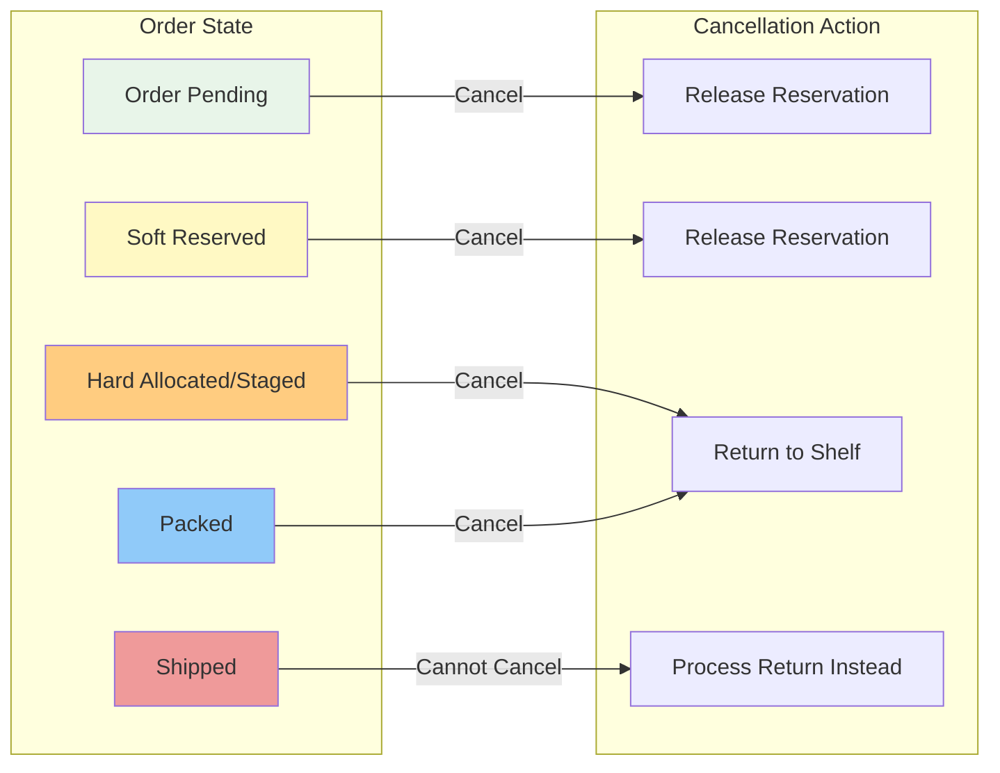
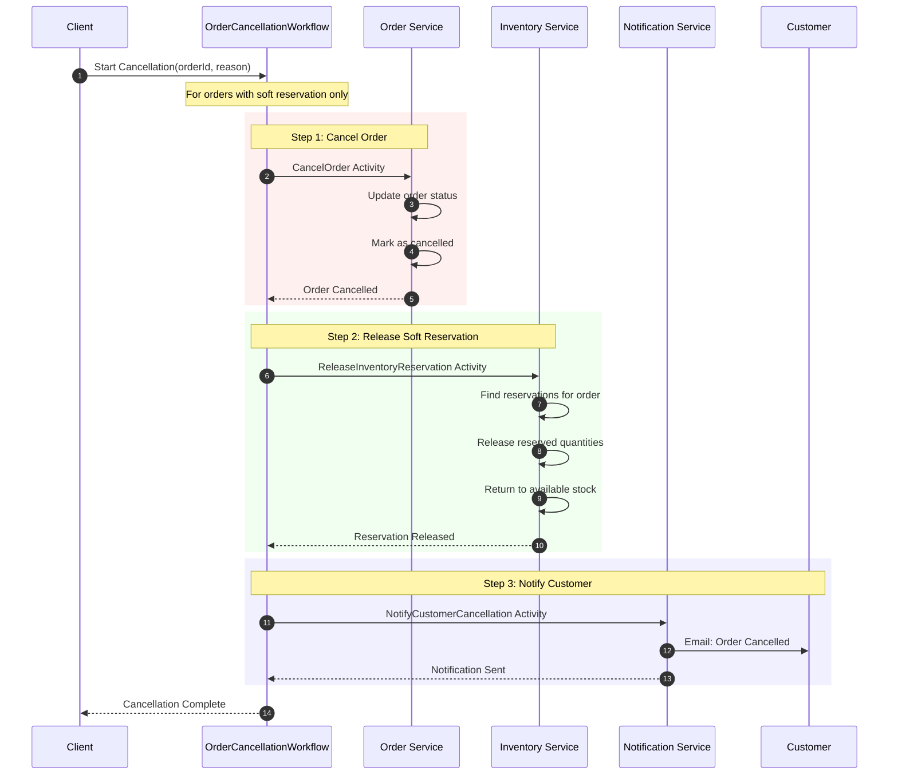
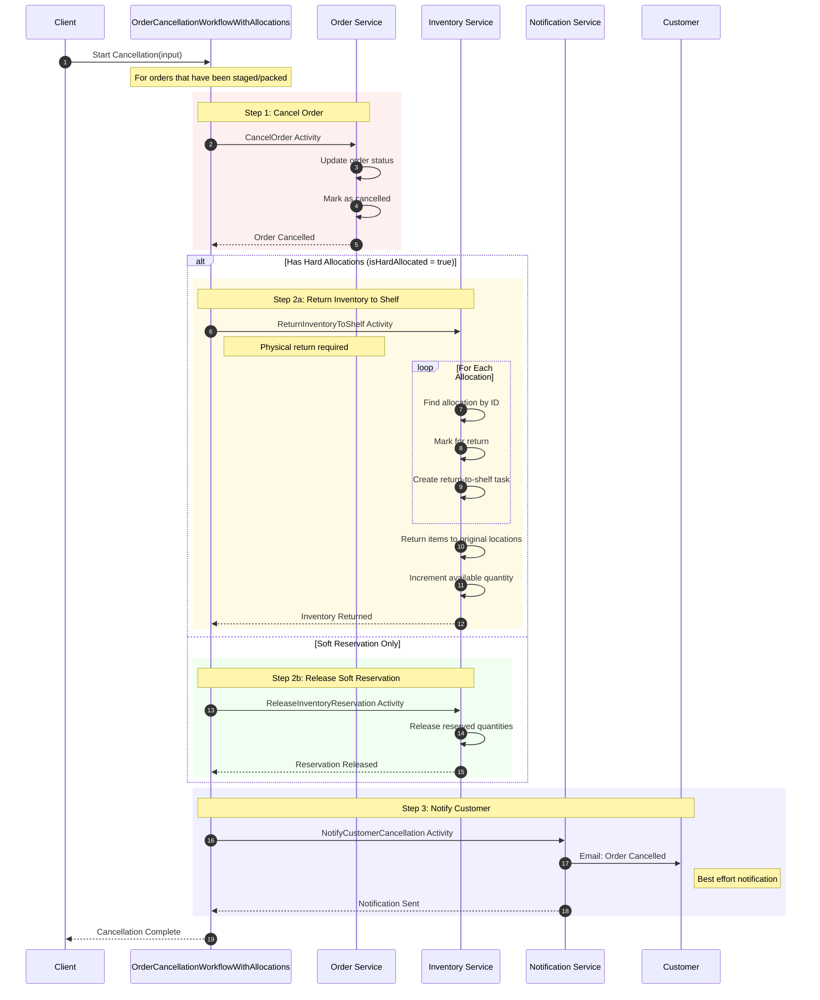
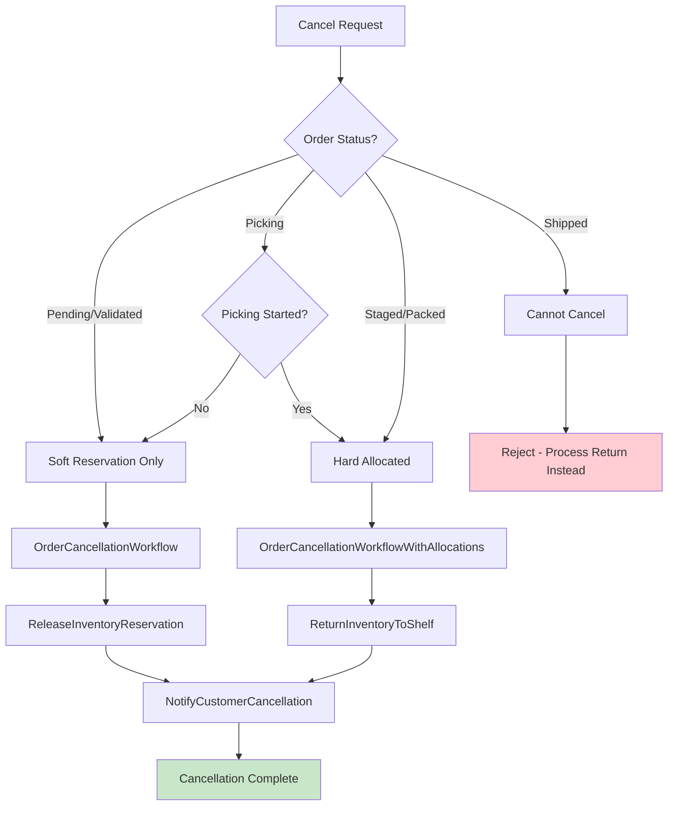
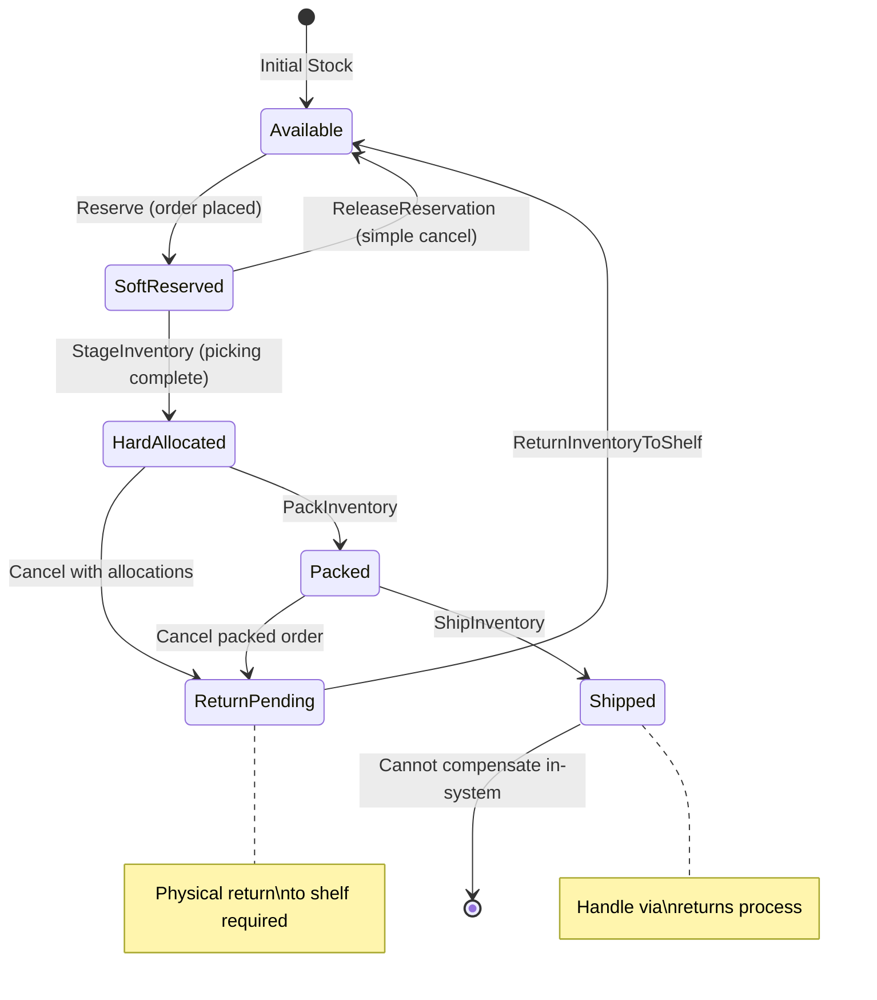
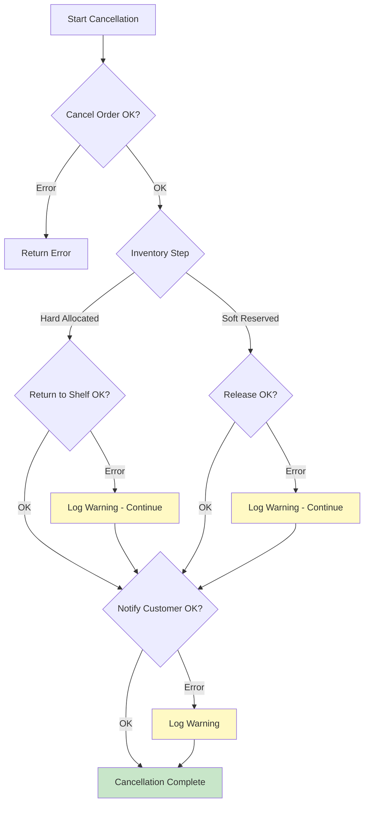

# Order Cancellation Workflow

This diagram shows the order cancellation workflow that handles compensation and cleanup when orders are cancelled at various stages of fulfillment.

## Cancellation Overview

## Simple Cancellation Sequence (Soft Reservation Only)

## Cancellation with Hard Allocations Sequence

## Cancellation Decision Flow

## Inventory Compensation States

## Data Structures

### OrderCancellationInput (Simple)
| Field | Type | Description |
|-------|------|-------------|
| OrderID | string | Order to cancel |
| Reason | string | Cancellation reason |

### OrderCancellationInput (With Allocations)
| Field | Type | Description |
|-------|------|-------------|
| OrderID | string | Order to cancel |
| Reason | string | Cancellation reason |
| AllocationIDs | []string | Hard allocation IDs to return |
| PickedItems | []PickedItem | Items that were picked |
| IsHardAllocated | bool | Whether inventory has been staged |

### Return-to-Shelf Item
| Field | Type | Description |
|-------|------|-------------|
| SKU | string | Item SKU |
| AllocationID | string | Hard allocation to reverse |

## Cancellation Reasons

| Code | Reason | Description |
|------|--------|-------------|
| customer_request | Customer Requested | Customer cancelled order |
| payment_failed | Payment Failed | Payment could not be processed |
| inventory_unavailable | Inventory Unavailable | Items became unavailable |
| fraud_detected | Fraud Detected | Fraudulent order detected |
| address_invalid | Invalid Address | Shipping address invalid |
| duplicate_order | Duplicate Order | Duplicate of another order |

## Error Handling

## Compensation Matrix

| Order State | Inventory State | Cancellation Action | Physical Action Required |
|-------------|-----------------|---------------------|--------------------------|
| Pending | None | None | No |
| Validated | Soft Reserved | ReleaseInventoryReservation | No |
| Wave Assigned | Soft Reserved | ReleaseInventoryReservation | No |
| Picking Started | Soft Reserved | ReleaseInventoryReservation | No |
| Picking Complete | Hard Allocated | ReturnInventoryToShelf | Yes - Return to location |
| Consolidated | Hard Allocated | ReturnInventoryToShelf | Yes - Return to location |
| Packed | Hard Allocated (Packed) | ReturnInventoryToShelf | Yes - Unpack & return |
| Shipped | Removed from System | Cannot Cancel | N/A - Use returns process |

## Related Diagrams

- [Order Fulfillment Flow](order-fulfillment.md) - Main workflow that may trigger cancellation
- [Picking Workflow](picking-workflow.md) - Where hard allocation begins
- [Shipping Workflow](shipping-workflow.md) - Point of no return for cancellation
