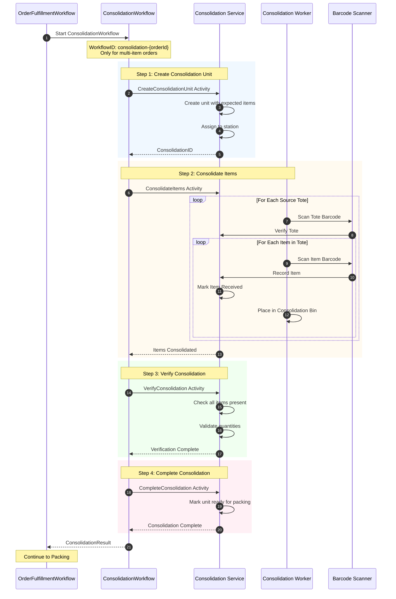
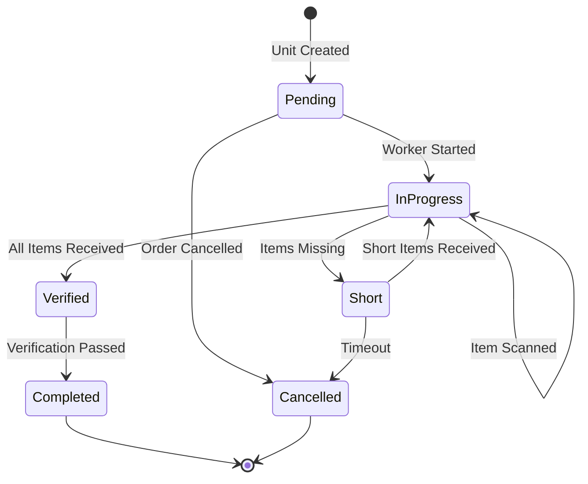
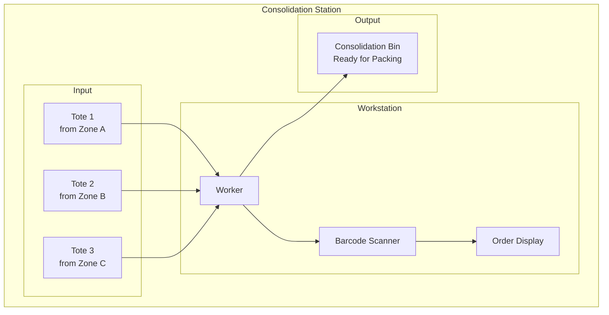

# Consolidation Workflow

This diagram shows the consolidation child workflow for multi-item orders, where items from different pick totes are combined into a single unit.

## Consolidation Sequence Diagram

## Consolidation State Machine

## Consolidation Station Layout

## Data Structures

### ConsolidationUnit
| Field | Type | Description |
|-------|------|-------------|
| ConsolidationID | string | Unique identifier |
| OrderID | string | Associated order |
| WaveID | string | Wave reference |
| Status | string | Current status |
| Station | string | Assigned station |
| ExpectedItems | []ExpectedItem | Items to receive |
| ConsolidatedItems | []ConsolidatedItem | Items received |
| DestinationBin | string | Output location |

### ExpectedItem
| Field | Type | Description |
|-------|------|-------------|
| SKU | string | Item SKU |
| Quantity | int | Expected quantity |
| SourceToteID | string | Source tote |
| Status | string | pending/partial/received/short |

### ConsolidatedItem
| Field | Type | Description |
|-------|------|-------------|
| SKU | string | Item SKU |
| Quantity | int | Received quantity |
| ScannedAt | time | Scan timestamp |
| VerifiedBy | string | Worker ID |

## Consolidation Strategies

| Strategy | Description | Use Case |
|----------|-------------|----------|
| order | Consolidate by order | Standard fulfillment |
| carrier | Group by carrier | Batch shipping |
| route | Group by delivery route | Regional optimization |
| time | Group by time window | SLA management |

## Related Diagrams

- [Picking Workflow](picking-workflow.md) - Previous step
- [Packing Workflow](packing-workflow.md) - Next step
- [Order Fulfillment Flow](../../../docs/diagrams/order-fulfillment-flow.md) - Parent workflow
