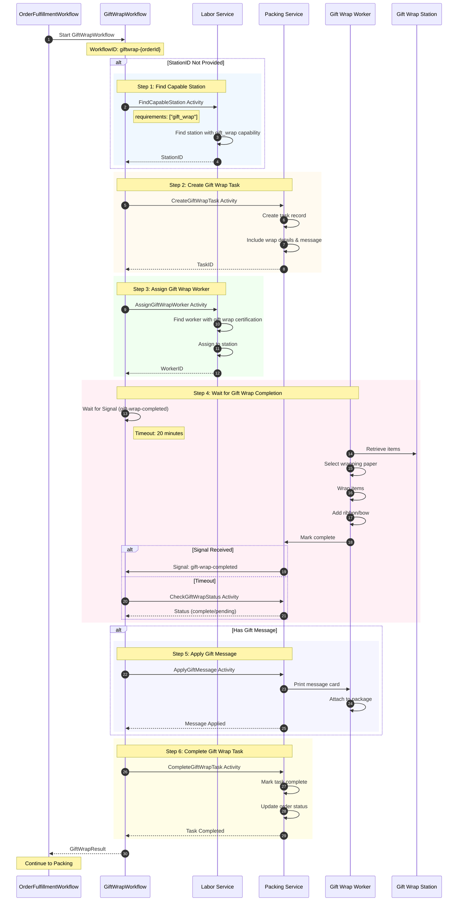
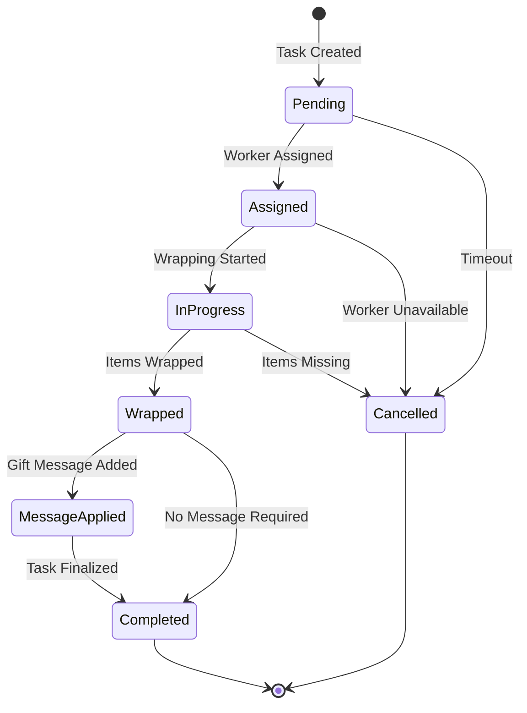
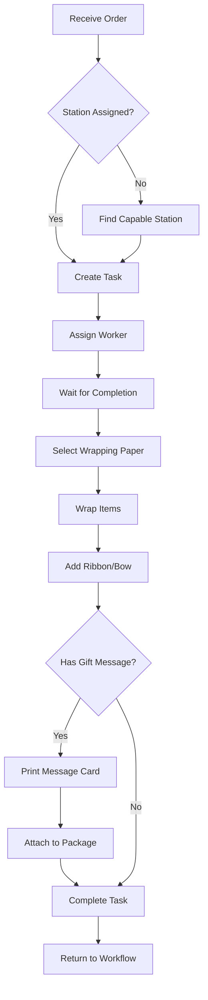
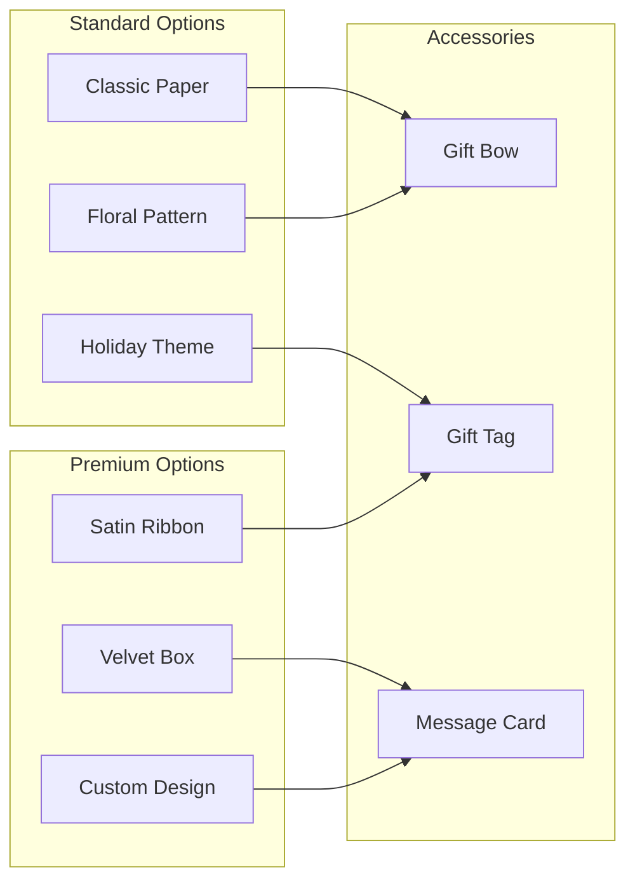
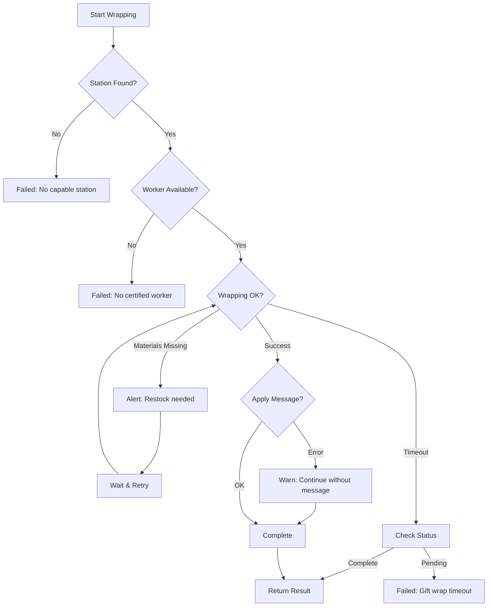

# Gift Wrap Workflow

This diagram shows the gift wrap child workflow that coordinates special gift wrapping for orders.

## Gift Wrap Sequence Diagram

## Gift Wrap Task State Machine

## Gift Wrap Process Flow

## Wrap Types

## Data Structures

### GiftWrapInput
| Field | Type | Description |
|-------|------|-------------|
| OrderID | string | Order to gift wrap |
| WaveID | string | Processing wave |
| Items | []GiftWrapItem | Items to wrap |
| WrapDetails | GiftWrapDetails | Wrap configuration |
| StationID | string | Pre-assigned station (optional) |

### GiftWrapDetails
| Field | Type | Description |
|-------|------|-------------|
| WrapType | string | Paper type (classic/floral/holiday/premium) |
| GiftMessage | string | Message for gift card |
| HidePrice | bool | Whether to exclude price tags |

### GiftWrapResult
| Field | Type | Description |
|-------|------|-------------|
| TaskID | string | Completed task ID |
| OrderID | string | Order ID |
| StationID | string | Station used |
| WorkerID | string | Worker who wrapped |
| CompletedAt | time.Time | Completion timestamp |
| Success | bool | Completion status |

### GiftWrapTask
| Field | Type | Description |
|-------|------|-------------|
| TaskID | string | Unique identifier |
| OrderID | string | Associated order |
| StationID | string | Assigned station |
| WorkerID | string | Assigned worker |
| Status | string | Current status |
| WrapType | string | Wrap configuration |
| GiftMessage | string | Gift message text |
| HidePrice | bool | Exclude pricing |

## Worker Requirements

| Certification | Description |
|---------------|-------------|
| gift_wrap_basic | Can perform standard wrapping |
| gift_wrap_premium | Can perform premium/custom wrapping |
| gift_message | Can create handwritten cards |

## Station Capabilities

| Capability | Equipment |
|------------|-----------|
| gift_wrap | Wrapping paper, scissors, tape |
| ribbon_station | Ribbon, bows, accessories |
| message_printer | Card printer, pens |
| premium_materials | Velvet boxes, satin |

## Error Handling

## Related Diagrams

- [Order Fulfillment Flow](order-fulfillment.md) - Parent workflow
- [Packing Workflow](packing-workflow.md) - Next step
- [Consolidation Workflow](consolidation-workflow.md) - Previous step (if multi-item)
