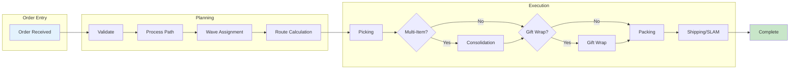
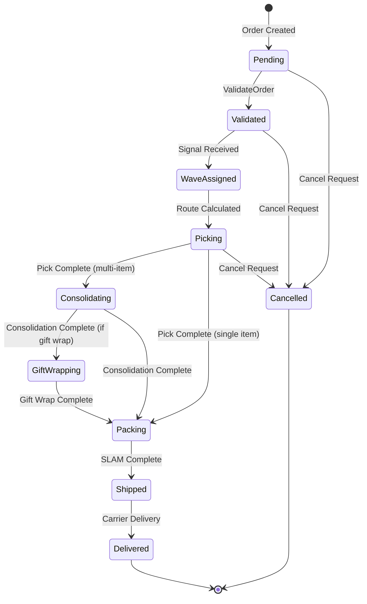
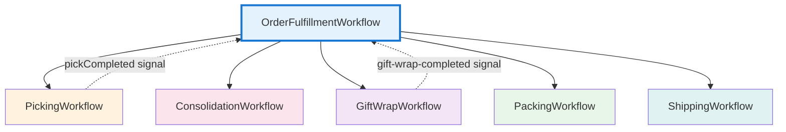
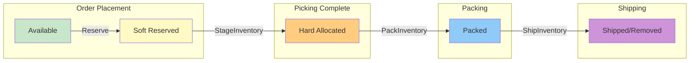
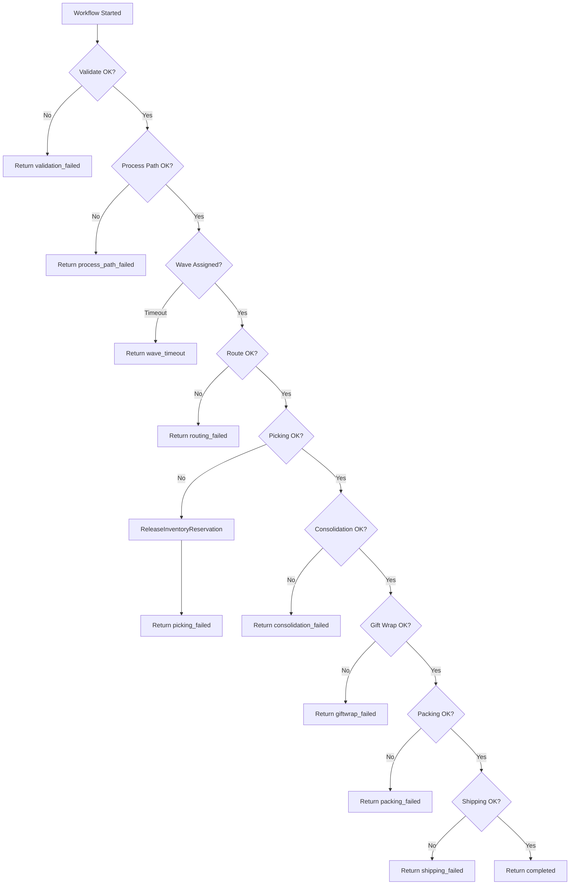

# Order Fulfillment Workflow

This diagram shows the main saga workflow that orchestrates the entire order fulfillment process across all bounded contexts.

## High-Level Flow

## Order Fulfillment Sequence Diagram

```mermaid
sequenceDiagram
    autonumber
    participant Client
    participant Workflow as OrderFulfillmentWorkflow
    participant OrderSvc as Order Service
    participant ProcessPath as Process Path Service
    participant WaveSvc as Wave Service
    participant RoutingSvc as Routing Service
    participant LaborSvc as Labor Service
    participant InventorySvc as Inventory Service
    participant PickingWF as PickingWorkflow
    participant ConsolidationWF as ConsolidationWorkflow
    participant GiftWrapWF as GiftWrapWorkflow
    participant PackingWF as PackingWorkflow
    participant ShippingWF as ShippingWorkflow

    Client->>Workflow: Start OrderFulfillmentWorkflow
    Note over Workflow: WorkflowID: order-fulfillment-{orderId}

    rect rgb(240, 248, 255)
        Note over Workflow,OrderSvc: Step 1: Validate Order
        Workflow->>OrderSvc: ValidateOrder Activity
        OrderSvc->>OrderSvc: Check inventory availability
        OrderSvc->>OrderSvc: Validate customer info
        OrderSvc->>OrderSvc: Reserve inventory (soft)
        OrderSvc-->>Workflow: Order Validated
    end

    rect rgb(255, 250, 240)
        Note over Workflow,ProcessPath: Step 2: Determine Process Path
        Workflow->>ProcessPath: DetermineProcessPath Activity
        ProcessPath->>ProcessPath: Analyze order items
        ProcessPath->>ProcessPath: Check hazmat/cold chain/gift wrap
        ProcessPath->>ProcessPath: Determine requirements
        ProcessPath-->>Workflow: ProcessPathResult
        Note right of Workflow: pathId, requirements[], consolidationRequired, giftWrapRequired
    end

    rect rgb(240, 255, 240)
        Note over Workflow,WaveSvc: Step 3: Wait for Wave Assignment
        Workflow->>Workflow: Wait for Signal (waveAssigned)
        Note right of Workflow: Timeout based on priority
        WaveSvc->>Workflow: Signal: waveAssigned
        Note right of Workflow: waveId, scheduledStart
    end

    rect rgb(255, 240, 245)
        Note over Workflow,RoutingSvc: Step 4: Calculate Route
        Workflow->>RoutingSvc: CalculateRoute Activity
        RoutingSvc->>RoutingSvc: Optimize pick path
        RoutingSvc->>RoutingSvc: Group by zone
        RoutingSvc-->>Workflow: RouteResult
        Note right of Workflow: routeId, stops[], estimatedDistance
    end

    rect rgb(230, 240, 255)
        Note over Workflow,PickingWF: Step 5: Execute Picking (Child Workflow)
        Workflow->>OrderSvc: StartPicking Activity
        OrderSvc-->>Workflow: Status Updated
        Workflow->>PickingWF: Start PickingWorkflow
        Note over PickingWF: See picking-workflow.md
        PickingWF->>PickingWF: CreatePickTask
        PickingWF->>PickingWF: AssignPickerToTask
        PickingWF->>PickingWF: Wait for pickCompleted signal
        PickingWF->>PickingWF: ConfirmInventoryPick
        PickingWF->>PickingWF: StageInventory
        PickingWF-->>Workflow: PickResult (taskId, pickedItems, allocationIds)
    end

    alt Consolidation Required (multi-item order)
        rect rgb(255, 245, 238)
            Note over Workflow,ConsolidationWF: Step 6: Consolidation (Child Workflow)
            Workflow->>ConsolidationWF: Start ConsolidationWorkflow
            Note over ConsolidationWF: See consolidation-workflow.md
            ConsolidationWF->>ConsolidationWF: CreateConsolidationUnit
            ConsolidationWF->>ConsolidationWF: ConsolidateItems
            ConsolidationWF->>ConsolidationWF: VerifyConsolidation
            ConsolidationWF->>ConsolidationWF: CompleteConsolidation
            ConsolidationWF-->>Workflow: Consolidation Complete
            Workflow->>OrderSvc: MarkConsolidated Activity
        end
    end

    alt Gift Wrap Required
        rect rgb(255, 240, 255)
            Note over Workflow,GiftWrapWF: Step 7: Gift Wrap (Child Workflow)
            Workflow->>GiftWrapWF: Start GiftWrapWorkflow
            Note over GiftWrapWF: See giftwrap-workflow.md
            GiftWrapWF->>GiftWrapWF: FindCapableStation
            GiftWrapWF->>GiftWrapWF: CreateGiftWrapTask
            GiftWrapWF->>GiftWrapWF: AssignGiftWrapWorker
            GiftWrapWF->>GiftWrapWF: Wait for gift-wrap-completed signal
            GiftWrapWF->>GiftWrapWF: ApplyGiftMessage
            GiftWrapWF->>GiftWrapWF: CompleteGiftWrapTask
            GiftWrapWF-->>Workflow: GiftWrapResult
        end
    end

    alt Has Special Requirements
        rect rgb(245, 255, 250)
            Note over Workflow,LaborSvc: Step 8: Find Capable Station
            Workflow->>LaborSvc: FindCapableStation Activity
            LaborSvc->>LaborSvc: Match requirements to stations
            LaborSvc-->>Workflow: StationID
        end
    end

    rect rgb(240, 255, 255)
        Note over Workflow,PackingWF: Step 9: Packing (Child Workflow)
        Workflow->>PackingWF: Start PackingWorkflow
        Note over PackingWF: See packing-workflow.md
        PackingWF->>PackingWF: CreatePackTask
        PackingWF->>PackingWF: SelectPackagingMaterials
        PackingWF->>PackingWF: PackItems
        PackingWF->>PackingWF: WeighPackage
        PackingWF->>PackingWF: GenerateShippingLabel
        PackingWF->>PackingWF: ApplyLabelToPackage
        PackingWF->>PackingWF: SealPackage
        PackingWF->>PackingWF: PackInventory (if allocations)
        PackingWF-->>Workflow: PackResult (packageId, trackingNumber, carrier)
        Workflow->>OrderSvc: MarkPacked Activity
    end

    rect rgb(252, 228, 236)
        Note over Workflow,ShippingWF: Step 10: Shipping/SLAM (Child Workflow)
        Workflow->>ShippingWF: Start ShippingWorkflow
        Note over ShippingWF: See shipping-workflow.md
        ShippingWF->>ShippingWF: CreateShipment
        ShippingWF->>ShippingWF: ScanPackage
        ShippingWF->>ShippingWF: VerifyShippingLabel
        ShippingWF->>ShippingWF: PlaceOnOutboundDock
        ShippingWF->>ShippingWF: AddToCarrierManifest
        ShippingWF->>ShippingWF: MarkOrderShipped
        ShippingWF->>ShippingWF: ShipInventory (if allocations)
        ShippingWF->>ShippingWF: NotifyCustomerShipped
        ShippingWF-->>Workflow: Shipping Complete
    end

    Workflow-->>Client: OrderFulfillmentResult
    Note over Workflow: status: completed, trackingNumber
```

## Order State Machine

## Workflow Hierarchy

## Inventory Lifecycle

## Data Structures

### OrderFulfillmentInput
| Field | Type | Description |
|-------|------|-------------|
| OrderID | string | Unique order identifier |
| CustomerID | string | Customer identifier |
| Items | []Item | Order line items |
| Priority | string | same_day/next_day/standard |
| PromisedDeliveryAt | time.Time | Promised delivery date |
| IsMultiItem | bool | Whether order has multiple items |
| GiftWrap | bool | Gift wrap requested |
| GiftWrapDetails | *GiftWrapDetailsInput | Gift wrap configuration |
| HazmatDetails | *HazmatDetailsInput | Hazmat requirements |
| ColdChainDetails | *ColdChainDetailsInput | Cold chain requirements |
| TotalValue | float64 | Order total value |

### OrderFulfillmentResult
| Field | Type | Description |
|-------|------|-------------|
| OrderID | string | Order identifier |
| Status | string | Final status |
| TrackingNumber | string | Shipping tracking number |
| WaveID | string | Assigned wave |
| Error | string | Error message if failed |

### ProcessPathResult
| Field | Type | Description |
|-------|------|-------------|
| PathID | string | Process path identifier |
| Requirements | []string | Special requirements (hazmat, cold_chain, gift_wrap) |
| ConsolidationRequired | bool | Multi-item consolidation needed |
| GiftWrapRequired | bool | Gift wrapping needed |
| SpecialHandling | []string | Special handling instructions |
| TargetStation | string | Recommended packing station |

## Error Handling & Compensation

## Signal Handling

| Signal | Source | Purpose |
|--------|--------|---------|
| waveAssigned | Wave Service | Assigns order to a picking wave |
| pickCompleted | Picking Service | Indicates picker finished task |
| gift-wrap-completed | Packing Station | Indicates gift wrap applied |

## Timeout Configuration

| Priority | Wave Timeout | Description |
|----------|--------------|-------------|
| same_day | 15 minutes | Expedited processing |
| next_day | 30 minutes | Priority processing |
| standard | 2 hours | Normal processing |

## Related Diagrams

- [Picking Workflow](picking-workflow.md) - Step 5 child workflow
- [Consolidation Workflow](consolidation-workflow.md) - Step 6 child workflow (conditional)
- [Gift Wrap Workflow](giftwrap-workflow.md) - Step 7 child workflow (conditional)
- [Packing Workflow](packing-workflow.md) - Step 9 child workflow
- [Shipping Workflow](shipping-workflow.md) - Step 10 child workflow
- [Cancellation Workflow](cancellation-workflow.md) - Compensation workflow
