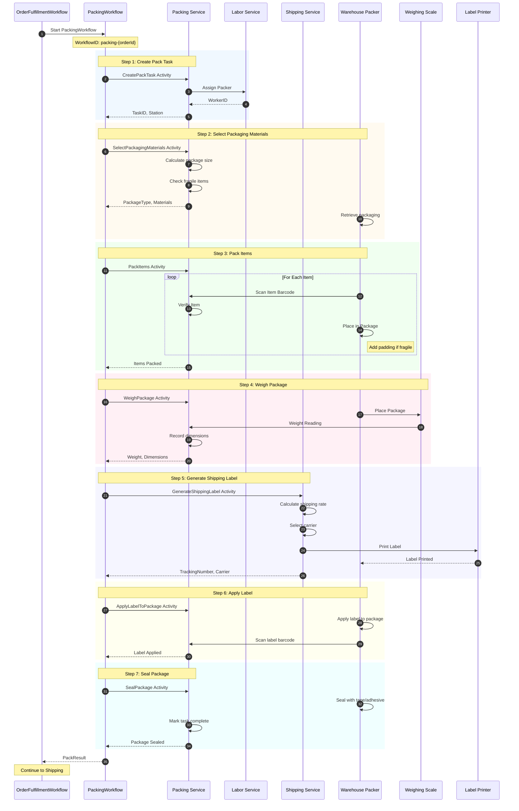
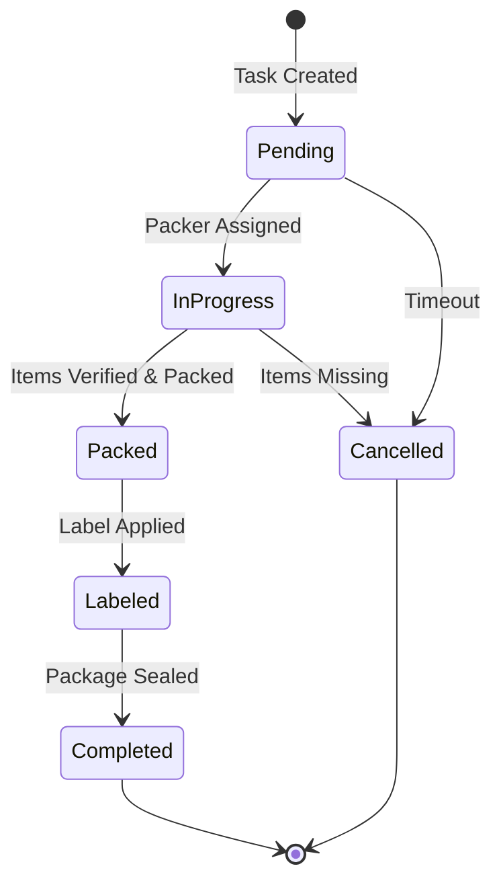
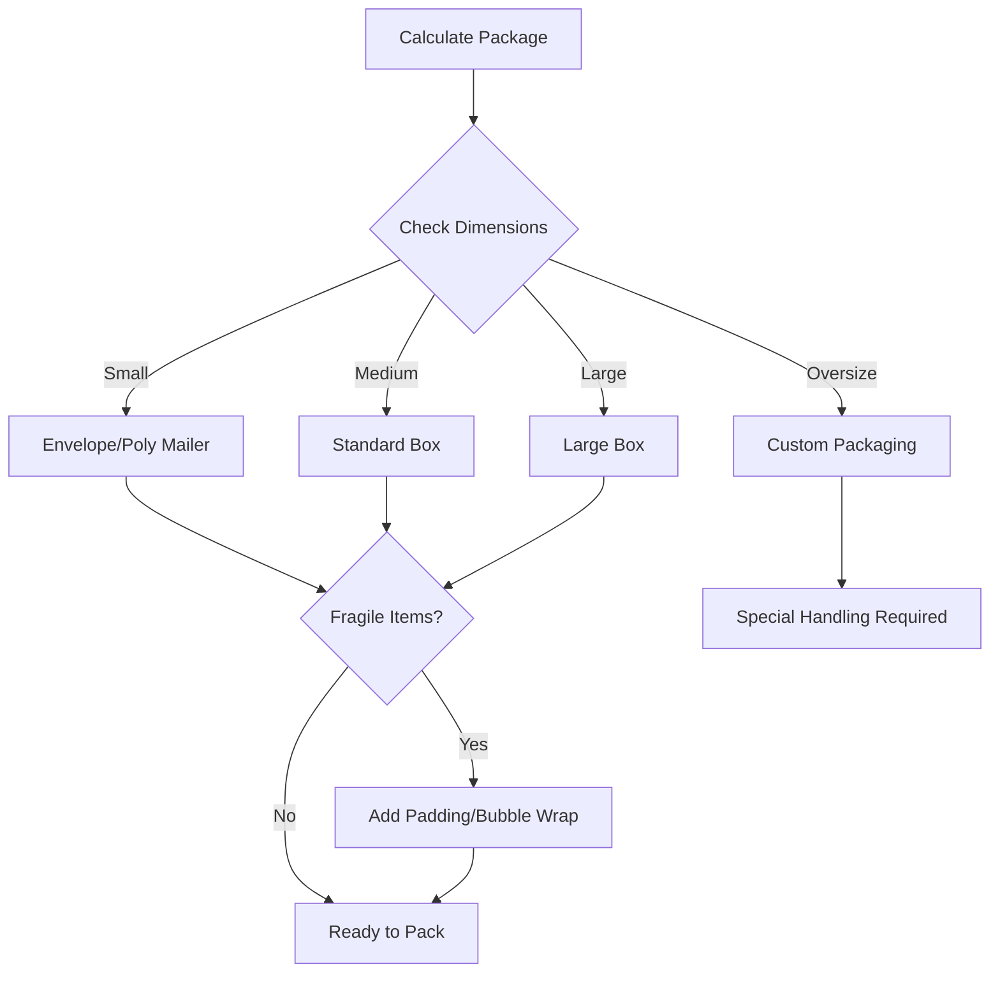
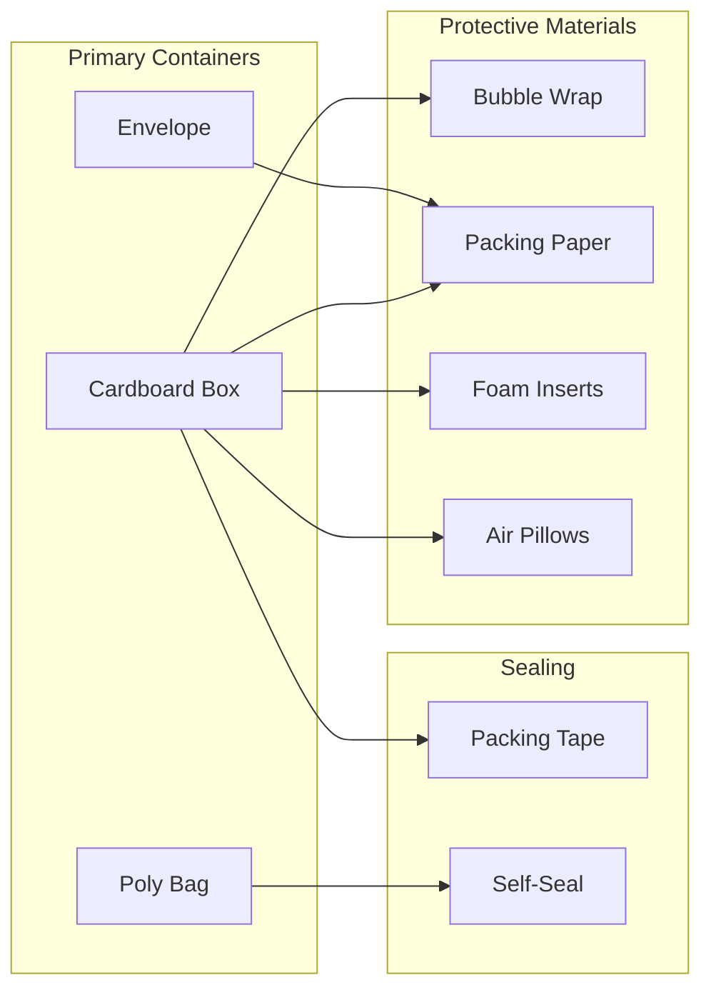

# Packing Workflow

This diagram shows the packing child workflow with 7 steps: task creation, material selection, packing, weighing, label generation, label application, and sealing.

## Packing Sequence Diagram

## Pack Task State Machine

## Package Type Selection

## Data Structures

### PackTask
| Field | Type | Description |
|-------|------|-------------|
| TaskID | string | Unique identifier |
| OrderID | string | Associated order |
| Status | string | Current status |
| WorkerID | string | Assigned packer |
| Items | []PackItem | Items to pack |
| PackageID | string | Package identifier |
| PackageType | string | box/envelope/bag |
| TrackingNumber | string | Shipping tracking |
| Carrier | string | Shipping carrier |
| Weight | float64 | Package weight (kg) |
| Dimensions | Dimensions | L x W x H |

### PackResult
| Field | Type | Description |
|-------|------|-------------|
| PackageID | string | Sealed package ID |
| TrackingNumber | string | Carrier tracking number |
| Carrier | string | Carrier name |
| Weight | float64 | Final weight |

### Package Types
| Type | Use Case | Max Weight |
|------|----------|------------|
| envelope | Documents, thin items | 0.5 kg |
| padded_envelope | Small fragile items | 1 kg |
| bag | Soft goods, clothing | 5 kg |
| box | General merchandise | 30 kg |
| custom | Oversize items | Varies |

## Packaging Materials

## Related Diagrams

- [Consolidation Workflow](consolidation-workflow.md) - Previous step (multi-item)
- [Picking Workflow](picking-workflow.md) - Previous step (single item)
- [Shipping Workflow](shipping-workflow.md) - Next step (SLAM)
- [Order Fulfillment Flow](../../../docs/diagrams/order-fulfillment-flow.md) - Parent workflow
