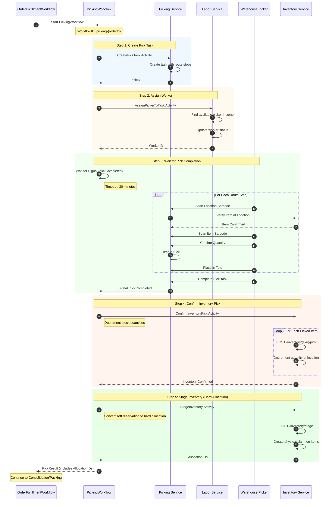
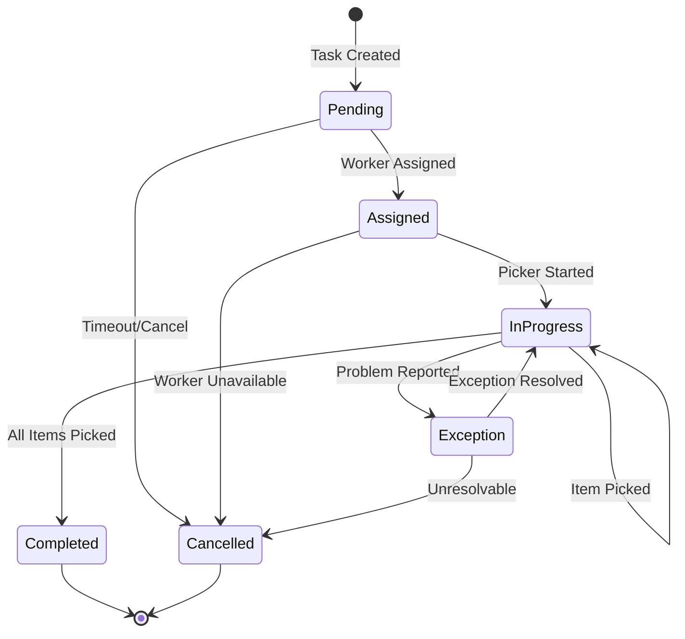
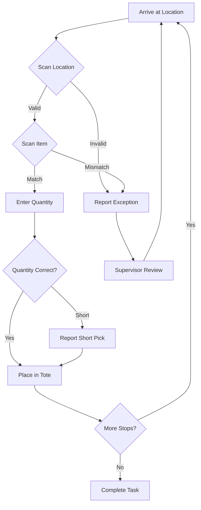

# Picking Workflow

This diagram shows the detailed picking child workflow, including task creation, worker assignment, and pick completion signaling.

## Picking Sequence Diagram

## Pick Task State Machine

## Pick Item Flow

## Data Structures

### PickTask
| Field | Type | Description |
|-------|------|-------------|
| TaskID | string | Unique task identifier |
| OrderID | string | Associated order |
| WaveID | string | Wave assignment |
| RouteID | string | Optimized pick route |
| WorkerID | string | Assigned picker |
| Status | string | Current status |
| Items | []PickItem | Items to pick |
| ToteID | string | Output container |

### PickResult
| Field | Type | Description |
|-------|------|-------------|
| TaskID | string | Completed task ID |
| PickedItems | []PickedItem | Successfully picked items |
| AllocationIDs | []string | Hard allocation IDs from staging |
| Success | bool | Completion status |

### PickedItem
| Field | Type | Description |
|-------|------|-------------|
| SKU | string | Item SKU |
| Quantity | int | Quantity picked |
| LocationID | string | Pick location |
| ToteID | string | Destination tote |

## Exception Types

| Exception | Cause | Resolution |
|-----------|-------|------------|
| ItemNotFound | Item not at location | Check alternate location |
| Damaged | Item damaged | Report for adjustment |
| QuantityMismatch | Less than expected | Short pick or recount |
| WrongItem | SKU mismatch | Find correct item |

## Related Diagrams

- [Order Fulfillment Flow](order-fulfillment.md) - Parent workflow
- [Consolidation Workflow](consolidation-workflow.md) - Next step (multi-item)
- [Packing Workflow](packing-workflow.md) - Next step (single item)
