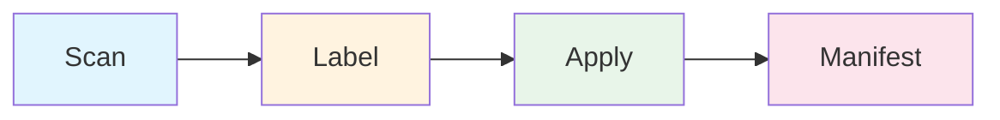
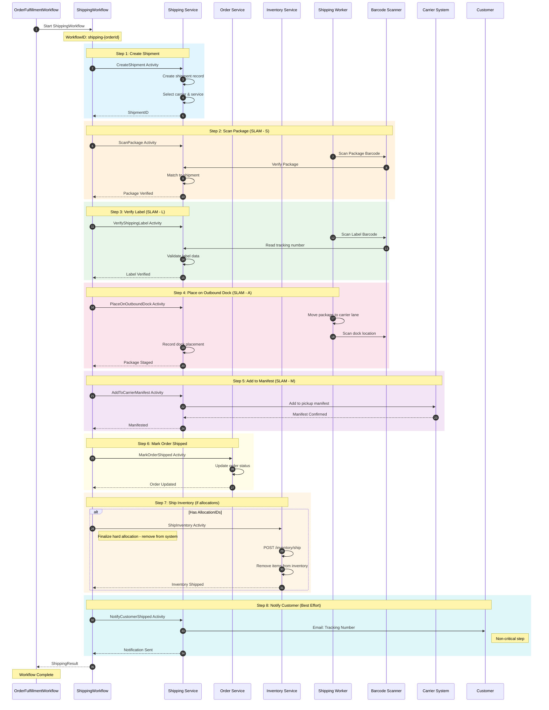
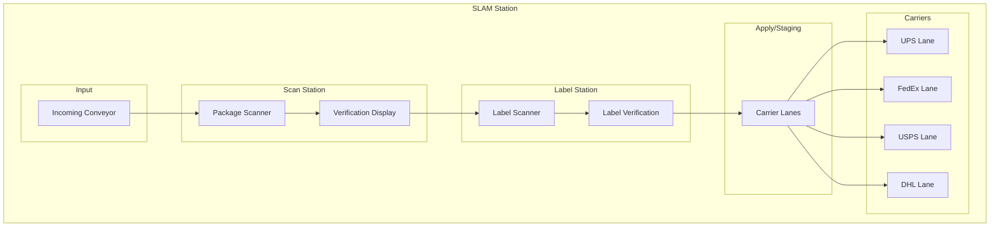
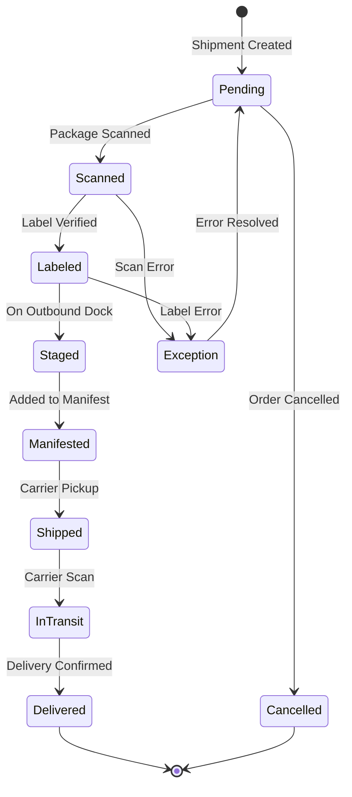
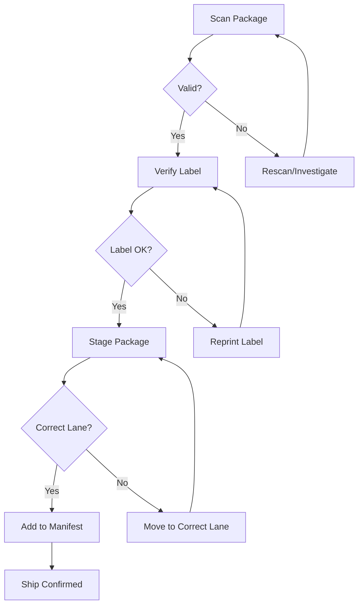

# Shipping Workflow (SLAM Process)

This diagram shows the shipping child workflow implementing the SLAM process: Scan, Label, Apply, Manifest.

## SLAM Process Overview

## Shipping Sequence Diagram

## SLAM Station Layout

## Shipment State Machine

## Data Structures

### Shipment
| Field | Type | Description |
|-------|------|-------------|
| ShipmentID | string | Unique identifier |
| OrderID | string | Associated order |
| PackageID | string | Package being shipped |
| Carrier | string | UPS/FedEx/USPS/DHL |
| Service | string | Service level |
| TrackingNumber | string | Tracking number |
| Status | string | Current status |
| Weight | float64 | Package weight |
| Dimensions | Dimensions | Package dimensions |
| ShippingAddress | Address | Destination |
| Label | ShippingLabel | Label info |

### Carrier Options
| Carrier | Services | Features |
|---------|----------|----------|
| UPS | Ground, 2-Day, Next Day | Full tracking, pickup |
| FedEx | Ground, Express, Priority | Real-time tracking |
| USPS | Priority, First Class | Residential delivery |
| DHL | Express, eCommerce | International |

### Manifest
| Field | Type | Description |
|-------|------|-------------|
| ManifestID | string | Unique identifier |
| Carrier | string | Carrier code |
| PickupDate | date | Scheduled pickup |
| Shipments | []string | Shipment IDs |
| Status | string | open/closed/picked_up |
| TotalPackages | int | Package count |
| TotalWeight | float64 | Combined weight |

## Error Handling

## Related Diagrams

- [Order Fulfillment Flow](order-fulfillment.md) - Parent workflow
- [Packing Workflow](packing-workflow.md) - Previous step
- [Cancellation Workflow](cancellation-workflow.md) - Compensation workflow
