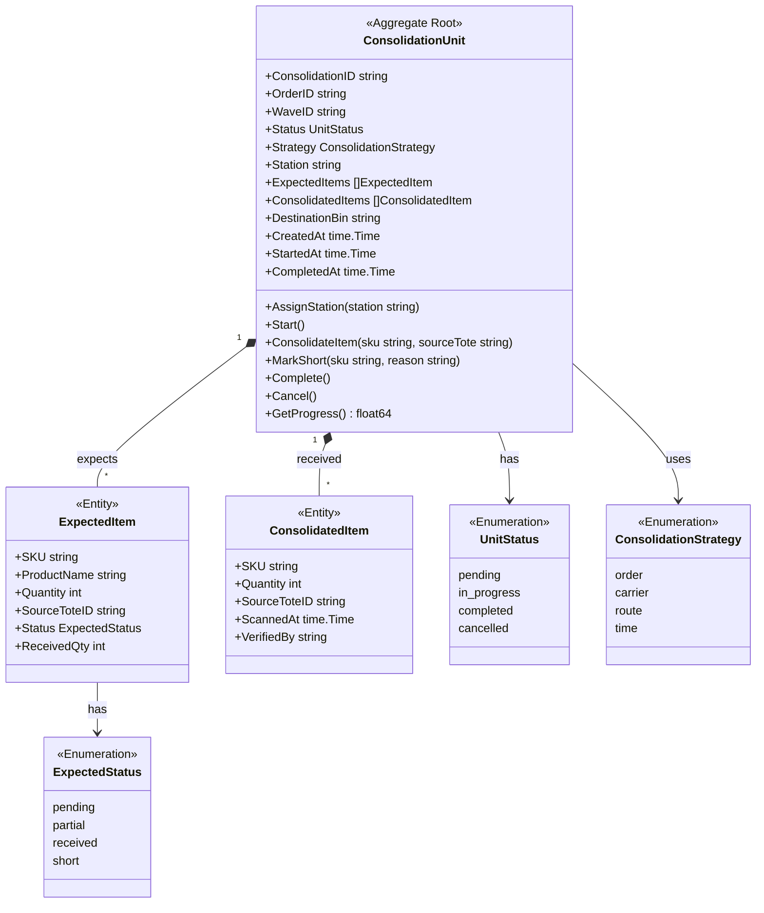
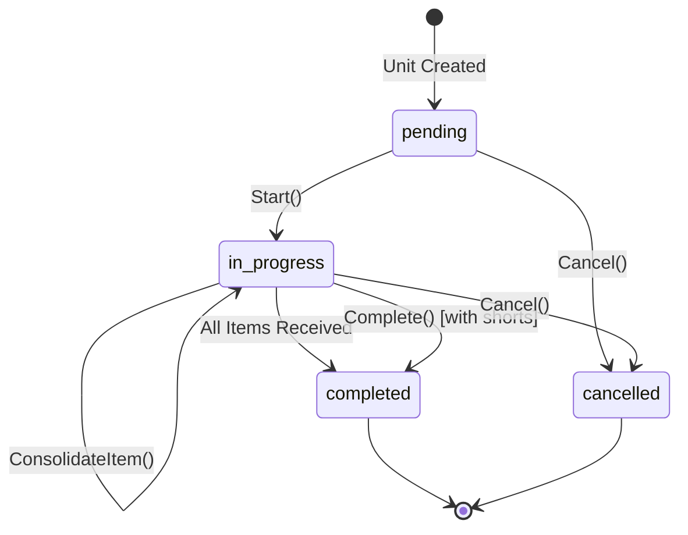

# Consolidation Service - Class Diagram

This diagram shows the domain model for the Consolidation Service bounded context.

## Domain Model

## Consolidation Flow

## Related Diagrams

- [Aggregate Diagram](ddd/aggregates.md) - DDD aggregate structure
- [Consolidation Workflow](../../../orchestrator/docs/diagrams/consolidation-workflow.md) - Workflow details
