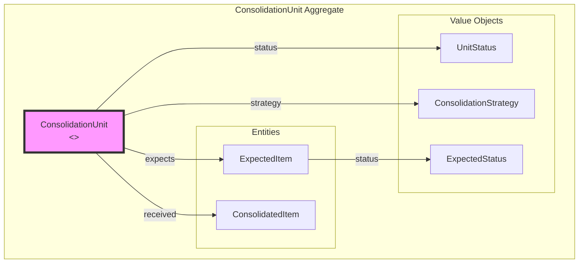
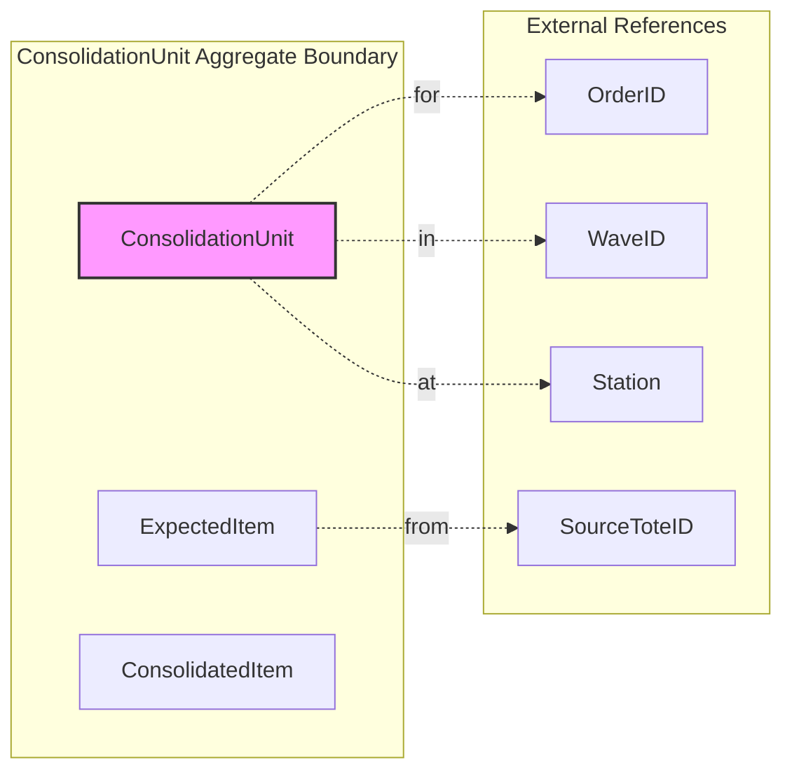
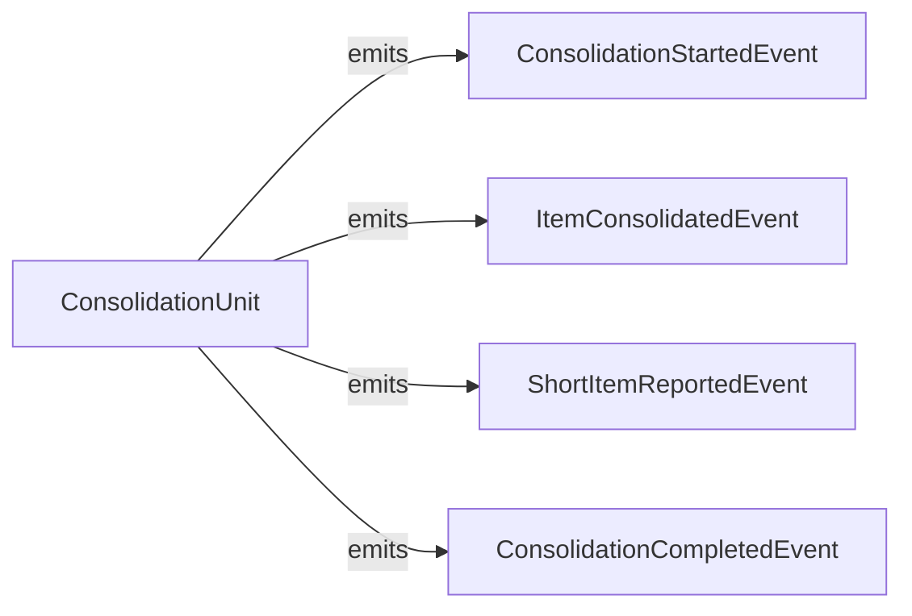

# Consolidation Service - DDD Aggregates

This document describes the aggregate structure for the Consolidation bounded context.

## Aggregate: ConsolidationUnit

The ConsolidationUnit aggregate manages combining items from multiple totes.

## Aggregate Boundaries

## Invariants

| Invariant | Description |
|-----------|-------------|
| Station assigned | Must have station before start |
| Items match | Consolidated items must match expected |
| No duplicates | Each item scanned only once |
| Complete tracking | All items must be accounted for |

## Domain Events

## Related Documentation

- [Class Diagram](../class-diagram.md) - Full domain model
- [Consolidation Workflow](../../../../orchestrator/docs/diagrams/consolidation-workflow.md) - Workflow details
