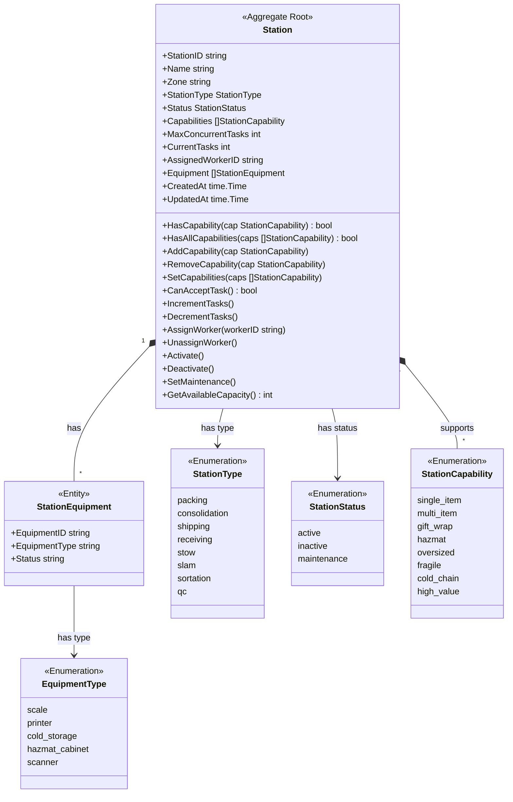
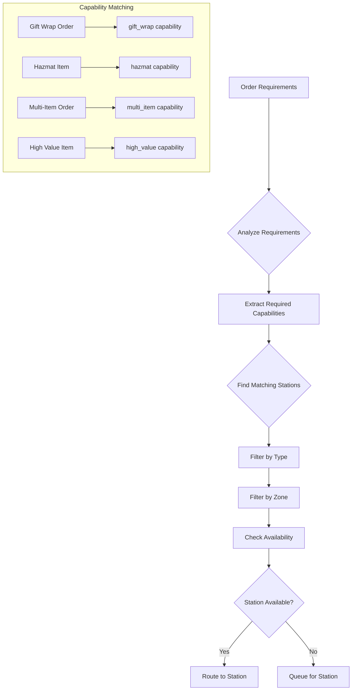
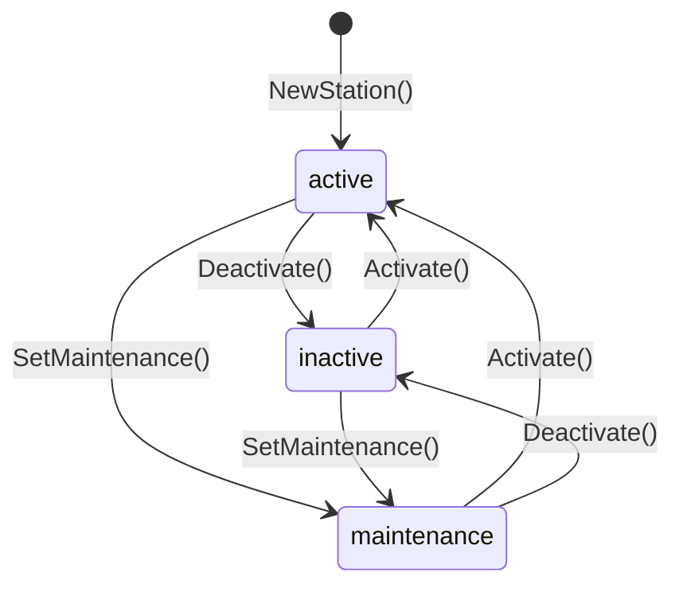
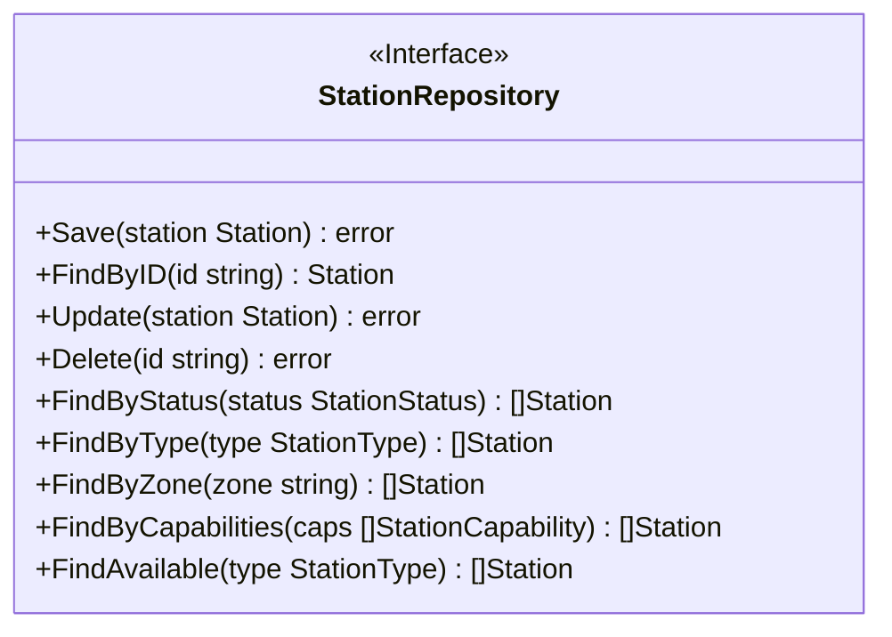

# Facility Service - Class Diagram

This diagram shows the domain model for the Facility Service bounded context.

## Domain Model

## Process Path Routing

## Station Status Transitions

## Repository Interface

## Related Diagrams

- [DDD Aggregates](ddd/aggregates.md) - Aggregate documentation
- [OpenAPI Specification](openapi.yaml) - REST API contracts
- [AsyncAPI Specification](asyncapi.yaml) - Event contracts
