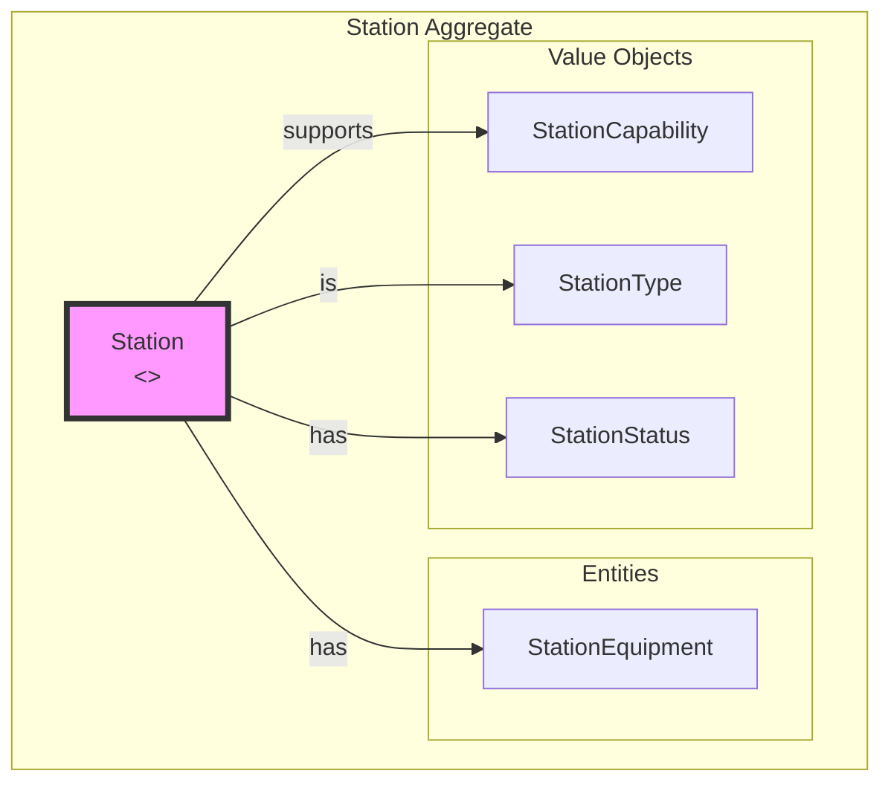
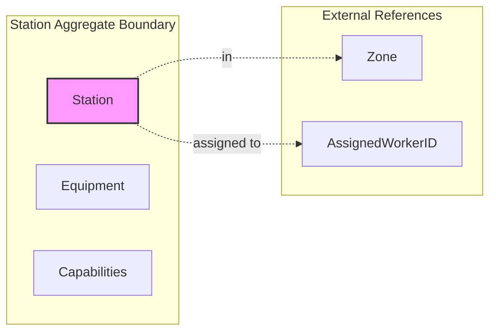
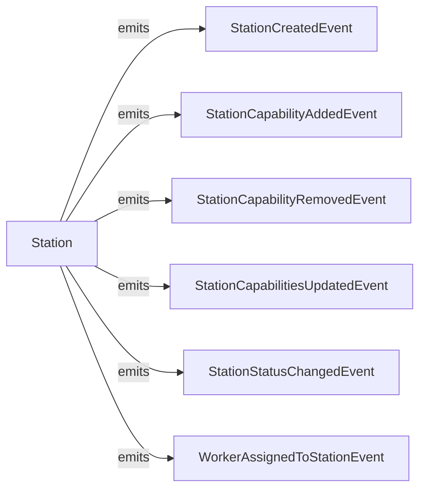
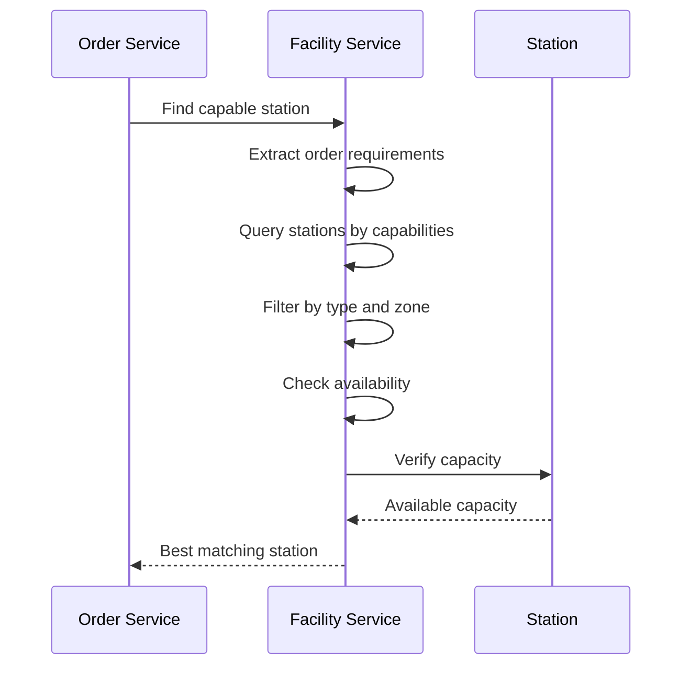
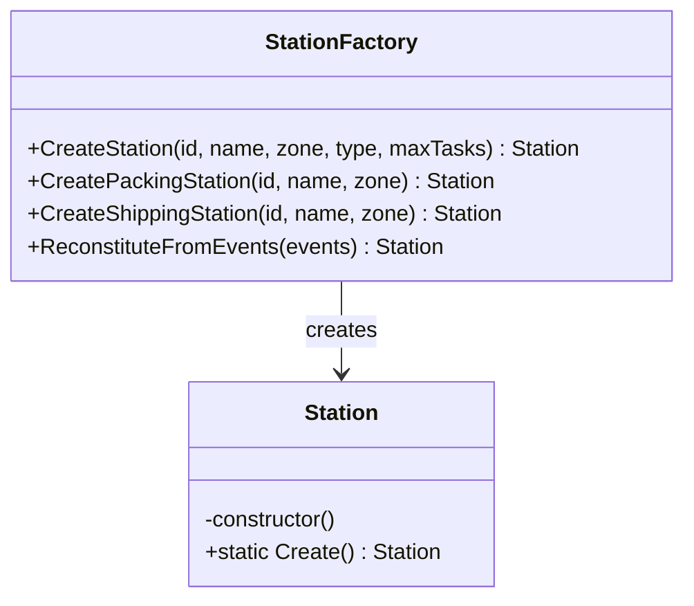
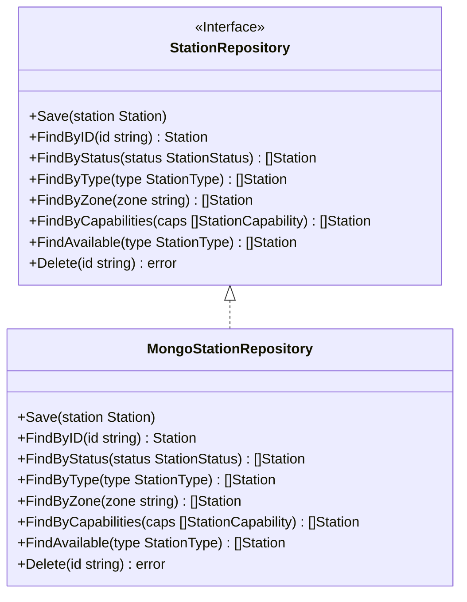

# Facility Service - DDD Aggregates

This document describes the aggregate structure for the Facility bounded context following Domain-Driven Design principles.

## Aggregate: Station

The Station aggregate represents a work station in the warehouse with specific capabilities for process path routing.

## Aggregate Boundaries

## Invariants

| Invariant | Description |
|-----------|-------------|
| Valid station type | Station type must be from defined enum |
| Valid capabilities | All capabilities must be from defined enum |
| Max concurrent tasks positive | MaxConcurrentTasks must be > 0 |
| Current tasks <= max | Cannot exceed maximum concurrent tasks |
| Active for task assignment | Cannot assign tasks to inactive/maintenance stations |
| Unique capability per station | Cannot add duplicate capabilities |

## Capability Matching Rules

| Order Characteristic | Required Capability |
|---------------------|---------------------|
| Single item order | `single_item` |
| Multi-item order | `multi_item` |
| Gift wrap requested | `gift_wrap` |
| Hazardous materials | `hazmat` |
| Oversized items | `oversized` |
| Fragile items | `fragile` |
| Temperature-sensitive | `cold_chain` |
| High-value items | `high_value` |

## Domain Events

## Event Details

| Event | Trigger | Payload |
|-------|---------|---------|
| StationCreatedEvent | New station created | stationId, name, zone, stationType |
| StationCapabilityAddedEvent | Capability added | stationId, capability, addedAt |
| StationCapabilityRemovedEvent | Capability removed | stationId, capability, removedAt |
| StationCapabilitiesUpdatedEvent | Bulk capability update | stationId, capabilities, updatedAt |
| StationStatusChangedEvent | Status changed | stationId, oldStatus, newStatus |
| WorkerAssignedToStationEvent | Worker assigned | stationId, workerId, assignedAt |

## Process Path Routing Flow

## Factory Pattern

## Repository Pattern

## Related Documentation

- [Class Diagram](../class-diagram.md) - Full domain model
- [OpenAPI Specification](../openapi.yaml) - REST API contracts
- [AsyncAPI Specification](../asyncapi.yaml) - Event contracts
