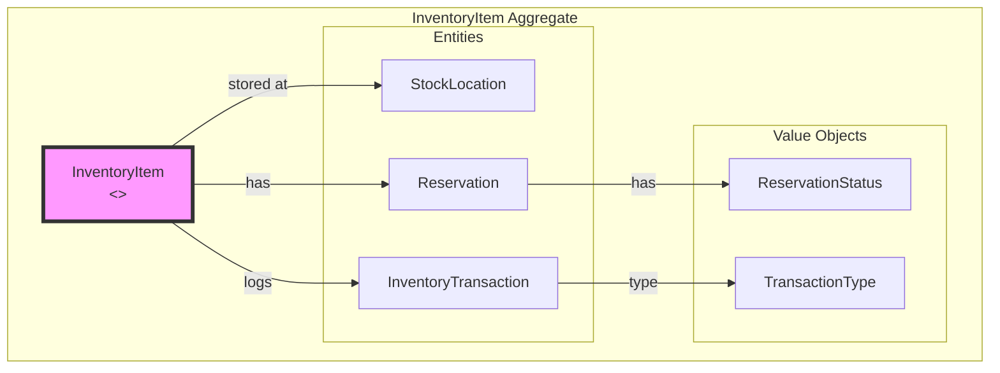
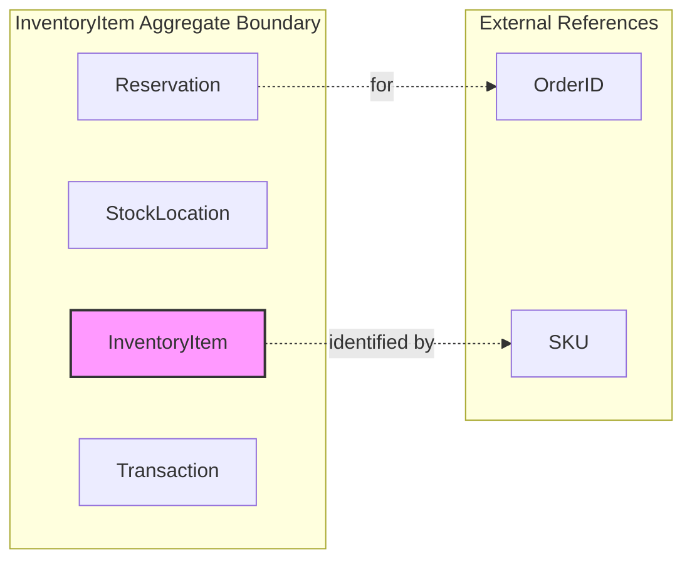
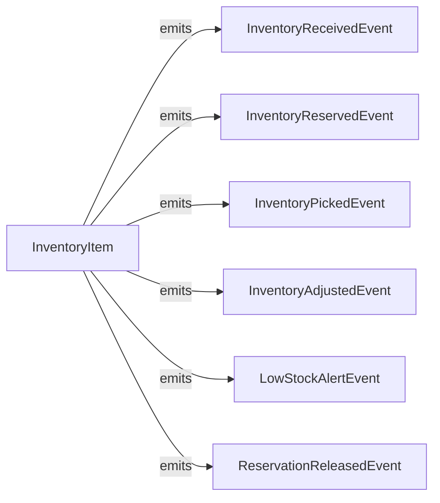
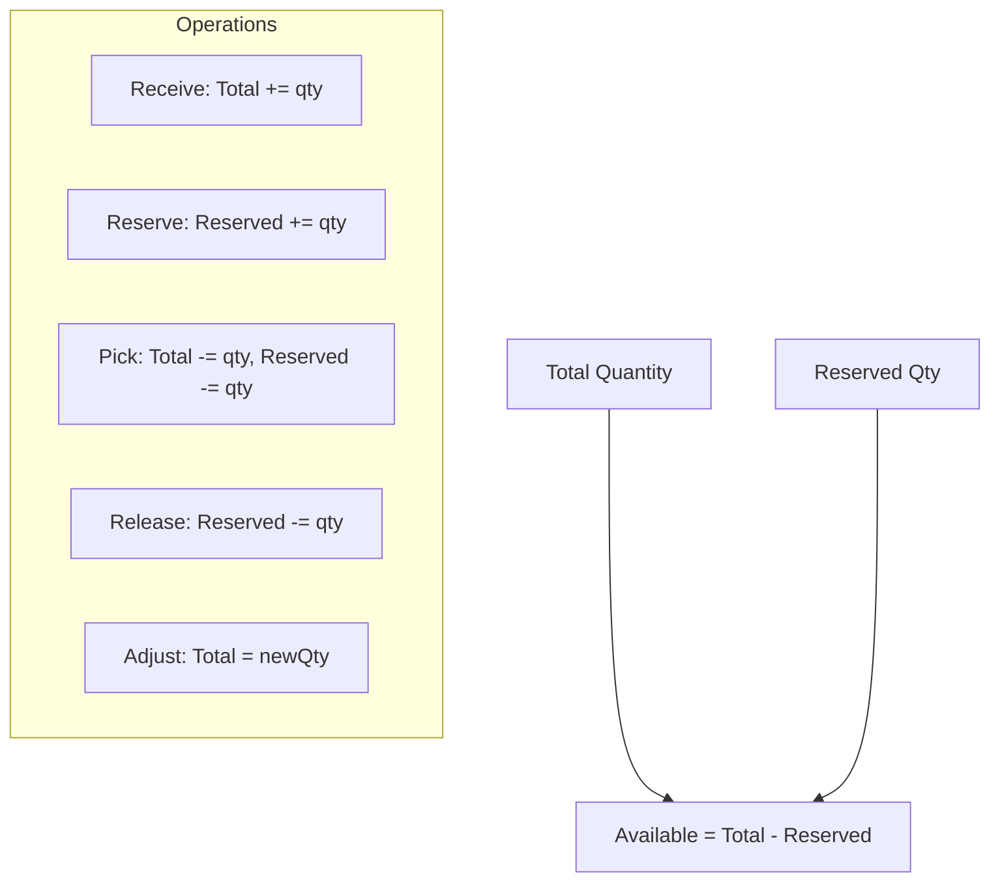

# Inventory Service - DDD Aggregates

This document describes the aggregate structure for the Inventory bounded context.

## Aggregate: InventoryItem

The InventoryItem aggregate manages stock levels, locations, and reservations for a single SKU.

## Aggregate Boundaries

## Invariants

| Invariant | Description |
|-----------|-------------|
| Available >= 0 | Available quantity cannot be negative |
| Reserved <= Total | Reserved cannot exceed total quantity |
| Single reservation per order | One reservation per order per SKU |
| Expiration enforced | Reservations expire after 24 hours |
| Location quantity >= 0 | Location quantity must be non-negative |

## Domain Events

## Stock Calculations

## Related Documentation

- [Class Diagram](../class-diagram.md) - Full domain model
- [Context Map](../../../../docs/diagrams/ddd/context-map.md) - Bounded context relationships
