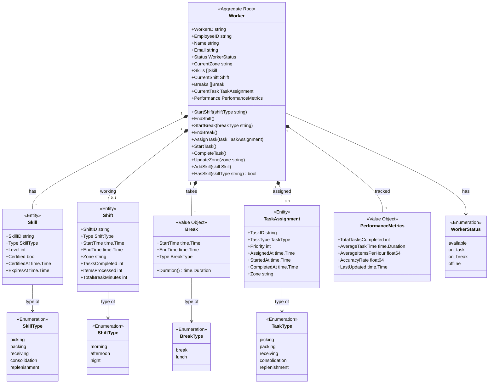
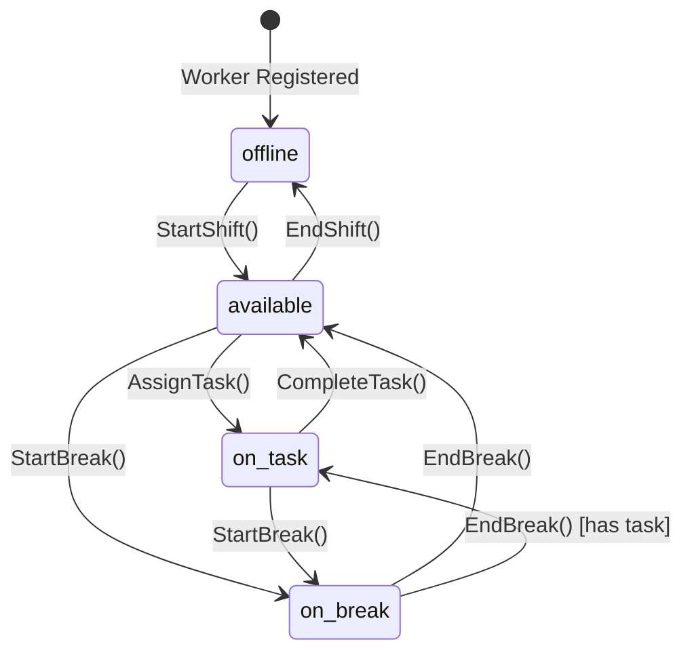
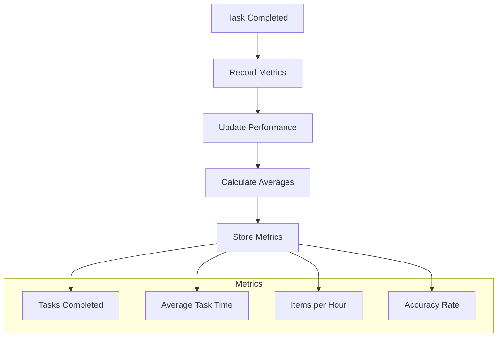

# Labor Service - Class Diagram

This diagram shows the domain model for the Labor Service bounded context.

## Domain Model

## Worker Lifecycle

## Performance Tracking

## Related Diagrams

- [Aggregate Diagram](ddd/aggregates.md) - DDD aggregate structure
- [Picking Workflow](../../../orchestrator/docs/diagrams/picking-workflow.md) - Worker assignment
