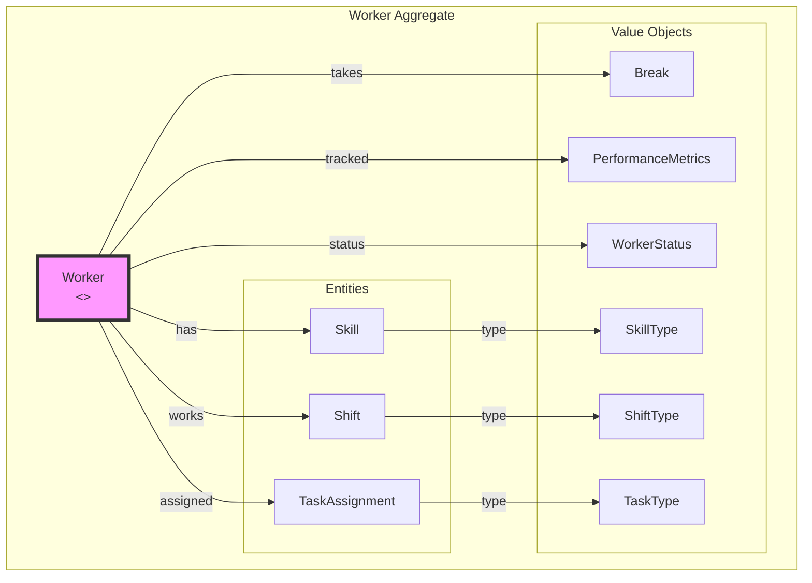
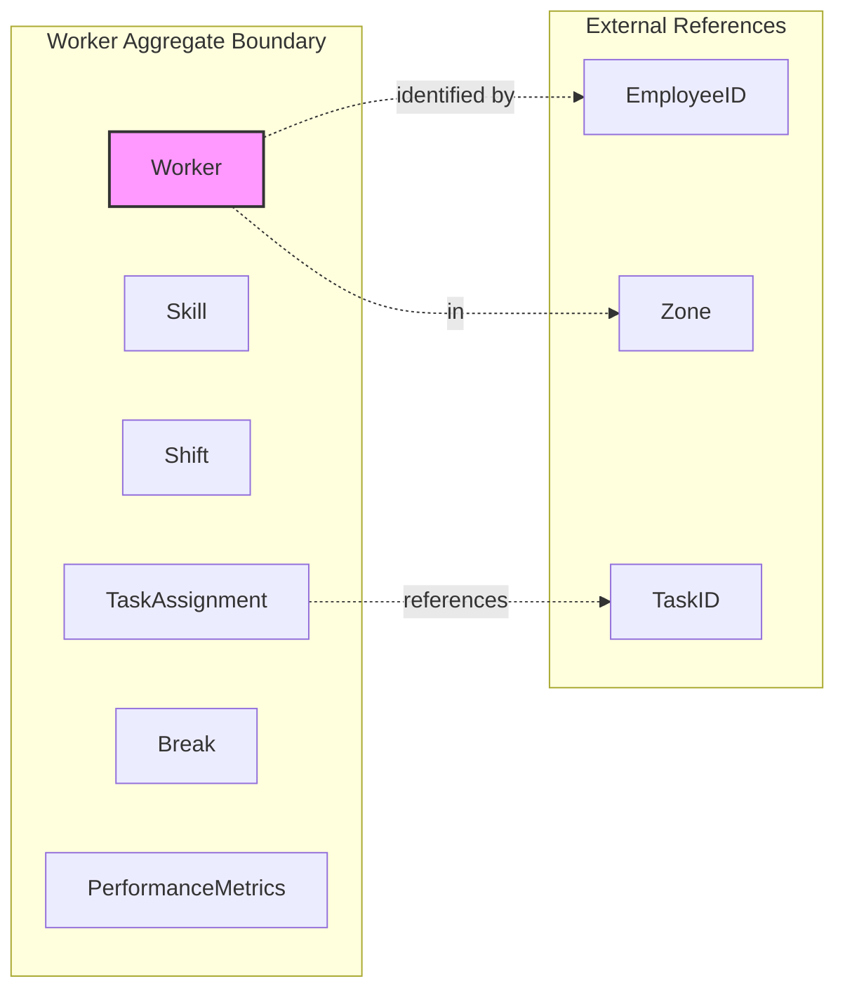
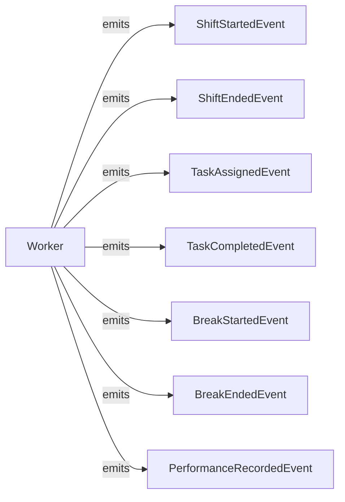
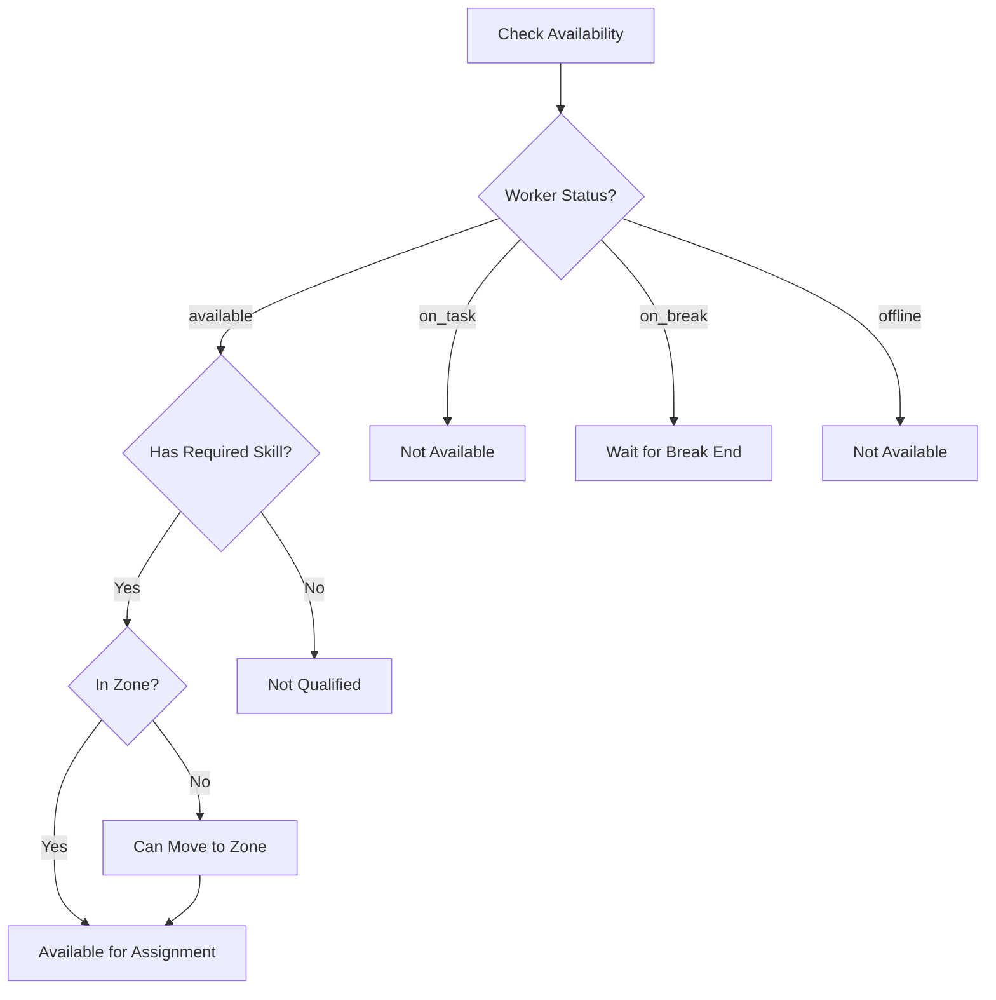

# Labor Service - DDD Aggregates

This document describes the aggregate structure for the Labor bounded context.

## Aggregate: Worker

The Worker aggregate manages workforce assignments and performance.

## Aggregate Boundaries

## Invariants

| Invariant | Description |
|-----------|-------------|
| One active shift | Worker can have only one active shift |
| One active task | Worker can have only one assigned task |
| Skill certification | Certified skills have expiration dates |
| Break limits | Maximum break time per shift enforced |
| Skill required | Cannot assign task without required skill |

## Domain Events

## Worker Availability

## Related Documentation

- [Class Diagram](../class-diagram.md) - Full domain model
- [Picking Workflow](../../../../orchestrator/docs/diagrams/picking-workflow.md) - Worker assignment
