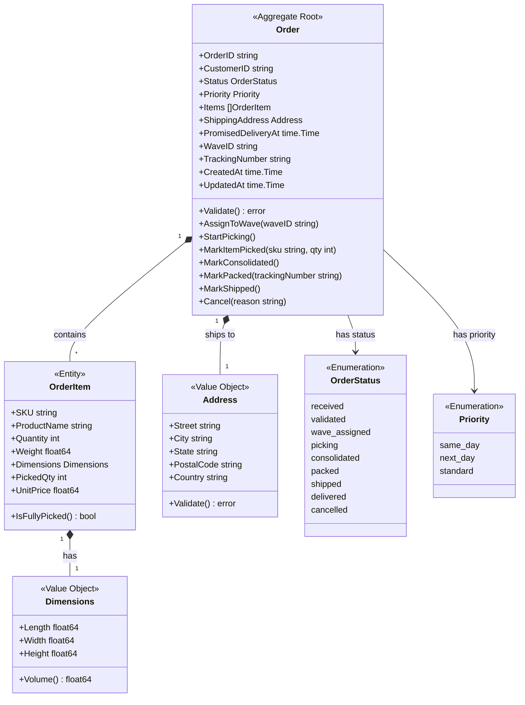
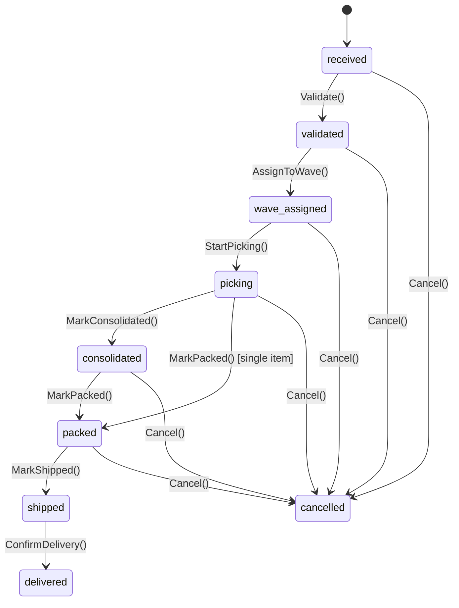
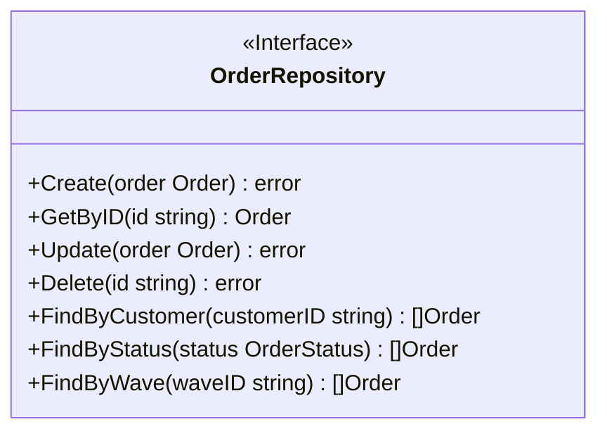

# Order Service - Class Diagram

This diagram shows the domain model for the Order Service bounded context.

## Domain Model

## State Transitions

## Repository Interface

## Related Diagrams

- [Aggregate Diagram](ddd/aggregates.md) - DDD aggregate structure
- [Order Fulfillment Flow](../../../docs/diagrams/order-fulfillment-flow.md) - Workflow integration
