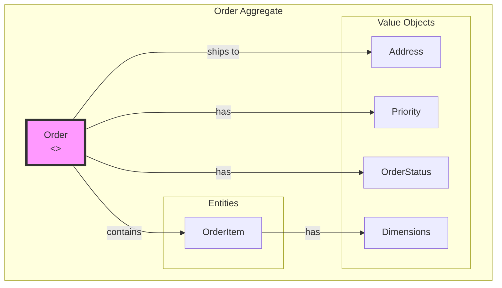
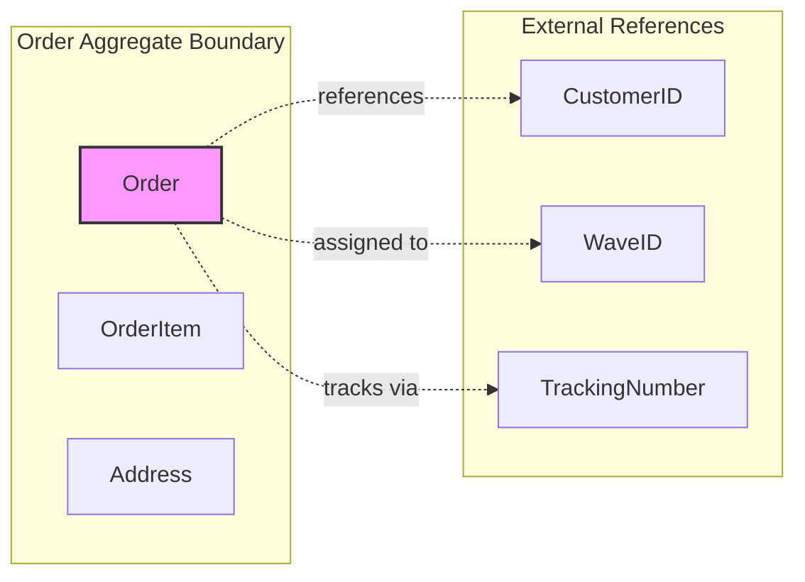
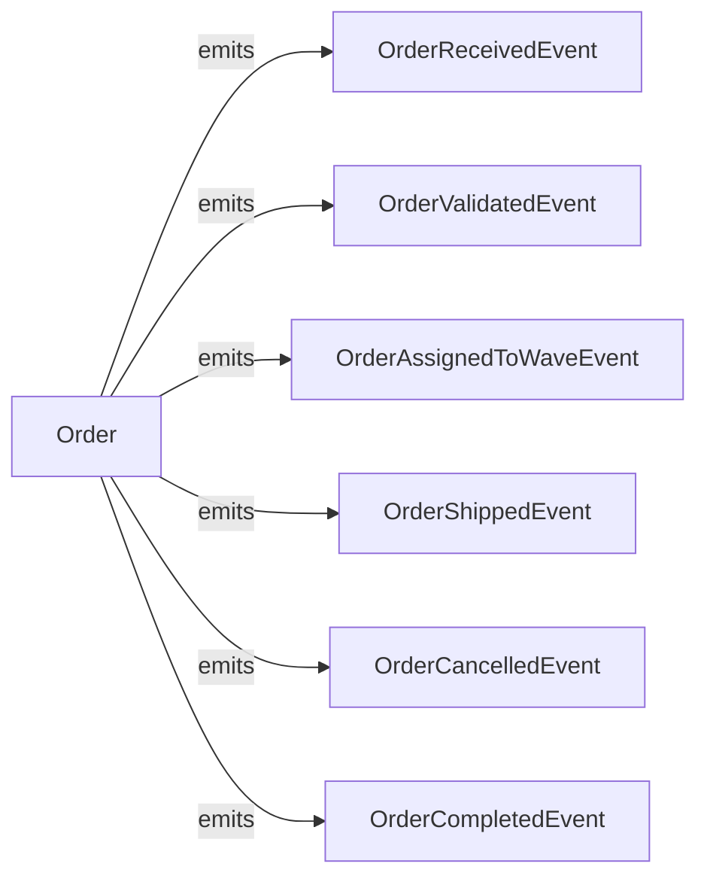
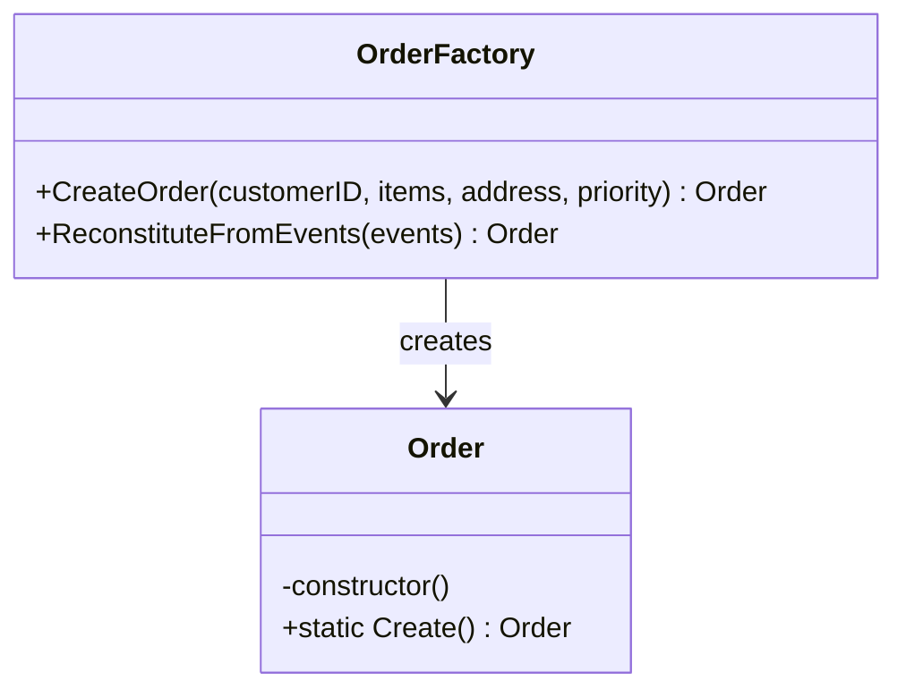
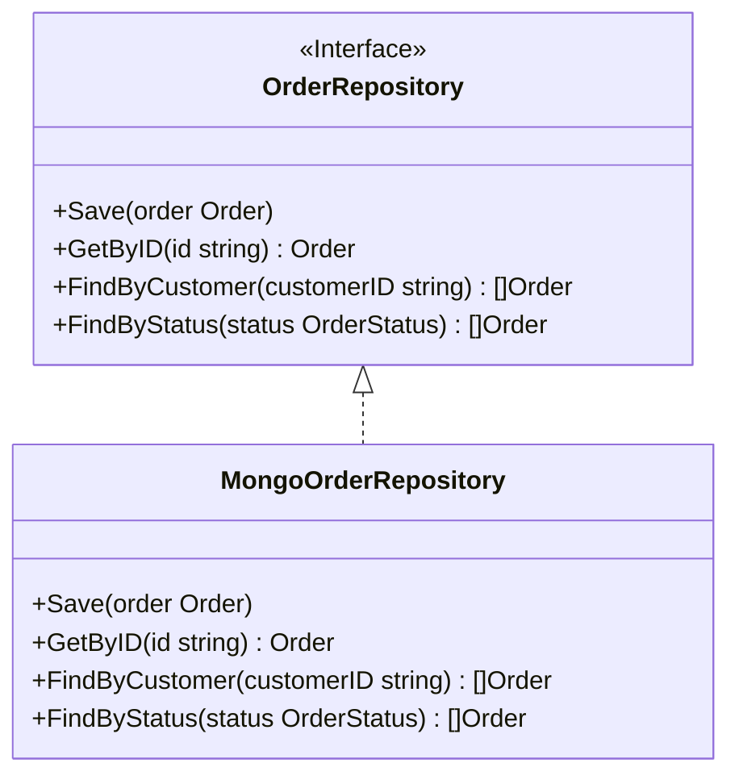

# Order Service - DDD Aggregates

This document describes the aggregate structure for the Order bounded context following Domain-Driven Design principles.

## Aggregate: Order

The Order aggregate is the core domain entity that represents a customer order throughout its fulfillment lifecycle.

## Aggregate Boundaries

## Invariants

| Invariant | Description |
|-----------|-------------|
| Order must have items | An order cannot exist without at least one item |
| Valid status transitions | Status can only change according to state machine |
| Priority immutable | Priority cannot change after validation |
| Quantity positive | OrderItem quantity must be > 0 |
| Address required | Shipping address must be valid for shipping |

## Domain Events

## Factory Pattern

## Repository Pattern

## Related Documentation

- [Class Diagram](../class-diagram.md) - Full domain model
- [Context Map](../../../../docs/diagrams/ddd/context-map.md) - Bounded context relationships
