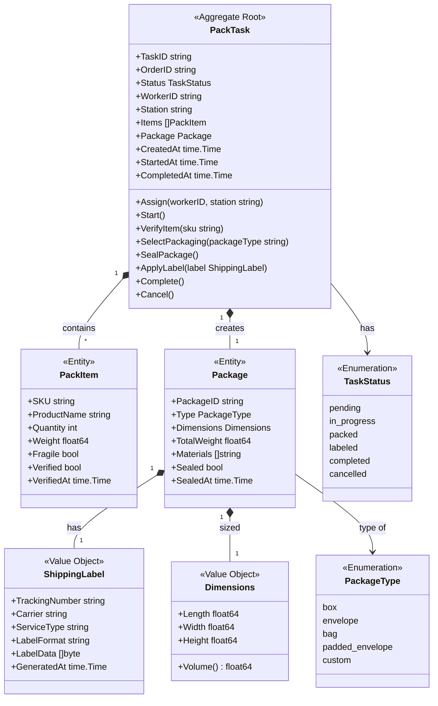
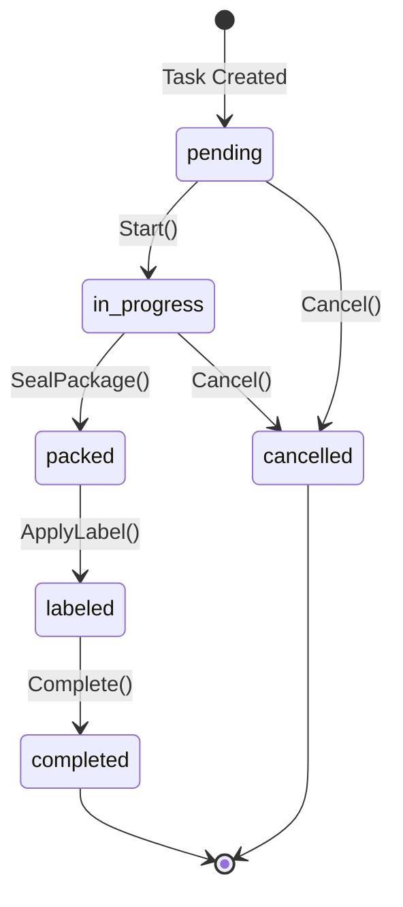

# Packing Service - Class Diagram

This diagram shows the domain model for the Packing Service bounded context.

## Domain Model

## Pack Task Flow

## Related Diagrams

- [Aggregate Diagram](ddd/aggregates.md) - DDD aggregate structure
- [Packing Workflow](../../../orchestrator/docs/diagrams/packing-workflow.md) - Workflow details
