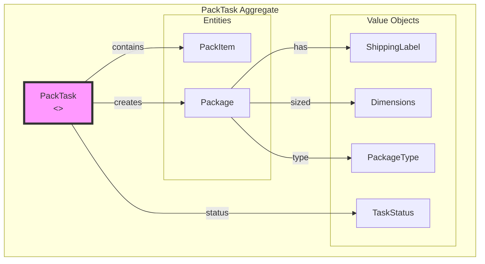
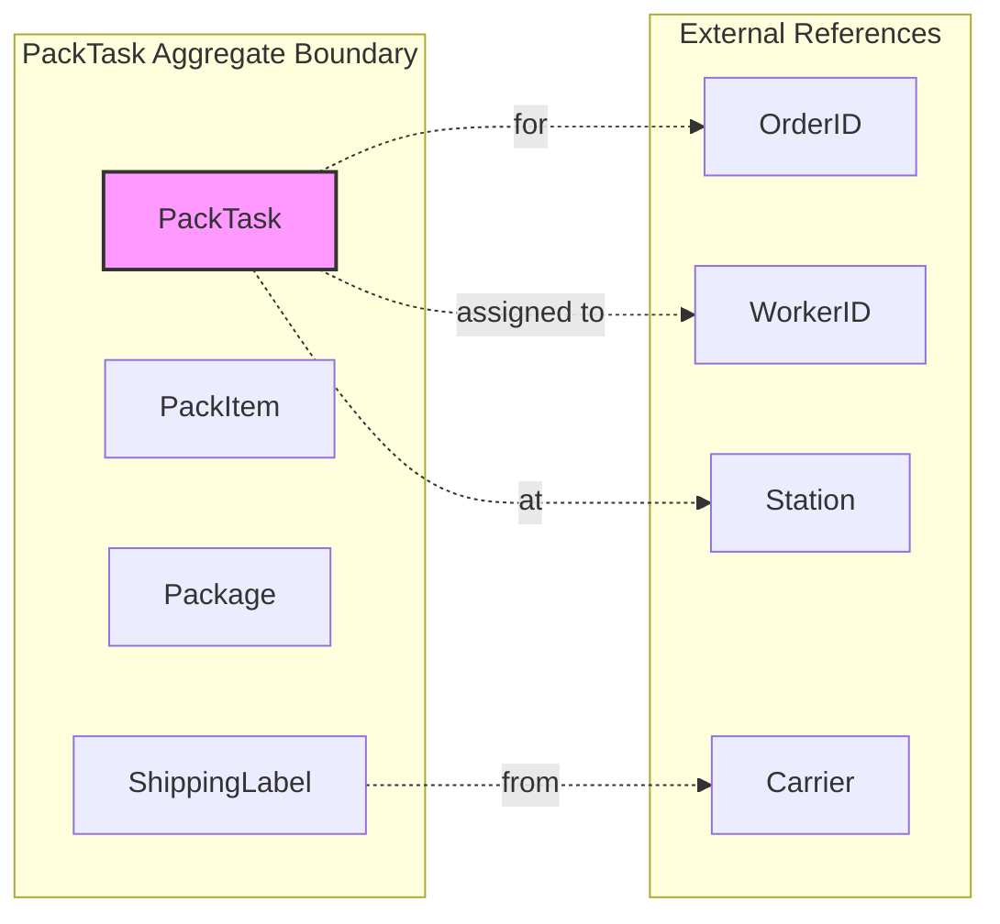
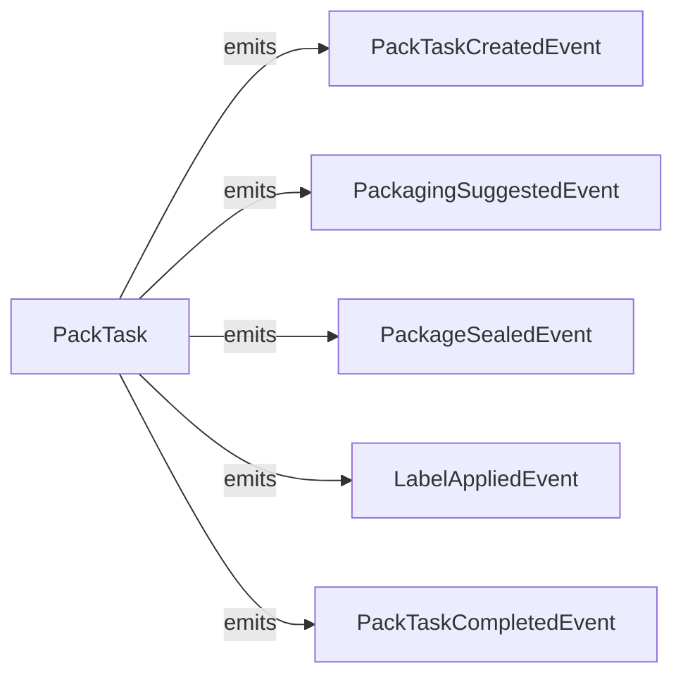

# Packing Service - DDD Aggregates

This document describes the aggregate structure for the Packing bounded context.

## Aggregate: PackTask

The PackTask aggregate manages the packing and labeling operation.

## Aggregate Boundaries

## Invariants

| Invariant | Description |
|-----------|-------------|
| Items verified | All items must be verified before sealing |
| Package selected | Must have package type before packing |
| Label before seal | Label must be generated before sealing |
| Weight recorded | Package weight must be recorded |

## Domain Events

## Related Documentation

- [Class Diagram](../class-diagram.md) - Full domain model
- [Packing Workflow](../../../../orchestrator/docs/diagrams/packing-workflow.md) - Workflow details
