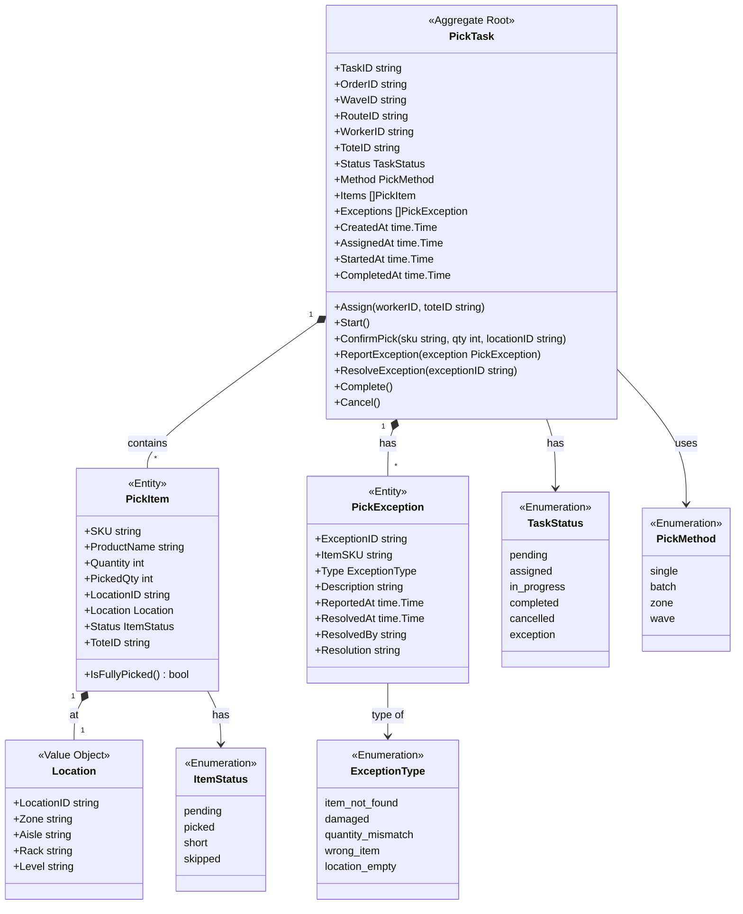
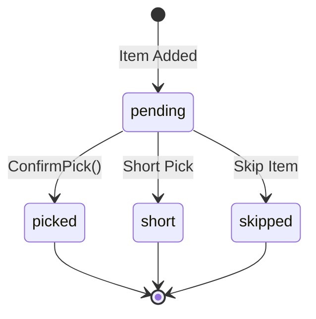

# Picking Service - Class Diagram

This diagram shows the domain model for the Picking Service bounded context.

## Domain Model

## Pick Item Flow

## Related Diagrams

- [Aggregate Diagram](ddd/aggregates.md) - DDD aggregate structure
- [Picking Workflow](../../../orchestrator/docs/diagrams/picking-workflow.md) - Workflow details
