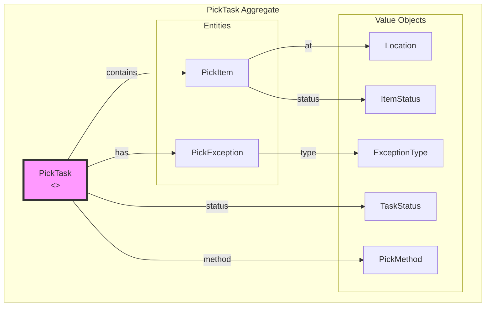
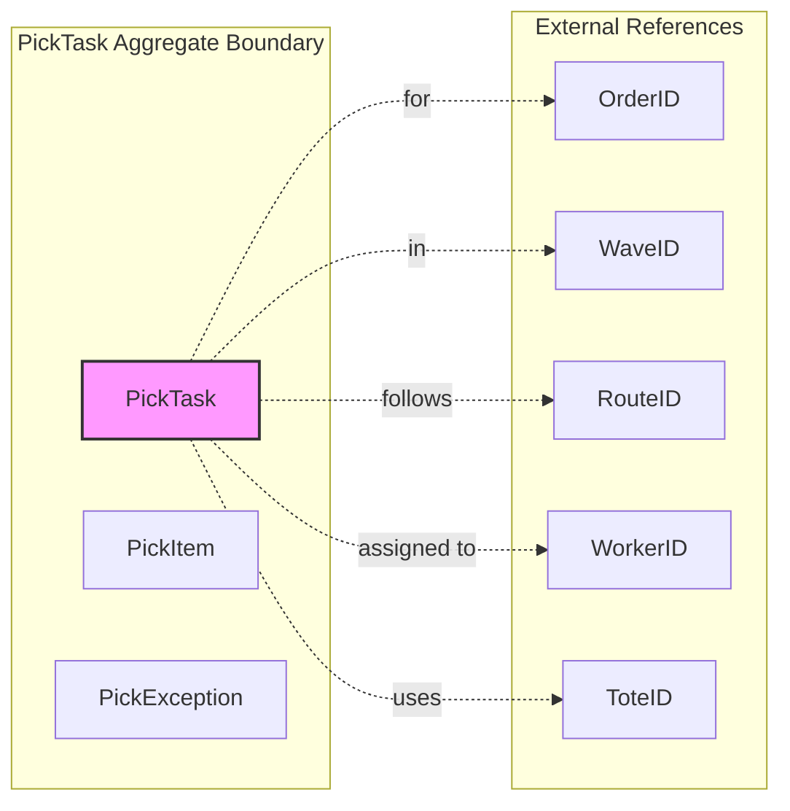
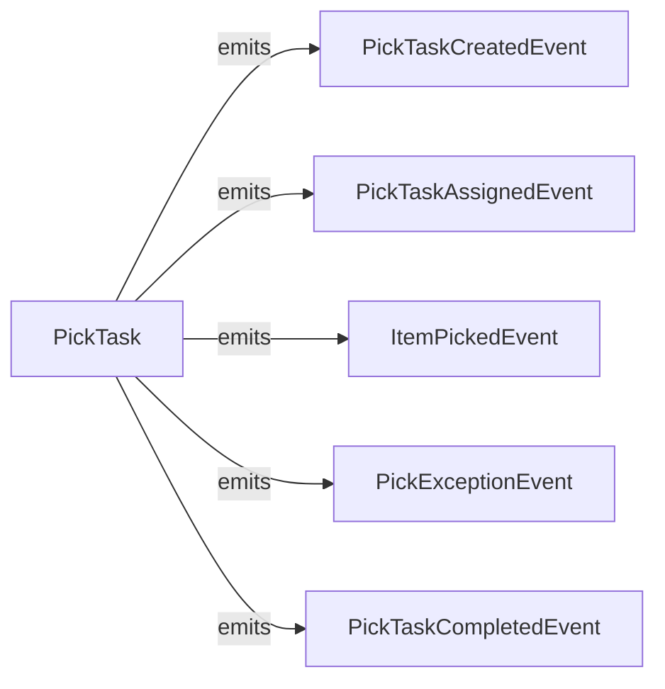

# Picking Service - DDD Aggregates

This document describes the aggregate structure for the Picking bounded context.

## Aggregate: PickTask

The PickTask aggregate manages the picking operation for an order.

## Aggregate Boundaries

## Invariants

| Invariant | Description |
|-----------|-------------|
| Worker required | Cannot start without assigned worker |
| Tote required | Cannot pick without assigned tote |
| Quantity valid | Picked quantity <= expected quantity |
| Exception resolution | Exceptions must be resolved to complete |

## Domain Events

## Related Documentation

- [Class Diagram](../class-diagram.md) - Full domain model
- [Picking Workflow](../../../../orchestrator/docs/diagrams/picking-workflow.md) - Workflow details
