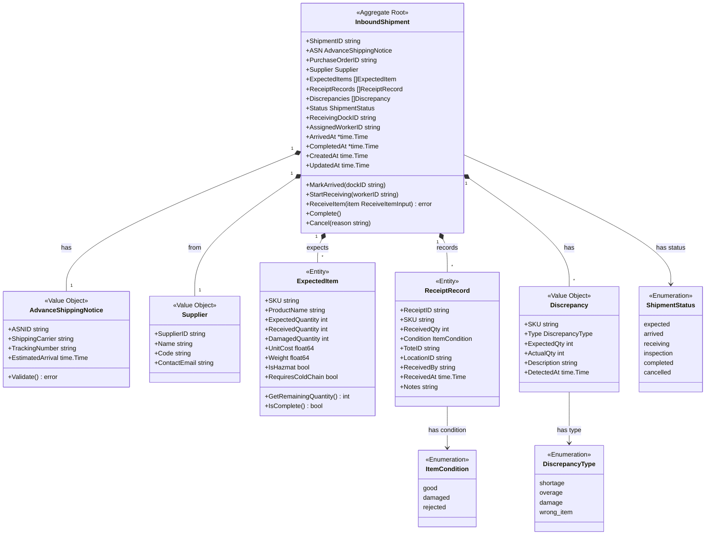
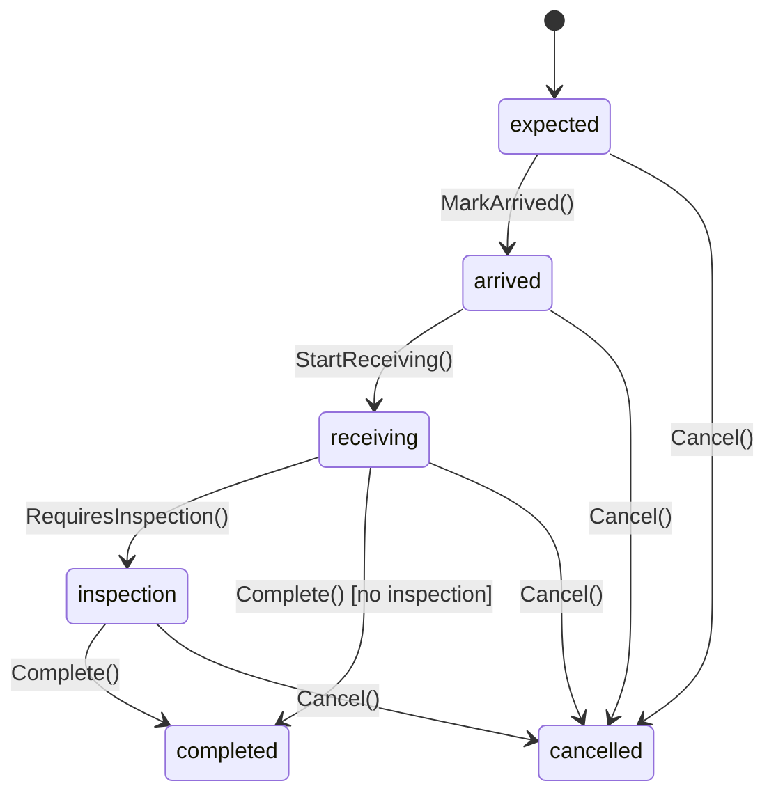
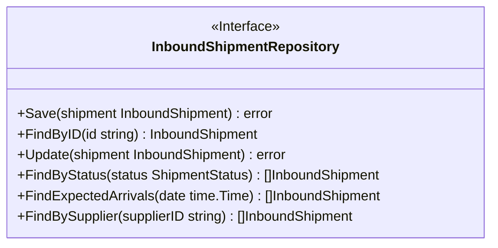

# Receiving Service - Class Diagram

This diagram shows the domain model for the Receiving Service bounded context.

## Domain Model

## State Transitions

## Repository Interface

## Related Diagrams

- [DDD Aggregates](ddd/aggregates.md) - Aggregate documentation
- [AsyncAPI Specification](asyncapi.yaml) - Event contracts
