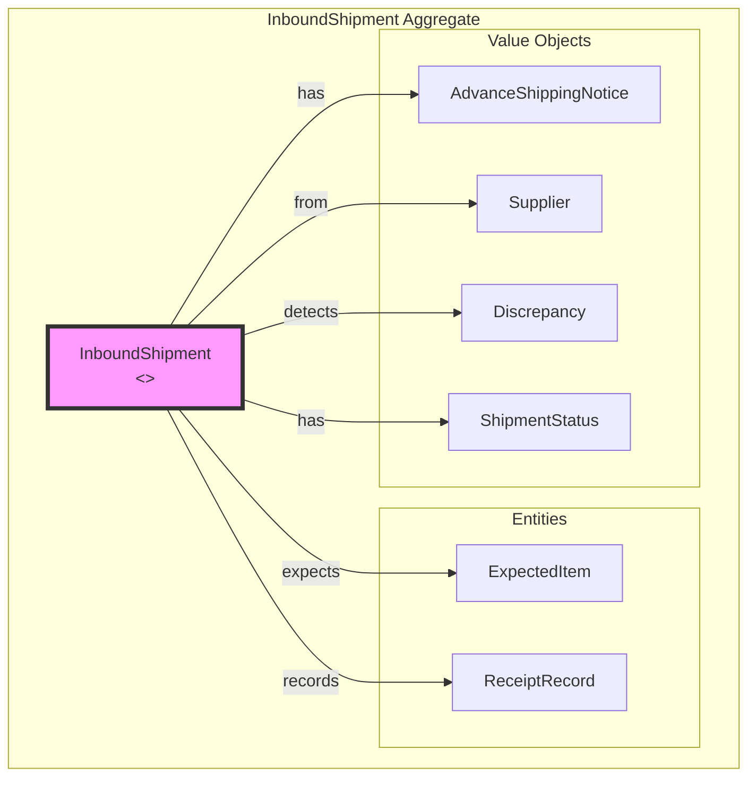
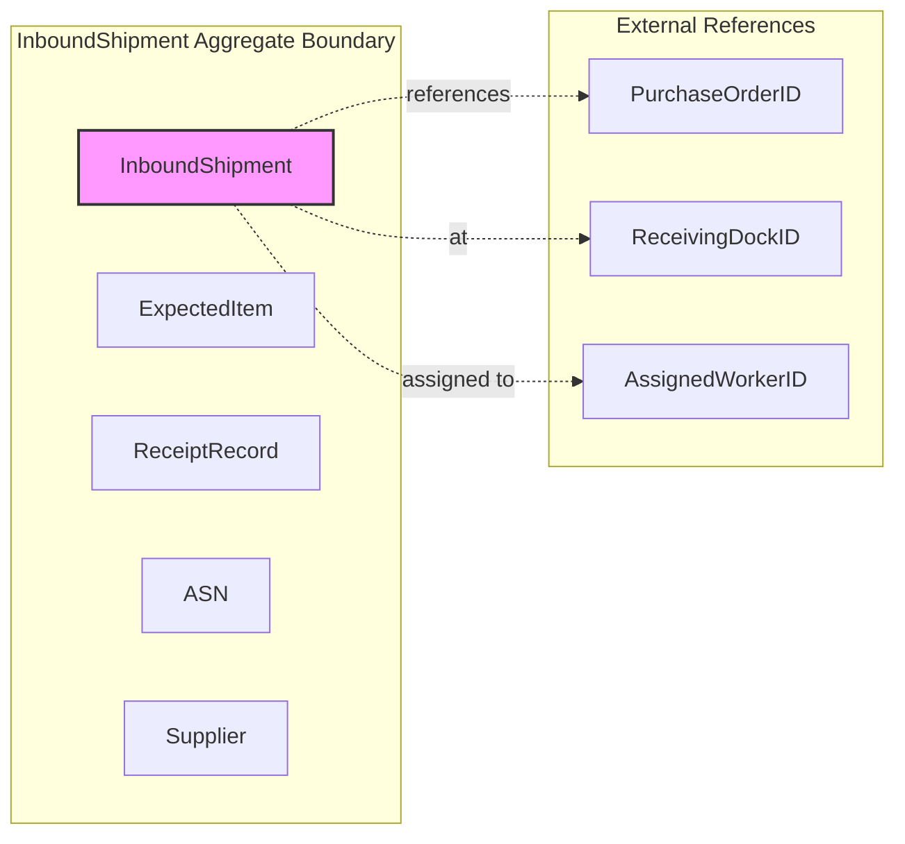
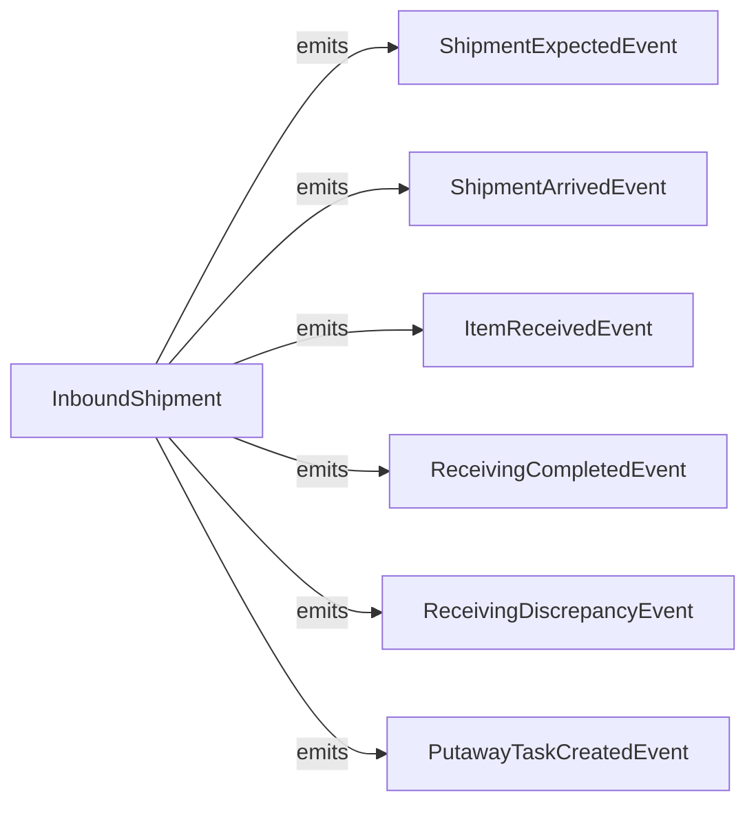
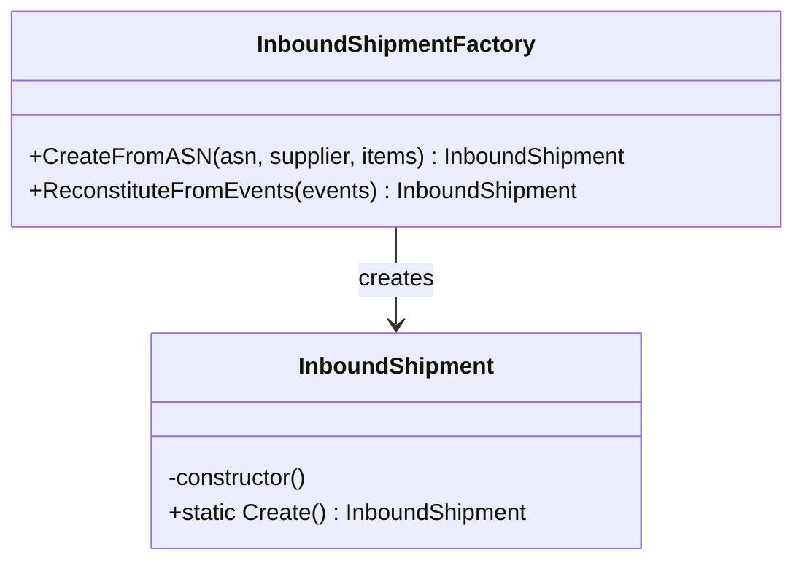
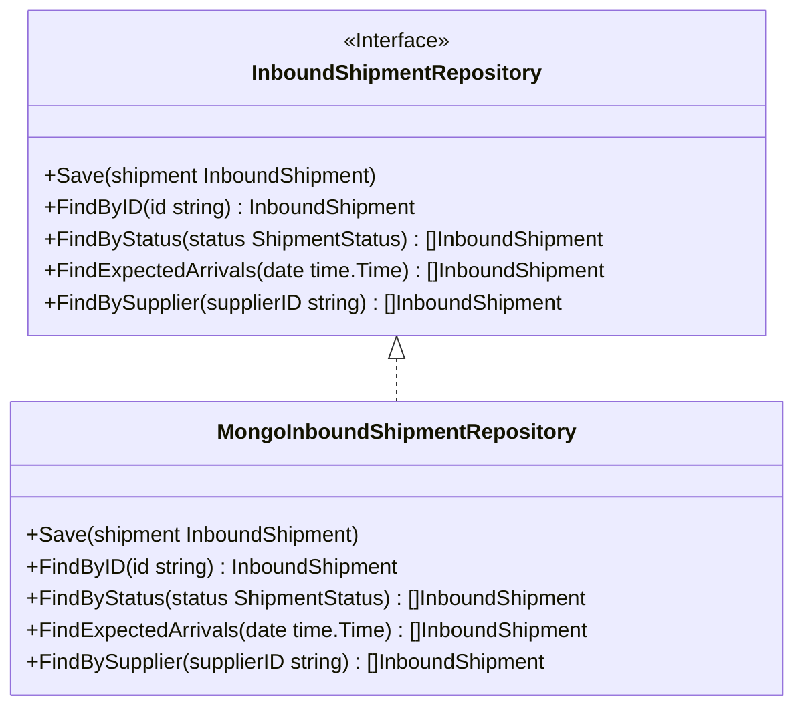

# Receiving Service - DDD Aggregates

This document describes the aggregate structure for the Receiving bounded context following Domain-Driven Design principles.

## Aggregate: InboundShipment

The InboundShipment aggregate represents an incoming shipment from a supplier and tracks the receiving process.

## Aggregate Boundaries

## Invariants

| Invariant | Description |
|-----------|-------------|
| Valid ASN required | Shipment must have valid ASN with tracking info |
| Supplier required | Shipment must have supplier information |
| Expected items exist | Cannot receive items without expected items list |
| Status transitions valid | Status can only change according to state machine |
| Received qty <= expected | Cannot receive more than expected (logs overage discrepancy) |
| Condition tracking | Every received item must have condition recorded |

## Domain Events

## Event Details

| Event | Trigger | Payload |
|-------|---------|---------|
| ShipmentExpectedEvent | New shipment created | shipmentId, supplierId, expectedArrival, items |
| ShipmentArrivedEvent | Shipment arrives at dock | shipmentId, dockId, arrivedAt |
| ItemReceivedEvent | Item scanned/received | shipmentId, sku, quantity, condition, toteId |
| ReceivingCompletedEvent | All items received | shipmentId, totalReceived, totalDamaged |
| ReceivingDiscrepancyEvent | Discrepancy detected | shipmentId, type, sku, expected, actual |
| PutawayTaskCreatedEvent | Putaway triggered | shipmentId, taskId, sku, quantity, toteId |

## Factory Pattern

## Repository Pattern

## Related Documentation

- [Class Diagram](../class-diagram.md) - Full domain model
- [AsyncAPI Specification](../asyncapi.yaml) - Event contracts
