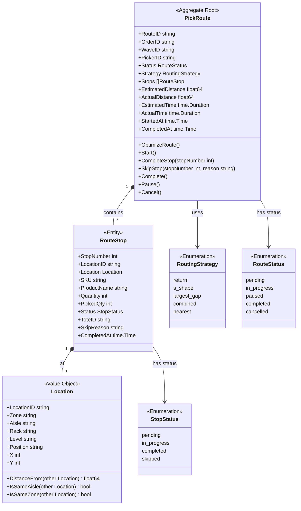
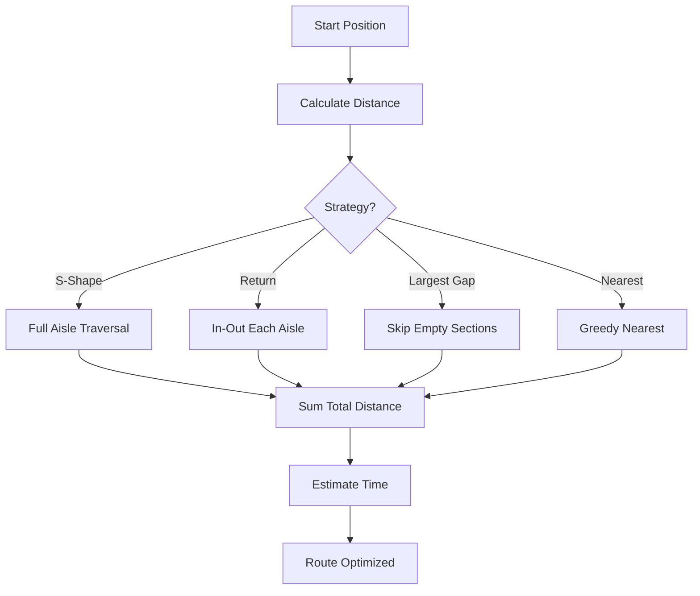

# Routing Service - Class Diagram

This diagram shows the domain model for the Routing Service bounded context.

## Domain Model

## Routing Strategies

```mermaid
graph TD
    subgraph "S-Shape Strategy"
        A1[Start] --> A2[Aisle 1 Full]
        A2 --> A3[Aisle 2 Full]
        A3 --> A4[Aisle 3 Full]
        A4 --> A5[End]
    end

    subgraph "Return Strategy"
        B1[Start] --> B2[Aisle 1 In]
        B2 --> B3[Aisle 1 Out]
        B3 --> B4[Aisle 2 In]
        B4 --> B5[Aisle 2 Out]
        B5 --> B6[End]
    end

    subgraph "Largest Gap Strategy"
        C1[Start] --> C2[Skip Empty Section]
        C2 --> C3[Pick Items]
        C3 --> C4[Skip Empty Section]
        C4 --> C5[End]
    end
```

## Distance Calculation

## Related Diagrams

- [Aggregate Diagram](ddd/aggregates.md) - DDD aggregate structure
- [Picking Workflow](../../../orchestrator/docs/diagrams/picking-workflow.md) - Uses calculated routes
