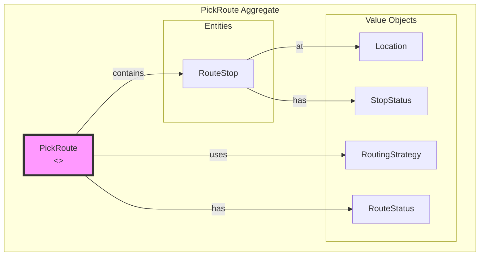
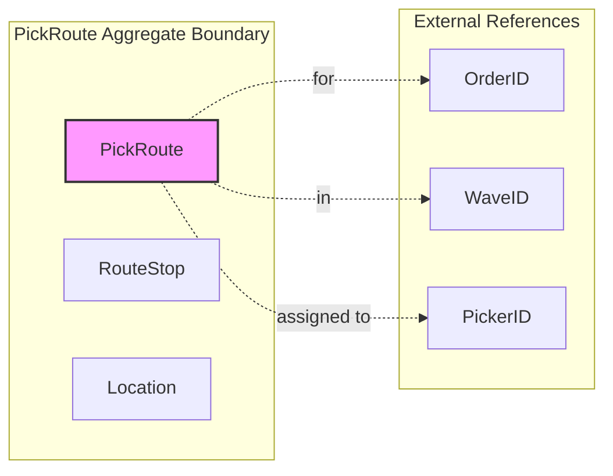
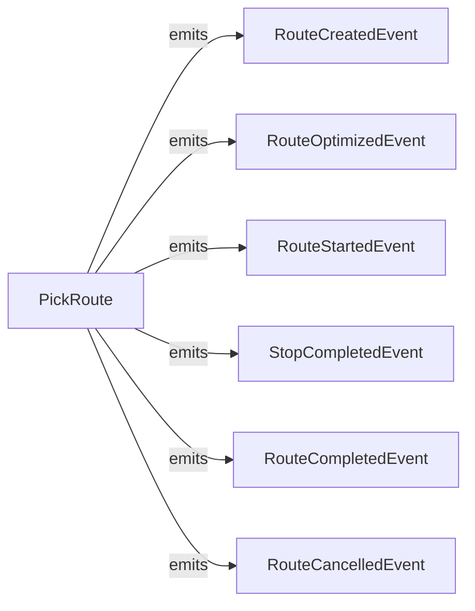

# Routing Service - DDD Aggregates

This document describes the aggregate structure for the Routing bounded context.

## Aggregate: PickRoute

The PickRoute aggregate manages the optimized sequence of locations for picking.

## Aggregate Boundaries

## Invariants

| Invariant | Description |
|-----------|-------------|
| Ordered stops | Stops must be in sequence order |
| Valid locations | All locations must exist |
| Single active route | One active route per order |
| Complete before finish | All stops must be completed or skipped |

## Domain Events

## Related Documentation

- [Class Diagram](../class-diagram.md) - Full domain model
- [Context Map](../../../../docs/diagrams/ddd/context-map.md) - Bounded context relationships
