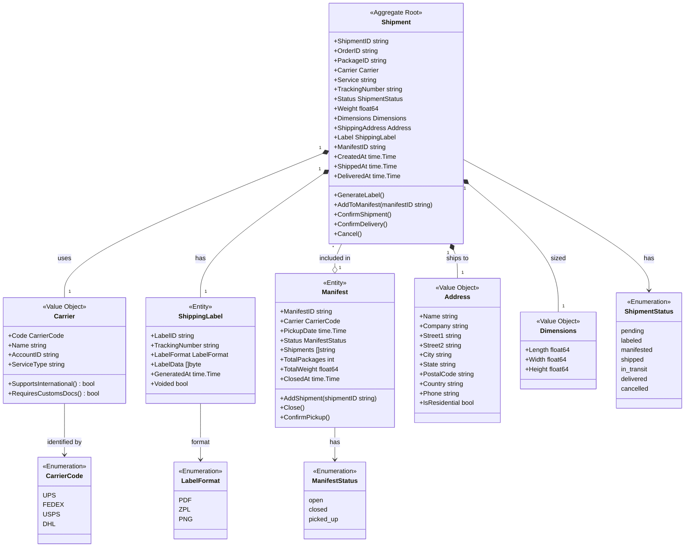
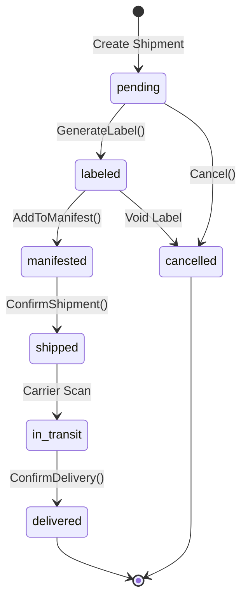

# Shipping Service - Class Diagram

This diagram shows the domain model for the Shipping Service bounded context.

## Domain Model

## Shipment Flow

## Related Diagrams

- [Aggregate Diagram](ddd/aggregates.md) - DDD aggregate structure
- [Shipping Workflow](../../../orchestrator/docs/diagrams/shipping-workflow.md) - SLAM process
