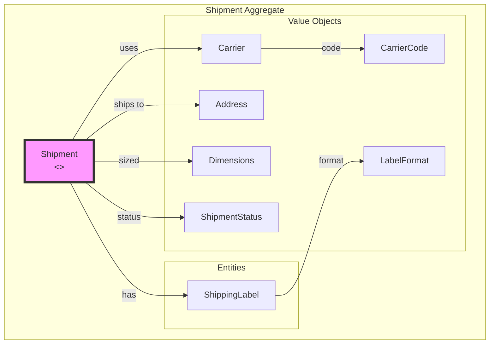
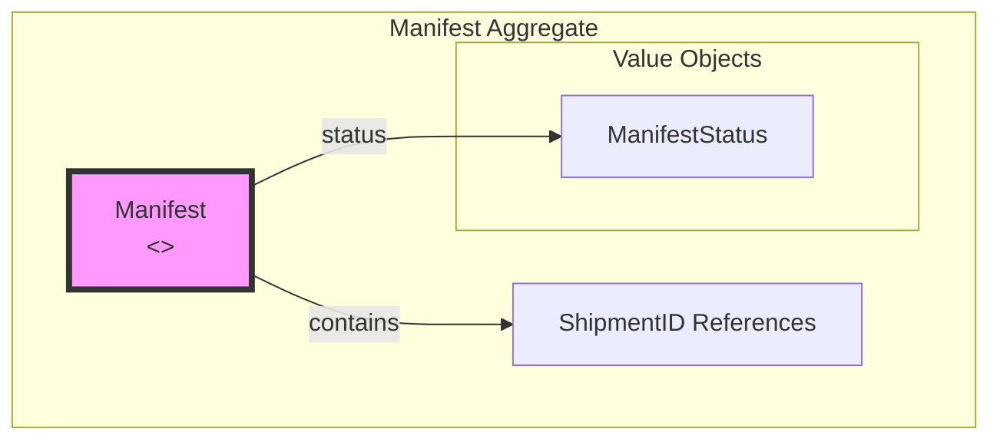
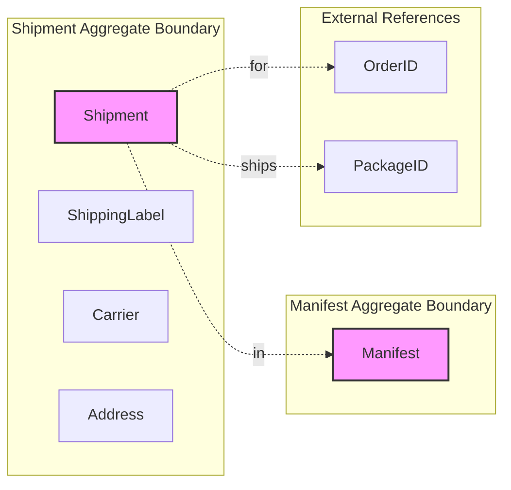
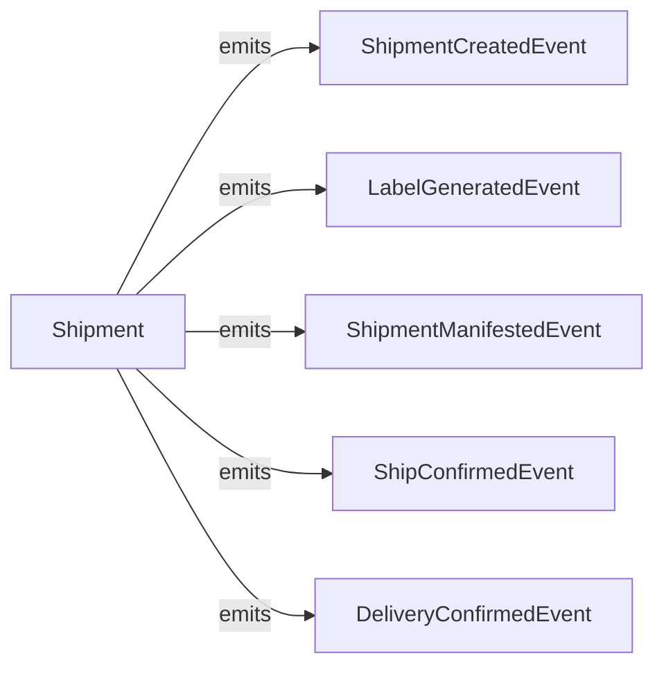

# Shipping Service - DDD Aggregates

This document describes the aggregate structure for the Shipping bounded context.

## Aggregate: Shipment

The Shipment aggregate manages the SLAM process and carrier integration.

## Aggregate: Manifest

## Aggregate Boundaries

## Invariants

| Invariant | Description |
|-----------|-------------|
| Label required | Cannot manifest without label |
| Valid carrier | Carrier must support service type |
| Address valid | Shipping address must be complete |
| Manifest open | Can only add to open manifest |

## Domain Events

## Related Documentation

- [Class Diagram](../class-diagram.md) - Full domain model
- [Shipping Workflow](../../../../orchestrator/docs/diagrams/shipping-workflow.md) - SLAM process
