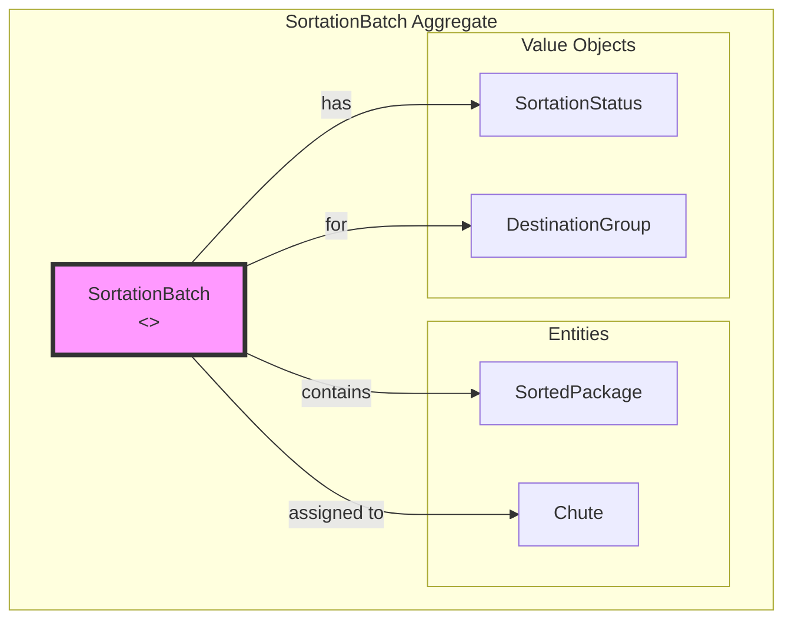
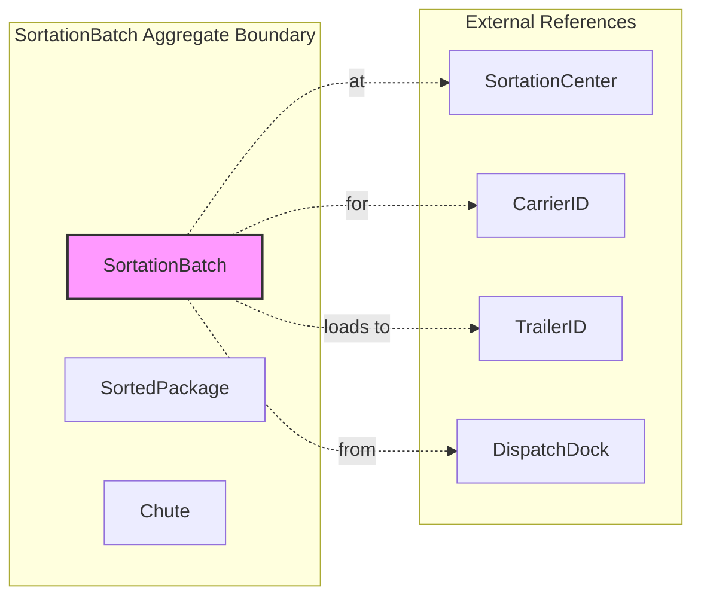
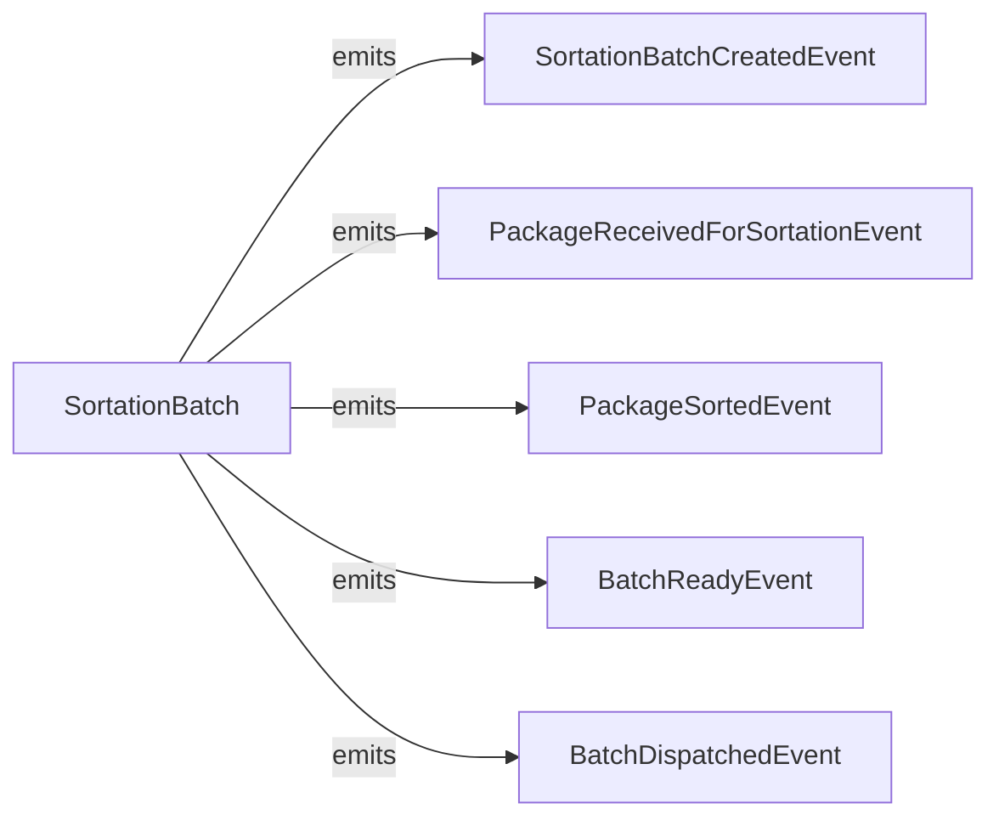
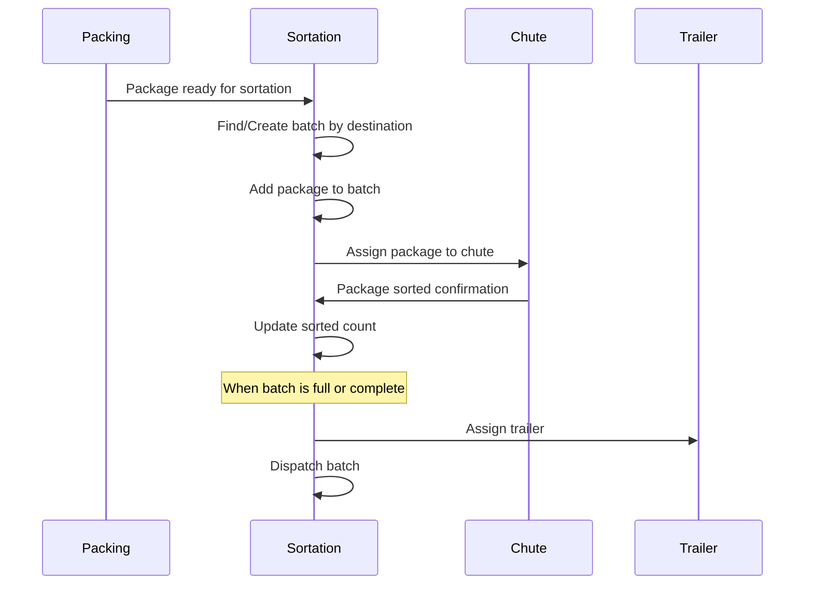
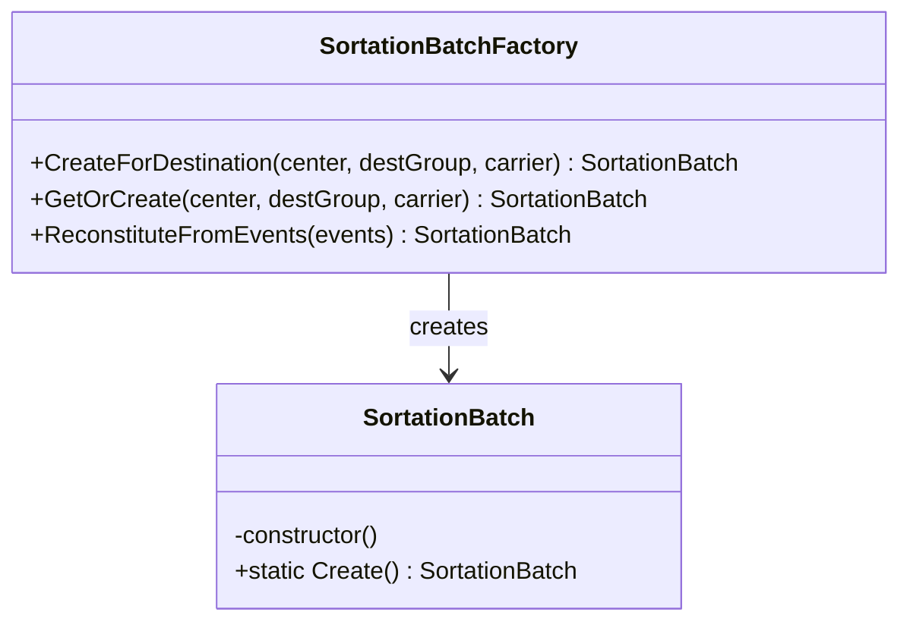
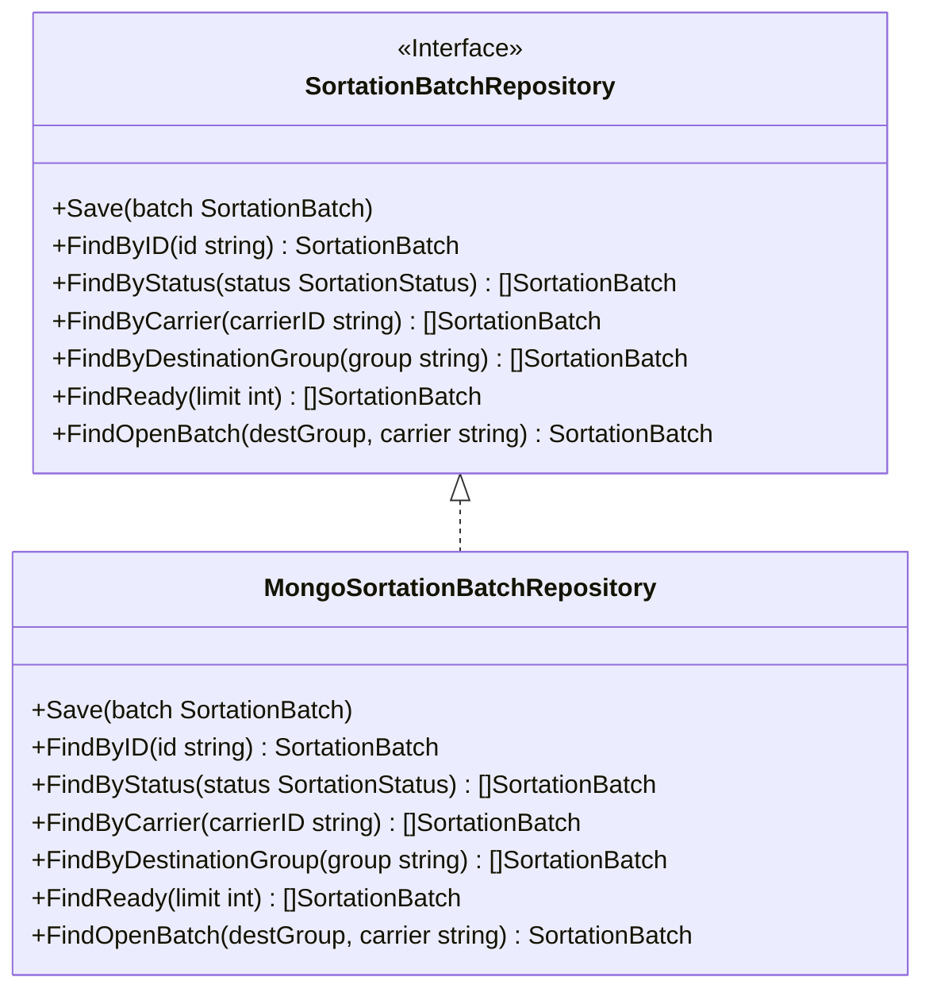

# Sortation Service - DDD Aggregates

This document describes the aggregate structure for the Sortation bounded context following Domain-Driven Design principles.

## Aggregate: SortationBatch

The SortationBatch aggregate represents a group of packages being sorted for the same destination/carrier combination.

## Aggregate Boundaries

## Invariants

| Invariant | Description |
|-----------|-------------|
| Status transitions valid | Status can only change according to state machine |
| Carrier required | Batch must have carrier assignment |
| Destination group required | Must have destination grouping (zip prefix/region) |
| Package uniqueness | Same package cannot be in multiple batches |
| Sort before ready | All packages must be sorted before marking ready |
| Trailer before dispatch | Trailer must be assigned before dispatch |

## Domain Events

## Event Details

| Event | Trigger | Payload |
|-------|---------|---------|
| SortationBatchCreatedEvent | New batch created | batchId, sortationCenter, destinationGroup, carrierId |
| PackageReceivedForSortationEvent | Package added to batch | batchId, packageId, orderId, destination |
| PackageSortedEvent | Package sorted to chute | batchId, packageId, chuteId, sortedBy |
| BatchReadyEvent | All packages sorted | batchId, destinationGroup, carrierId, packageCount |
| BatchDispatchedEvent | Batch leaves facility | batchId, trailerId, dispatchDock, packageCount, totalWeight |

## Sortation Flow

## Factory Pattern

## Repository Pattern

## Related Documentation

- [Class Diagram](../class-diagram.md) - Full domain model
- [AsyncAPI Specification](../asyncapi.yaml) - Event contracts
