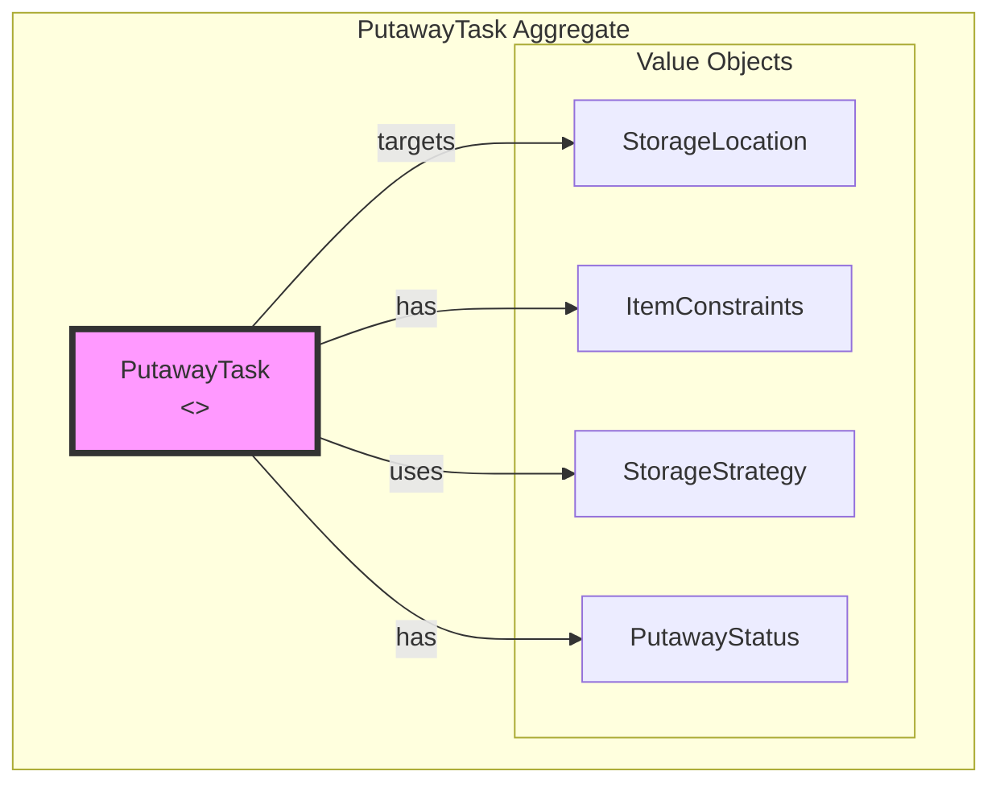
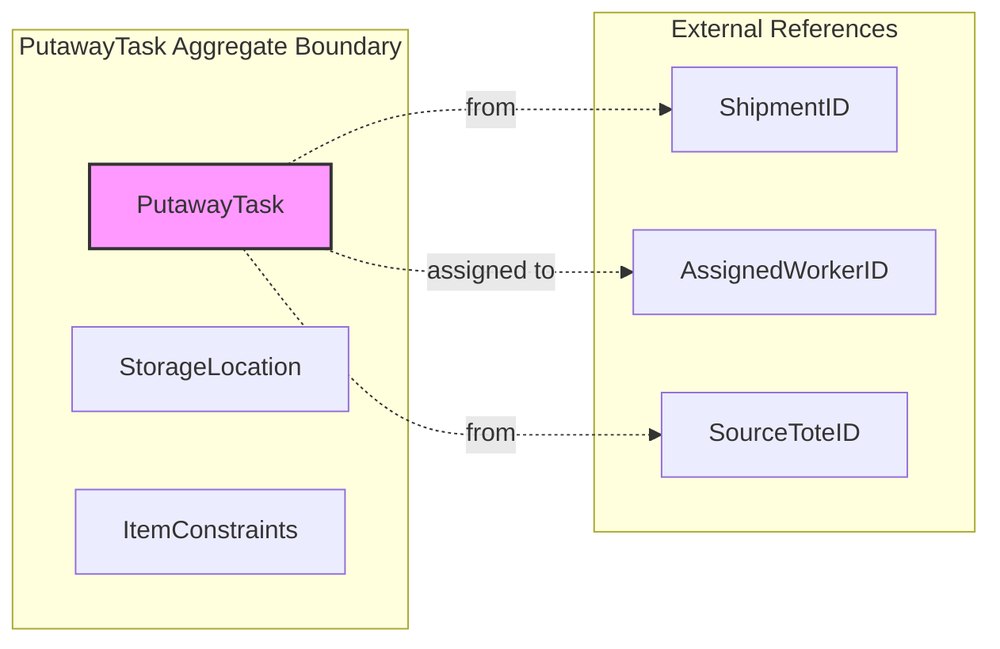
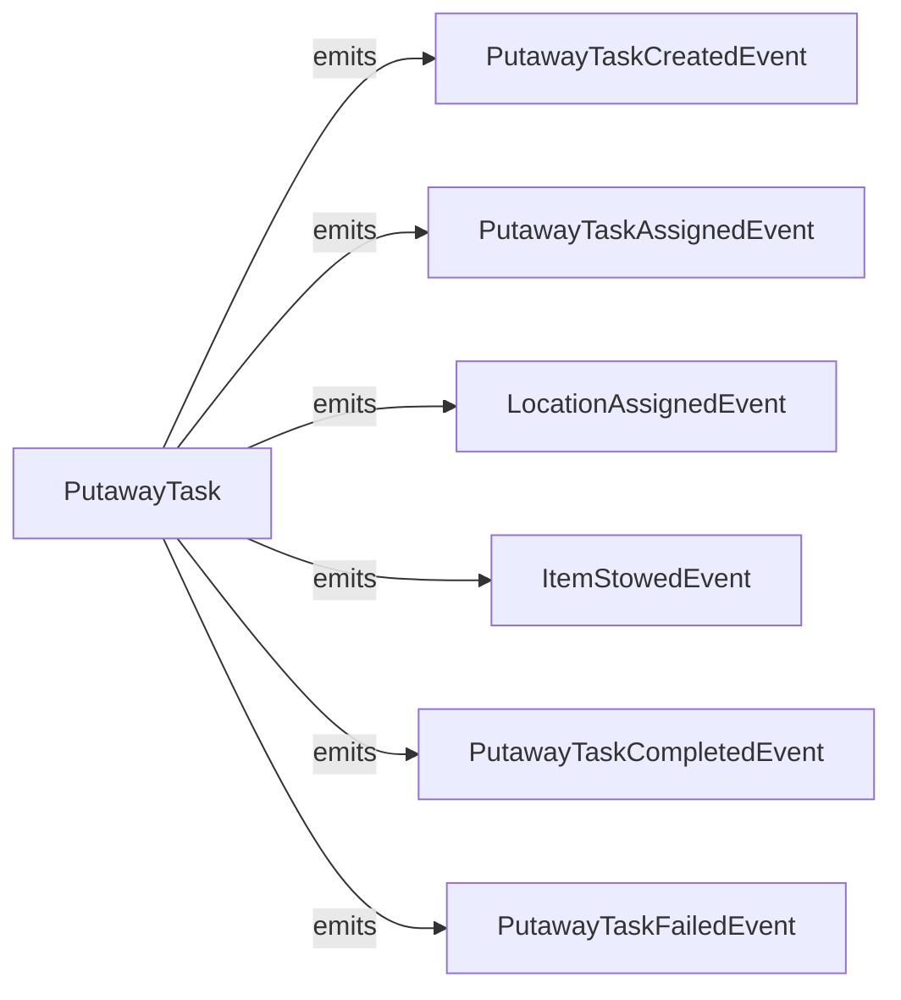
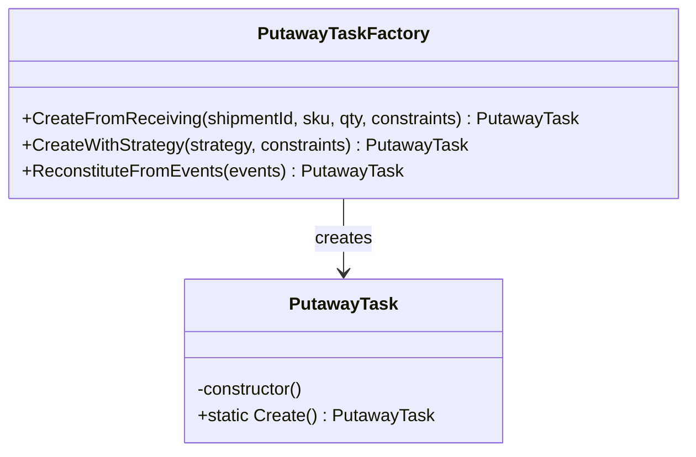
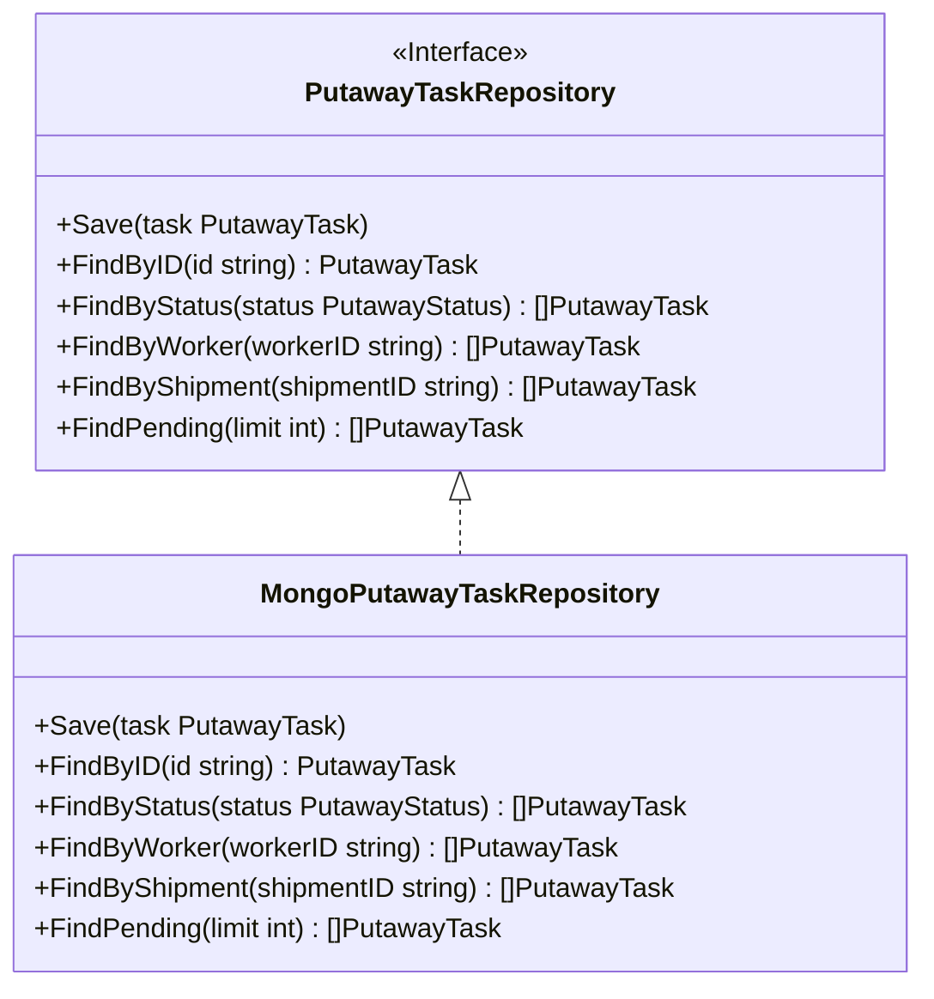

# Stow Service - DDD Aggregates

This document describes the aggregate structure for the Stow bounded context following Domain-Driven Design principles.

## Aggregate: PutawayTask

The PutawayTask aggregate represents a task to store received items in warehouse locations using various storage strategies.

## Aggregate Boundaries

## Invariants

| Invariant | Description |
|-----------|-------------|
| Valid SKU required | Task must have valid SKU and quantity |
| Quantity positive | Quantity must be > 0 |
| Status transitions valid | Status can only change according to state machine |
| Strategy immutable | Storage strategy cannot change after creation |
| Location matches constraints | Target location must support item constraints |
| Stowed qty <= total qty | Cannot stow more than total quantity |

## Storage Strategy Rules

| Strategy | Rule |
|----------|------|
| Chaotic | Random available location (Amazon-style) - maximizes space utilization |
| Directed | System assigns specific location based on predefined rules |
| Velocity | High-velocity SKUs near pick zones, slow-movers in reserve |
| Zone-Based | Products grouped by category/type in designated zones |

## Domain Events

## Event Details

| Event | Trigger | Payload |
|-------|---------|---------|
| PutawayTaskCreatedEvent | Task created from receiving | taskId, shipmentId, sku, quantity, strategy |
| PutawayTaskAssignedEvent | Worker assigned to task | taskId, workerId, assignedAt |
| LocationAssignedEvent | Target location determined | taskId, locationId, zone, strategy |
| ItemStowedEvent | Items placed in location | taskId, sku, quantity, locationId |
| PutawayTaskCompletedEvent | All items stowed | taskId, totalStowed, completedAt |
| PutawayTaskFailedEvent | Task cannot be completed | taskId, reason, failedAt |

## Factory Pattern

## Repository Pattern

## Related Documentation

- [Class Diagram](../class-diagram.md) - Full domain model
- [AsyncAPI Specification](../asyncapi.yaml) - Event contracts
