# Waving Service - Class Diagram

This diagram shows the domain model for the Waving Service bounded context.

## Domain Model

## Wave Lifecycle

```mermaid
stateDiagram-v2
    [*] --> planning: Create Wave
    planning --> planning: Add/Remove Orders
    planning --> scheduled: Schedule()
    scheduled --> released: Release()
    released --> in_progress: First Pick Started
    in_progress --> in_progress: Order Completed
    in_progress --> completed: All Orders Done

    planning --> cancelled: Cancel()
    scheduled --> cancelled: Cancel()
    released --> cancelled: Cancel()
```

## Repository Interface

## Related Diagrams

- [Aggregate Diagram](ddd/aggregates.md) - DDD aggregate structure
- [Order Fulfillment Flow](../../../docs/diagrams/order-fulfillment-flow.md) - Wave assignment step
