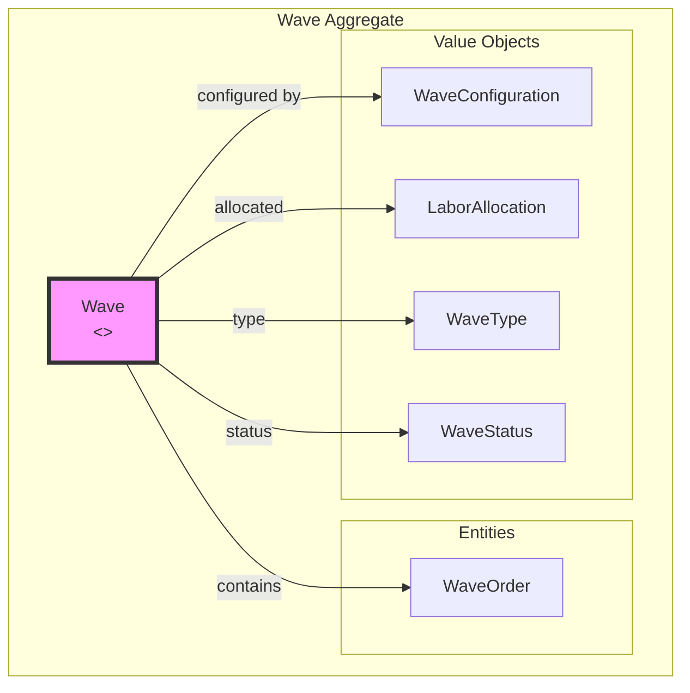
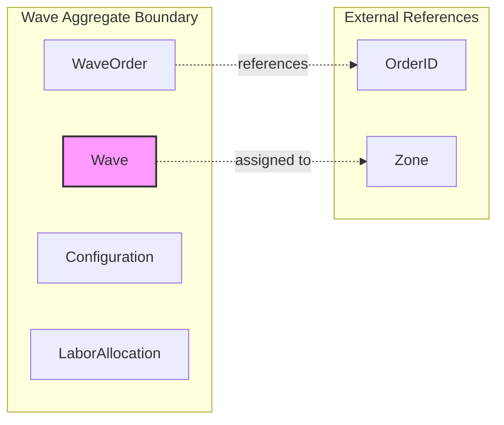
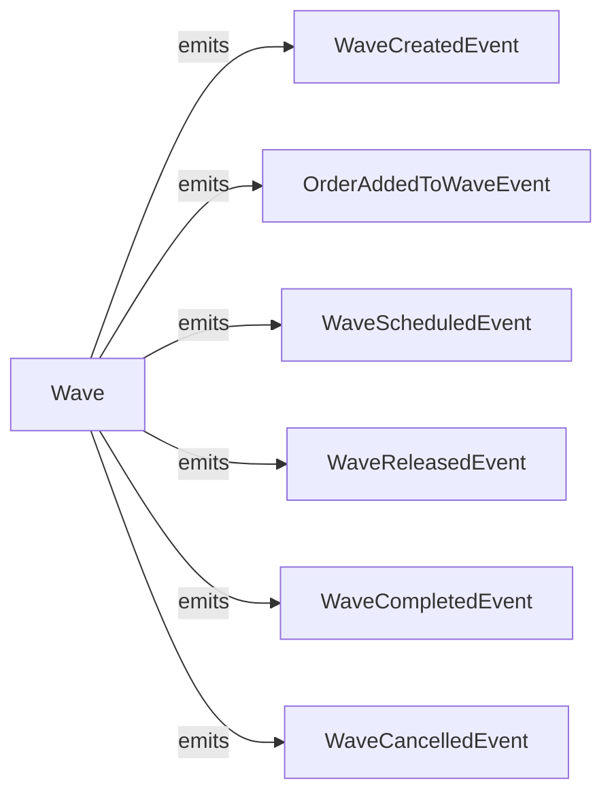

# Waving Service - DDD Aggregates

This document describes the aggregate structure for the Waving bounded context.

## Aggregate: Wave

The Wave aggregate manages the grouping of orders for batch fulfillment.

## Aggregate Boundaries

## Invariants

| Invariant | Description |
|-----------|-------------|
| Max orders respected | Cannot exceed configured max orders |
| Max weight respected | Total weight cannot exceed max weight |
| Valid status transitions | Wave follows defined state machine |
| Released waves immutable | Cannot add orders to released wave |
| Zone consistency | All orders must be in same zone |

## Domain Events

## Related Documentation

- [Class Diagram](../class-diagram.md) - Full domain model
- [Context Map](../../../../docs/diagrams/ddd/context-map.md) - Bounded context relationships
